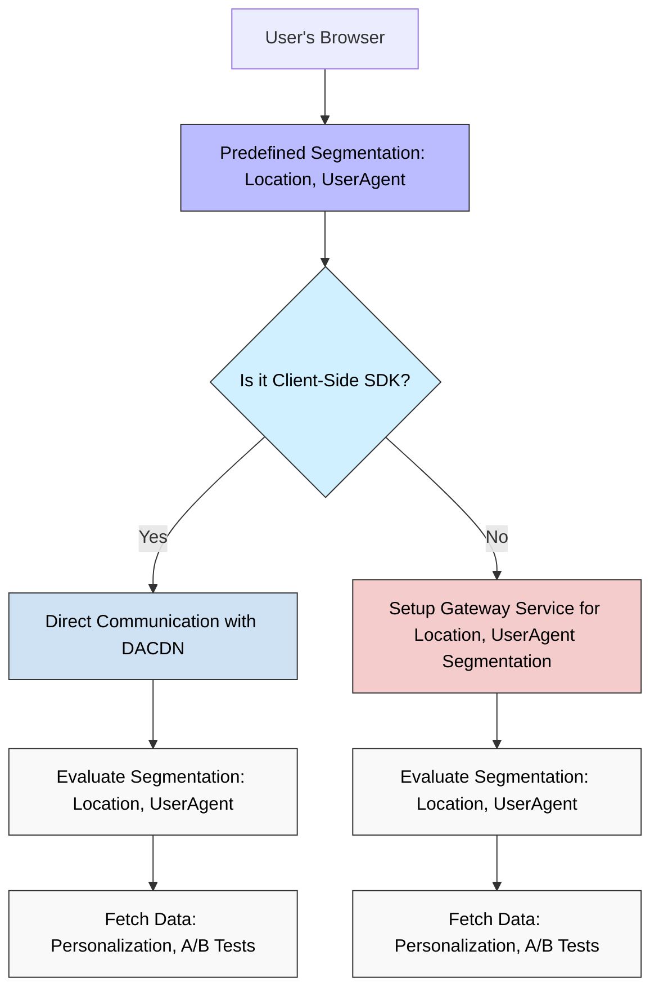

In traditional VWO implementations, when using a gateway service, the SDK communicates with the gateway to evaluate different user segments like Location, UserAgent, and attributes. This adds an extra layer of communication, resulting in multiple network requests and potential delays, especially in client-side environments where speed is crucial.

### Key Features:

1. **Out-of-the-box Targeting** : The JavaScript SDK now includes built-in targeting options, such as location and user agent (UA), without needing additional configuration. This means you don't have to manually set up complex segmentation rules.
2. **Faster Performance** : In the past, the SDK had to contact a gateway service to evaluate Location and UA based. With the new setup, the client side SDK's communicates directly with VWO's DACDN (Delivery and Content Distribution Network), which handles segmentation and evaluation in real time. This significantly reduces delays and improves performance.

### How It Works:

1. **Client-Side SDK**: Instead of waiting for the gateway service to evaluate a user's location, OS, or other factors, the SDK now automatically uses predefined segmentation. You only need to configure the flags once and the SDK will use the available targeting options (like location and user agent) without passing any additional data.
2. **Unlike Server-Side**: In server-side implementations, you must configure a Gateway Service to evaluate Location and User agent based segmentation. In contrast, the client-side SDK automatically handles this without needing additional configuration, offering faster, real-time responses for personalised content or A/B tests.

 

