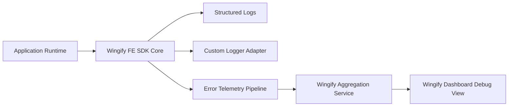
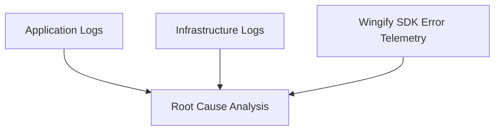

## Overview

When a Wingify Feature Experimentation (FE) SDK integration does not behave as expected, feature flags not evaluating correctly, variables returning defaults, events not tracking, or SDK initialization failing, the root cause is almost always visible through SDK logs or’s built-in error monitoring.

Wingify FE SDKs provide:

* Configurable log levels
* Custom log forwarding support
* Automatic error telemetry to Wingify
* In-app error visibility for debugging

This guide explains how to systematically debug SDK integrations across:

* Server-side SDKs (Node, Java, Python, Go, .NET, PHP, Ruby)
* Client-side SDKs (JavaScript, React)
* Mobile SDKs (iOS, Android, React Native, Flutter)

<br />

## Observability Flow (How Debugging Works)

Every Wingify FE SDK emits three streams of diagnostic signals:



| Stream          | Purpose                                        |
| --------------- | ---------------------------------------------- |
| Structured Logs | Local decisioning & execution trace            |
| Custom Logger   | Centralized log ingestion (Datadog, ELK, etc.) |
| Error Telemetry | Automatic ERROR reporting to Wingify               |

<Callout icon="📘" theme="info">
  ERROR-level logs are automatically transmitted to Wingify across server-side, browser, and mobile SDKs.
</Callout>

This allows remote diagnosis without SSH or mobile device log access.

### What Happens Internally

1. Your application calls the Wingify FE SDK.
2. SDK generates logs based on the configured log level.
3. Logs are:
   * Printed to standard output
   * Optionally forwarded to your logging system
   * ERROR-level logs automatically sent to Wingify
4. Wingify aggregates SDK errors and displays them inside the dashboard.

<br />

## SDK Logging Fundamentals

All Wingify FE SDKs from Wingify:

* Log errors to standard output by default
* Default log level: `ERROR`
* Support configurable log levels:
  * `ERROR`
  * `WARNING`
  * `INFO`
  * `DEBUG`

### What Each Level Provides

| Level   | Diagnostic Depth              |
| ------- | ----------------------------- |
| ERROR   | Hard failures only            |
| WARNING | Recoverable anomalies         |
| INFO    | Operational state transitions |
| DEBUG   | Full decisioning trace        |

### Default Behavior

If you don't configure anything at your end:

* Only `ERROR` logs are printed
* `ERROR` logs are also sent to Wingify automatically

<Callout icon="📘" theme="info">
  For production debugging, temporarily elevate to `DEBUG` mode in a controlled environment.
</Callout>

<br />

## Enabling Verbose Logging (Critical First Step)

When debugging, change the log level to `DEBUG`.

Below is a Node.js example of how to configure log level.

```javascript
const { init, LogLevelEnum } = require('wingify-fme-node-sdk');

const wingifyClient = init({
  sdkKey: 'YOUR_SDK_KEY',
  logger: {
    level: LogLevelEnum.DEBUG
  }
});
```

> For more details, see the Logging section in each SDK reference—for example, the [Node.js Logging](https://developers.wingify.com/v3/docs/fme-node-logging) documentation.

| Level   | What It Shows                   |
| ------- | ------------------------------- |
| ERROR   | Failures only                   |
| WARNING | Recoverable issues              |
| INFO    | Operational information         |
| DEBUG   | Full decisioning + network flow |

### What You See in `DEBUG` Mode

* SDK initialization lifecycle
* Settings file fetch & polling
* Rule evaluation steps
* Targeting condition checks
* Bucketing logic
* Variable resolution
* Network calls and retries
* Event dispatch payloads

This is the most important step when troubleshooting incorrect flag evaluations.

<br />

## Forwarding Logs to Your Monitoring System

All FE SDKs allow custom logger integration.

Instead of printing to the console, forward logs to:

* Datadog
* ELK Stack
* Splunk
* CloudWatch
* Any structured logging framework

### Example of custom logger

```javascript
const customLogger = {
  log: (level, message) => {
    myDatadogLogger.log(level, message);
  }
};

const wingifyClient = init({
  sdkKey: 'YOUR_SDK_KEY',
  logger: customLogger
});
```

### Why This Is Recommended

* Centralized observability
* Correlate SDK failures with deployments
* Identify environment-specific issues
* Monitor retry spikes

In production systems, this is far more powerful than console logging alone.

<br />

## Automatic SDK Error Telemetry (Server + Client Side)

Wingify FE SDKs automatically send ERROR-level logs to Wingify servers across:

* Server-side SDKs
* JavaScript / React SDK
* Mobile SDKs (iOS, Android, React Native)

This means:

> You can view critical SDK-generated errors inside the Wingify dashboard, even without accessing internal application logs.

No additional configuration is required.

<br />

## Using Wingify Advanced Debugging Dashboard

Inside the Wingify application, SDK-generated errors are aggregated and made searchable.

You can:

* View Critical Errors
* Initialization failures
* Invalid SDK key
* Missing feature key
* Network errors
* Retry attempts
* Timeout failures

### Understand Scope

Compare:

* Total events
* Unique users affected

This helps determine whether an issue is:

* Isolated to one user
* Environment-specific
* Widespread

### Filter Errors By

* Date range
* SDK name and version
* Environment
* Error category

### Drill Down Into Specific Errors

Inspect:

* Raw event payload
* Timestamp
* Affected user IDs

> For a complete walkthrough of the dashboard capabilities, refer to the Wingify [knowledge base article](https://help.vwo.com/hc/en-us/articles/53498732714393-Advanced-Debugging-in-VWO-Feature-Experimentation).

<br />

## Step-by-Step Troubleshooting Playbook

### Step 1 — Verify SDK Initialization

Enable DEBUG logs and confirm:

* SDK key is correct
* Settings file fetch succeeded

If initialization fails:

* Validate SDK key for the correct environment
* Check outbound network access
* Verify firewall/proxy restrictions

### Step 2 — Validate Feature Key

Common mistake:

```javascript
wingifyClient.getFlag('wrong_feature_key', context);
```

DEBUG logs will show:

* Feature not found
* Returning default value

Confirm:

* Feature key matches exactly
* Feature is enabled
* Correct environment

### Step 3 — Validate User Identity

Inconsistent user IDs cause bucketing inconsistencies.

Check:

* Same userId used across calls
* No random UUID per request
* Attribute types match targeting rules

DEBUG logs show:

* Which targeting condition failed
* Bucketing result
* Variation assignment

### Step 4 — Check Network Calls & Retries

If events are not recorded:

Look for:

* Retry attempts
* Timeout logs
* Network failures

Common causes:

* Browser/Edge navigation terminating request
* Server shuts down before flush
* Firewall blocking Wingify endpoints

### Step 5 — Correlate Local Logs with Wingify Dashboard

After enabling logs:

* Open Wingify Application
* Navigate to `Website and Apps` under `Configurations` section from the left navbar
* Select the Feature Experimentation Default Project and switch to `Logs` tab
* Filter by environment
* Inspect error category

If errors appear there:

* SDK is sending telemetry successfully

If not:

* Environment mismatch likely
* SDK key may be incorrect

## Common Integration Pitfalls

* Using the wrong SDK key
* Creating a new SDK instance per request
* Calling getFlag before initialization
* Inconsistent user ID
* Firewall blocking outbound calls

<br />

## Recommended Production Debugging Strategy

For stable production systems:

1. Keep log level at `ERROR`
2. Temporarily enable `DEBUG` in an affected environment
3. Forward logs to centralized logging
4. Compare dashboard telemetry with application logs
5. Identify spike patterns before rollback

<br />

## Three-Layer Debugging Model



When combined:

* Application logs show execution flow
* Infrastructure logs show environment failures
* Wingify telemetry shows SDK-specific errors

Together, they eliminate blind spots.

<br />

## When to Contact Support

If:

* Errors are visible but unclear.
* Initialization fails despite correct configuration.
* Network issues persist after validation.
* Dashboard shows repeated retry spikes.

Collect the following before contacting support:

* SDK name and version
* Environment (production/staging)
* Sample DEBUG logs
* Timestamp of issue
* Feature key involved
* User ID (if reproducible)

Providing these details significantly reduces resolution time.