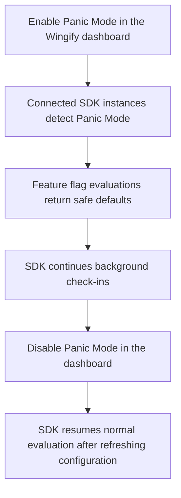
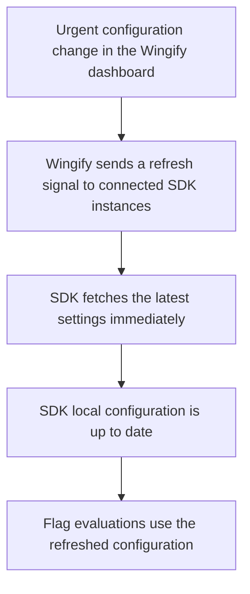

# Panic Mode and Force Refresh

## Panic Mode

Panic Mode is an account- and environment-specific remote kill switch. When you enable it from the Wingify dashboard, every connected SDK stops evaluating campaigns and feature flags and returns each flag’s configured default or fallback value.

This protects your application during an incident without requiring a code change, deployment, or SDK restart.

### Enable Panic Mode

1. Go to **Websites and Apps → SDK Settings**.
2. Select the required environment.
3. Click **Disable SDK**.
4. Resolve the issue, then click **Enable SDK** from the same screen.

Connected SDK instances detect the change automatically.

### Behavior while Panic Mode is active

| SDK behavior | Result |
| --- | --- |
| Feature flag evaluation, such as `getFlag()` | Returns the flag’s default or fallback state immediately. Campaign and targeting logic does not run. |
| Event tracking calls | Suppressed. No experiment or tracking data is sent to Wingify. |
| SDK initialization and usage events | Paused. |
| Background check-ins with Wingify | Continue so the SDK can detect when Panic Mode is turned off. |

### Recovery flow

## Force Refresh

Force Refresh tells connected SDKs to fetch the latest campaigns, feature flags, and settings immediately instead of waiting for the next scheduled polling interval.

Use it after an urgent configuration change or as part of Panic Mode recovery.

### Trigger Force Refresh

1. Go to **Websites and Apps → SDK Settings**.
2. Select the required environment.
3. Click **Force SDK Refresh**.

Connected SDK instances detect the refresh signal and fetch the latest settings automatically. You do not need to add SDK code or configure a separate API call.

### Force Refresh behavior

- Bypasses the normal polling wait and fetches the newest configuration immediately.
- Runs in the background and does not block in-flight flag evaluations or tracking calls.
- Avoids redundant fetches when multiple refresh signals arrive close together.
- Applies a five-minute cooldown after you click **Force SDK Refresh**. You can trigger the next refresh after the cooldown ends.
- Does not require a separate disable action.

### Refresh flow

## Use Panic Mode and Force Refresh together

Use these controls together during an incident:

1. Enable **Panic Mode** to immediately return safe default flag values and stop telemetry.
2. Resolve the underlying issue.
3. Disable **Panic Mode** from the dashboard.
4. The SDK detects that Panic Mode has cleared and force-refreshes its configuration.
5. The application resumes normal experimentation with the latest configuration.

> Configure meaningful default or fallback states for your feature flags before an incident. Panic Mode depends on these defaults to keep your application operating safely.