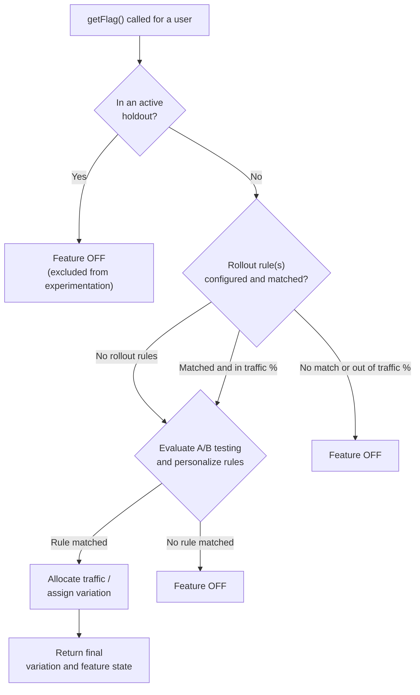

# **How Wingify FE Evaluates Feature Flag Rules**

## **Overview**

When a feature flag is evaluated for a user, the SDK has to decide two things:

1. should this feature be enabled for this user
2. which variation (if any) should the user see

This follows a set process, determined by the type of rules present in the feature flag, the order of the rules and presence of features like Holdouts or Force Users (Whitelisting)

## **Types of Rules**

|             Rule Type            |                                                          What it does                                                          |
| :------------------------------: | :----------------------------------------------------------------------------------------------------------------------------: |
|            **Rollout**           | Simple on/off gate Defined percentage of matching users get the feature turned on Commonly used to gradually release a feature |
| **A/B and Multivariate Testing** |             Splits qualifying traffic across two or more variations to compare their performance against each other            |
|          **Personalize**         |                        Delivers custom experience to a targeted percentage of a defined audience segment                       |

Inside a feature, you can combine Rollout rules with A/B Testing and/or Personalize rules.

## **Order of Evaluation**

For every `getFlag` call, Wingify evaluates rules in the following order. Evaluation stops as soon as a decision is reached and later rules are skipped once the user’s outcome is determined.

1. **Holdout check**
   1. If the feature flag is connected to an active Holdout, user is evaluated for Holdout first, before any rule
   2. If the user becomes part of the Holdout, then they will not be evaluated for any rule
   3. The user will not become part of the feature
2. **Rollout rules**
   1. Rollout rules are checked for audience targeting matches, and this evaluation happens in the order in which the rules are present in the dashboard, from top to bottom, one by one
   2. Once a user qualifies for a rule, the traffic percentage is used for final evaluation
   3. If both are passed, then the user is considered to become part of the Rollout rule
   4. Once a user qualifies for a rule, based on audience targeting match, they will not be evaluated for any other Rollout rule, irrespective of whether they become part of that rule or not
3. **A/B and Multivariate Testing and Personalize Rules**
   1. Only evaluated if the feature has **NO** Rollout rules, **OR** if the user became part of one of the Rollout rules
   2. Testing and Personalize rules are also checked for audience targeting matches, and this evaluation happens in the order in which the rules are present in the dashboard
   3. Once a user qualifies for a rule, the traffic percentage is used for final evaluation
   4. If both are passed, then the user is considered to become part of that rule
      1. If the user becomes part of a testing rule, then the user is assigned a variation based on the variations connected to the testing rule
      2. If the user becomes part of a personalize rule, then the user is assigned the variation associated with the rule
      3. If the user becomes part of a multivariate testing rule, then the user is assigned a combination based on the combinations connected to the multivariate rule
   5. Once a user qualifies for a rule, based on audience targeting match, they will not be evaluated for any other rule, irrespective of whether they become part of that rule or not

**Note:** if a feature has Rollout rules configured, they act as a gate. A user must pass a Rollout rule before Testing and Personalize rules are even considered for evaluation. If a feature has no Rollout rules at all, Testing and Personalize rules are evaluated directly.

**Note**: Mutually Exclusive Groups (MEG) are not mentioned here, as they have a different flow and will be covered separately

 

 

 

## **Exceptions & Special Cases**

### **Holdouts**

A Holdout reserves a percentage of user traffic as a **control group that never becomes part of any feature.** Once a user becomes part of a Holdout, they are not evaluated for any rule, and the feature flag is disabled for them

### **Whitelisting (Forced Variation)**

Whitelisting forces specific users into a specific rollout or personalize rule, or a specific variation of a testing rule. This is commonly used by QA team or internal stakeholders, to see a particular variation, regardless of normal targeting or traffic allocation rules. Once a user is eligible for whitelisting, they are not evaluated for any rules, and are directly made part of the whitelisted rule