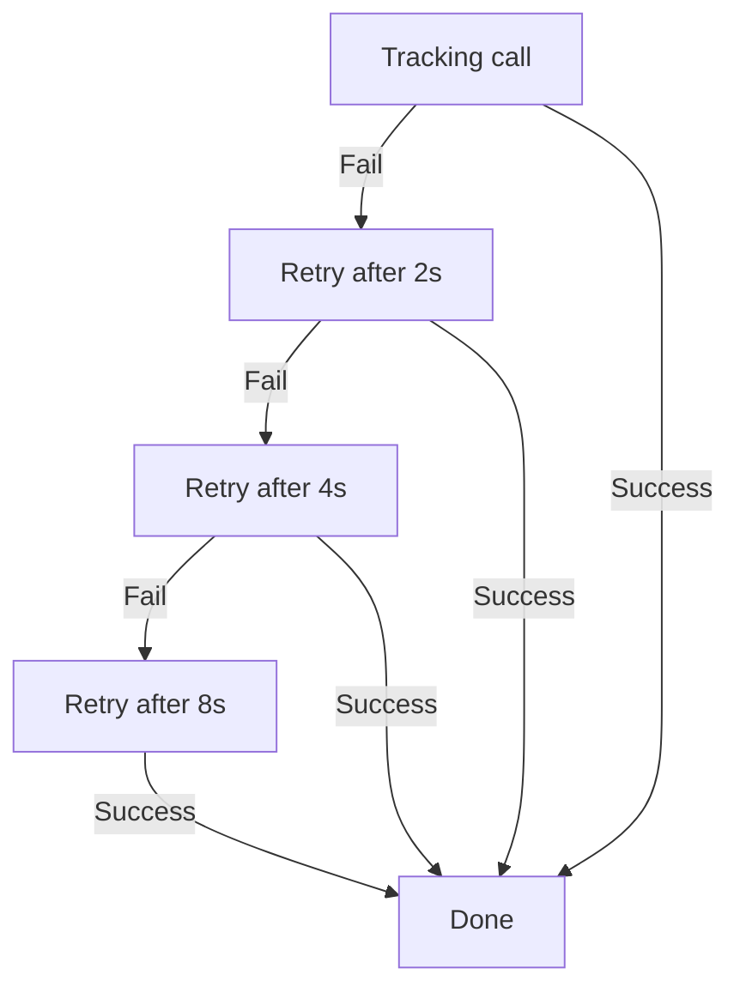

## Overview

The SDK includes an automatic retry mechanism to handle transient network communication failures, specifically for tracking calls. When a tracking request fails due to network instability or timeout, the SDK initiates a retry sequence using exponential backoff. This design improves system reliability while preventing server overload during temporary issues.

## Key Features:

* **Exponential Backoff:**\
  Retry intervals increase exponentially (2s → 4s → 8s), minimizing repeated pressure on network resources.
* **Maximum Retries:**\
  A failed request is retried up to 3 times.
* **Initial Delay:**\
  The first retry is initiated after a 2-second delay.

## Retry Workflow

The retry process follows these steps:

1. **Initial Request:**\
   The SDK attempts to send the tracking request.
2. **Failure Detection:**\
   If the request fails due to issues such as network errors or timeouts, the retry mechanism is triggered.
3. **Retry Attempts:**

   | Attempt | Delay Before Retry |
   | ------- | ------------------ |
   | 1st     | 2 seconds          |
   | 2nd     | 4 seconds          |
   | 3rd     | 8 seconds          |
4. **Max Retries Reached:**\
   After the third failed retry, the SDK ceases further attempts and logs the failure for further diagnosis.

> The following diagram illustrates the retry flow with exponential backoff. It visually represents how the SDK handles failures and retry attempts over time.

## Retry Configuration Parameters

| Parameter       | Description                                  | Default |
| --------------- | -------------------------------------------- | ------- |
| `maxRetries`    | Maximum number of retry attempts             | 3       |
| `initialDelay`  | Time in seconds before the first retry       | 2 sec   |
| `backoffFactor` | Multiplier for exponential backoff per retry | 2       |

## Benefits

* **Improved Reliability:**\
  Automatically recovers from temporary network issues without requiring developer intervention.
* **Reduced Server Load:**\
  Retry delays reduce the chance of overwhelming servers during outages or slowdowns.
* **Automatic Recovery:**\
  Maintains high data integrity by ensuring tracking events are retried intelligently and gracefully.

## Implementation Notes

* The retry mechanism is implemented at the network layer of the SDK.
* All retry events and final failures are logged for observability.
* The SDK avoids retrying non-idempotent or malformed requests.

> **Note**The SDK's built-in retry mechanism is a robust and efficient solution for handling intermittent network failures. It ensures that tracking events are reliably delivered without requiring additional logic from the developer.
>
> **⚠️ Important**: This retry mechanism does not apply to the PHP SDK, due to PHP's synchronous and request-bound execution model. Introducing asynchronous retry logic can lead to performance degradation and side effects in PHP-based environments. It is recommended to implement retries at the infrastructure level (e.g., queueing or background workers) if needed.