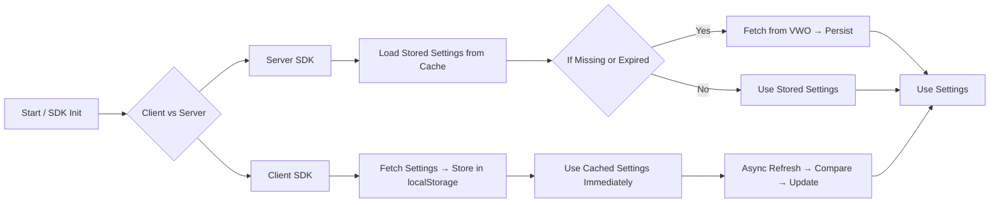

## Overview

A robust caching layer can significantly improve response times and reduce load on VWO servers by storing and reusing fetched settings at the edge or within your application’s storage. VWO FME SDKs support a variety of caching strategies—both at your infrastructure edge (e.g., Cloudflare Workers, AWS Lambda\@Edge) and within application-local storage (client‑side mobile and browser SDKs). This document details available options, behavior, and configuration.

***

## 1. Edge Caching

### 1.1 What Is Edge Caching?

Edge caching delegates storage and retrieval of VWO settings to your CDN or edge compute layer. Instead of every request hitting your origin or VWO API, frequently accessed settings are served from the nearest edge node.

### 1.2 Supported Edge Platforms

* **Cloudflare Workers & Cache**
* **AWS Lambda\@Edge & CloudFront**
* **Azure Front Door & Functions**
* **Fastly Compute\@Edge**

> **Note:** Caching control is entirely in your hands. You decide TTLs, invalidation rules, and storage namespaces.

### 1.3 Benefits

* Reduced latency by serving settings closer to the end user
* Lower origin and API load
* Fine‑grained control over cache invalidation and expiry

***

## 2. Client‑Side SDK Caching

Client‑side SDKs (browser, mobile) provide out‑of‑the‑box caching of VWO settings within the application’s storage (e.g., `localStorage`). You have the option to provide your storage connector for the SDKs to use.

### 2.1 How It Works

1. **Initial Fetch:** On the first invocation, the SDK retrieves the full settings payload from VWO.
2. **Local Cache:** Settings are stored locally (in Web or Mobile storage) under a designated key.
3. **Subsequent Calls:** SDK reads from local cache and uses settings immediately for flag/variable evaluation.
4. **Asynchronous Refresh:** In the background, SDK fetches current settings from VWO. If a difference is detected, the cache is updated and the SDK instance is refreshed.

### 2.2 Configuration

* **Cache Duration (TTL):** Control how long settings remain valid before background refresh (e.g., 1 hour, 6 hours).
* **Storage Key:** Customizable key or namespace in application storage.
* **Refresh Interval:** Optionally set polling interval.

```js
import { VwoClient } from 'vwo-browser-sdk';

const vwo = VwoClient.launch({
  sdkKey: 'YOUR_KEY',
  cacheTTL: 3600,        // seconds
  cacheKey: 'vwo-config',
  pollInterval: 300      // seconds
});
```

***

## 3. Server‑Side SDK Caching

Server‑side environments (Node.js, Python, Java, .NET, Ruby, PHP, and Go) rely on your custom implementation for caching settings. The SDK exposes hooks for loading and storing settings so you can integrate your existing cache/storage:

1. **Initialization with Stored Settings:** Pass previously stored JSON settings when initializing the SDK to skip initial fetch.
2. **On‑Fetch Callback:** SDK returns fresh settings for you to persist in your cache.
3. **Expiration Control:** Decide when to refresh or invalidate based on your use case.

```js
import { init } from 'vwo-fme-node-sdk';

// Load from your cache store
const storedSettings = await myCache.get('vwo-settings');

// Initialize the SDK with the storedSettings
const vwoInstance = init({
  accountId: 'VWO_ACCOUNT_ID'
  sdkKey: 'VWO_SDK_KEY',
  settings: storedSettings
});
```

> Coming soon: Storage Connector integration to automatically `get` and `set` VWO settings in popular data stores.

***

## 4. Polling & Webhooks

### 4.1 Polling

* **Mechanism:** Periodically (configurable interval) call VWO API to check for changes.
* **Behavior:** If settings have changed, SDK updates the local cache and refreshes the instance.

### 4.2 Webhooks

* **Mechanism:** VWO pushes change notifications to your endpoint via webhook.
* **Implementation:** On receiving a webhook event, call `updateSettings(newSettings)` on the SDK instance to apply the latest settings immediately.

```js
// Express.js example
app.post('/vwo-webhook', async (req, res) => {
  const updatedSettings = req.body.settings;
  await vwoInstance.updateSettings(updatedSettings);
  res.sendStatus(200);
});
```

***

## 5. Flow Diagram



## 6. Summary

* **Edge Caching:** Fully controlled by you at CDN/edge.
* **Client SDKs:** Automatic caching, TTL, async refresh.
* **Server SDKs:** Customer‑driven caching via initialization and callbacks.
* **Refresh Strategies:** Polling or Webhooks for near real‑time updates.

For more information, see our reference on Edge Support: [https://developers.vwo.com/v2/docs/fme-edge-support#/](https://developers.vwo.com/v2/docs/fme-edge-support#/)