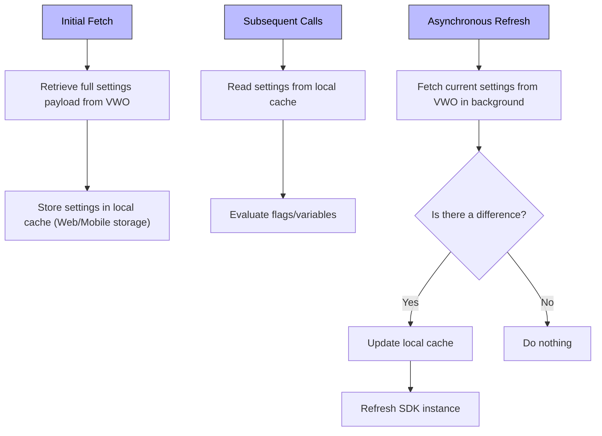
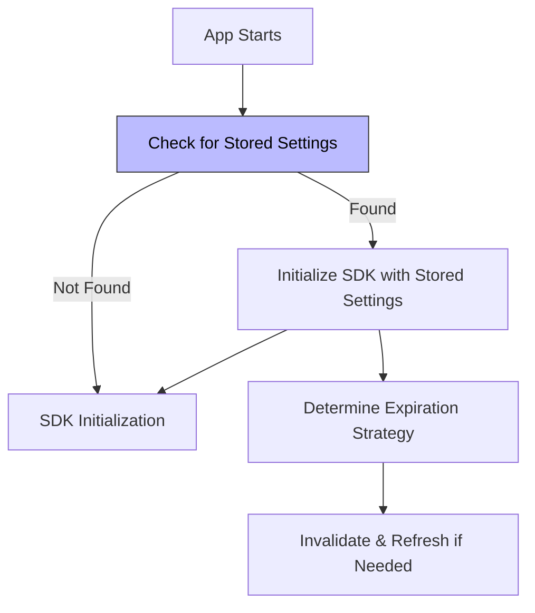
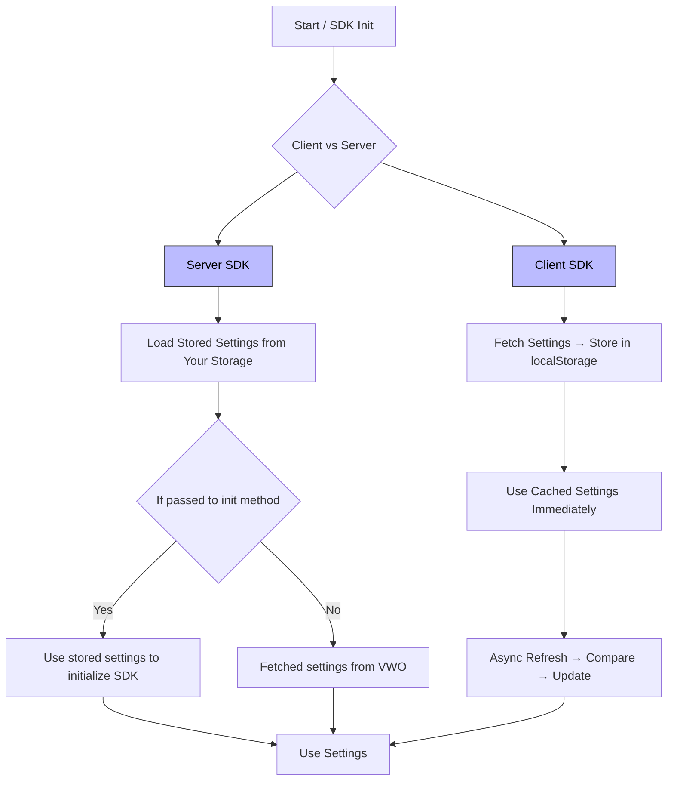

## Overview

A robust caching layer can significantly improve response times and reduce load on VWO servers by storing and reusing fetched settings at the edge or within your application’s storage. VWO FME SDKs support a variety of caching strategies, both at your infrastructure edge (e.g., Cloudflare Workers, AWS Lambda\@Edge) and within application-local storage (client‑side mobile and browser SDKs). This document details available options, behavior, and configuration.

<br />

## 1. Edge Caching

### 1.1 What Is Edge Caching?

Edge caching is a method of storing content closer to end users by placing cached versions of data or web assets (like images, scripts, or even full web pages) on edge servers, servers located in geographically distributed data centres near users.

With edge caching, you can delegate storage and retrieval of VWO settings to your CDN or edge compute layer. Instead of every request hitting your origin or VWO server, frequently accessed settings are served from the nearest edge node.

### 1.2 Supported Edge Platforms

* **Cloudflare Workers & Cache**
* **AWS Lambda\@Edge & CloudFront**
* **Azure Front Door & Functions**
* **Fastly Compute\@Edge**

> **Note:** Caching control is entirely in your hands. You decide TTLs, invalidation rules, and storage namespaces.

### 1.3 Benefits

* Reduced latency by serving settings closer to the end user
* Lower origin and API load
* Fine‑grained control over cache invalidation and expiry

<br />

## 2. Client‑Side SDK Caching

Client‑side SDKs (browsers and mobile-apps) provide out‑of‑the‑box caching of VWO settings within the application’s storage (e.g., `app-storage` in mobile and `localStorage`for browsers). You have the option to provide your storage connector for the SDKs to use.

### 2.1 How It Works

1. **Initial Fetch:** On the first invocation, the SDK retrieves the full settings payload from VWO.
2. **Local Cache:** Settings are stored locally (in Web or Mobile storage) under a designated key.
3. **Subsequent Calls:** SDK reads from local cache and uses settings immediately for flag/variable evaluation.
4. **Asynchronous Refresh:** In the background, SDK fetches current settings from VWO. If a difference is detected, the cache is updated and the SDK instance is refreshed.



<br />

### 2.2 Configuration

* **Cache Duration (TTL):** Control how long settings remain valid before background refresh (e.g., 1 hour, 6 hours).
* **Storage Key:** Customizable key or namespace in application storage.
* **Refresh Interval:** Optionally set polling interval.

```javascript
import { init } from 'vwo-fme-node-sdk';

const VwoClient = init({
  sdkKey: 'VWO_SDK_KEY',
  accountId: 123456,
  caching: {
    TTL: 60*60,             // milliseconds
  	key: 'vwo-cache-storage-key'
  },
  pollInterval: 60000       // milliseconds
});
```

For more information, see our reference on Edge Support: [https://developers.vwo.com/v2/docs/fme-edge-support#/](https://developers.vwo.com/v2/docs/fme-edge-support#/)

<br />

## 3. Server‑Side SDK Caching

Server‑side environments (Node.js, Python, Java, .NET, Ruby, PHP, and Go) rely on your custom implementation for caching settings. The SDK exposes hooks for loading and storing settings so you can integrate your existing cache/storage:

### 3.1 How It Works

1. **Initialization with Stored Settings:** Pass previously stored JSON settings when initializing the SDK to skip initial fetch.
2. **On‑Fetch Callback:** The SDK returns fresh settings for you to persist in your cache.
3. **Expiration Control:** Decide when to refresh or invalidate based on your use case.



<br />

### 3.2 How can you pass storedSettings while Initializing SDK

```javascript Node.js
import { init } from 'vwo-fme-node-sdk';

// Load from your cache store
const storedSettings = await myCache.get('vwo-settings');

// Initialize the SDK with the storedSettings
const vwoInstance = init({
  accountId: 'VWO_ACCOUNT_ID'
  sdkKey: 'VWO_SDK_KEY',
  settings: storedSettings
});
```

<br />

## 4. Polling & Webhooks

When using caching with VWO FullStack SDKs, it's essential to ensure that cached settings stay up-to-date with the latest configurations made in the VWO app. While caching improves performance and reduces network calls, it introduces the risk of stale data, especially in dynamic environments where flags, variables, or campaigns are updated frequently.

To address this, VWO provides two mechanisms: Polling and Webhooks.

### 4.1 Polling

* **Mechanism:** Periodically (configurable interval) call VWO API to check for changes.
* **Behavior:** If settings have changed, the SDK updates the local settings cache and refreshes the instance.
* **Trade-offs:** Increases periodic network usage. May not be truly real-time; depends on the polling interval (e.g., every 5 minutes).

```javascript
const vwoClient = await init({
  accountId: '123456',
  sdkKey: '32-alpha-numeric-sdk-key',
  pollInterval: 60000,
});
```

<br />

### 4.2 Webhooks

* **Mechanism:** Webhooks notify your system immediately when there’s a change in your VWO account (like a flag update). You can then trigger a refresh of the cached settings.
* **Implementation:** On receiving a webhook event, call `updateSettings(newSettings)` on the SDK instance to apply the latest settings immediately.
* **Trade-offs:** Requires endpoint setup.

```node
// Node.js express server example
app.post('/vwo-webhook', async (req, res) => {
  const updatedSettings = req.body.settings;
  
  await vwoClient.updateSettings(updatedSettings);
  
  res.sendStatus(200);
});
```

<br />

## 5. Flow Diagram



The diagram illustrates how VWO SDKs handle settings initialization and caching differently for client-side and server-side environments:

Client SDKs fetch settings from VWO, store them in localStorage, use them immediately, and refresh them asynchronously in the background.

Server SDKs fetch fresh settings from VWO; or use the passed stored settings, passed while initializing the SDK.

Both approaches ensure quick flag evaluations while keeping the cache updated to reflect changes from the VWO platform.

<br />

## 6. Summary

* **Edge Caching:** Fully controlled by you at CDN/edge.
* **Client SDKs:** Automatic caching, TTL, async refresh.
* **Server SDKs:** Customer‑driven caching via initialization and callbacks.
* **Refresh Strategies:** Polling or Webhooks for near real‑time updates.