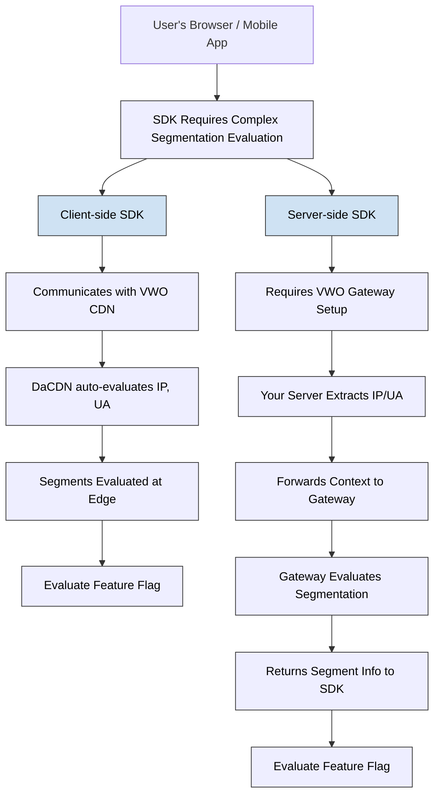

This guide details how VWO's Feature Experimentation (FE) SDKs handle segmentation, particularly based on **Location**, **User Agent (UA)**, and **User Attributes** — differently for **client-side** and **server-side** implementations.

## Overview

Segmentation is a critical part of delivering personalized experiences. VWO supports advanced segmentation based on:

* 🌍 Location (derived via IP)
* 🧭 User Agent (device/browser type)
* 🧑‍💼 User Attributes (e.g., logged-in state, subscription plan)

Depending on whether you use client-side or server-side SDKs, the evaluation workflow varies. Here's a visual representation:

## Client-side vs Server-side Complex Segment Evaluation

 

## Client-Side SDKs: Automatic Segmentation via DaCDN

### How it Works

VWO’s client-side SDKs leverage the **VWO DaCDN**, an intelligent CDN layer, **to automatically evaluate segments** using the request's IP and User-Agent. These values are implicitly available to DaCDN because it is invoked directly from the user's browser/device.

> ⚙️ Note
>
> No extra code is needed to pass IP or UA from your application.

### Benefits

* Zero configuration required
* Automatic targeting on geo/location and device/browser
* Fast, edge-based evaluation
* No backend setup required

### Ideal Use Cases

* A/B testing or personalization for web/mobile users
* Segmentation based on country/region/device/browser
* Experiments running at scale with minimal infrastructure overhead

 

## Server-Side SDKs: Requires Gateway Service

In server environments (e.g., Node.js, Python, Java, Ruby, PHP, .NET, and Go), IP and UA are **not available by default** to the SDK. These attributes live in your server's request context.

To support complex segments like Location and User Agent, you must:

1. Set up [Gateway Service](doc:gateway-service).
2. Forward IP/UA headers to the Gateway via SDK APIs.
3. Let Gateway handle segment evaluation.

### Why This Difference?

Server-side SDKs run in a backend context without automatic access to:

* Client IP addresses (due to proxies/load balancers)
* User agent strings (only available in incoming HTTP requests)

### Ideal For

* Teams needing complete control over request flows.
* Advanced integrations where client context is manually passed.

> 📘 Note
>
> For fast and frictionless implementation of advanced segment targeting (location, user-agent, and more), we strongly recommend using Client-Side SDKs wherever feasible. If you're using server-side SDKs, ensure VWO Gateway is correctly set up for similar capabilities.
