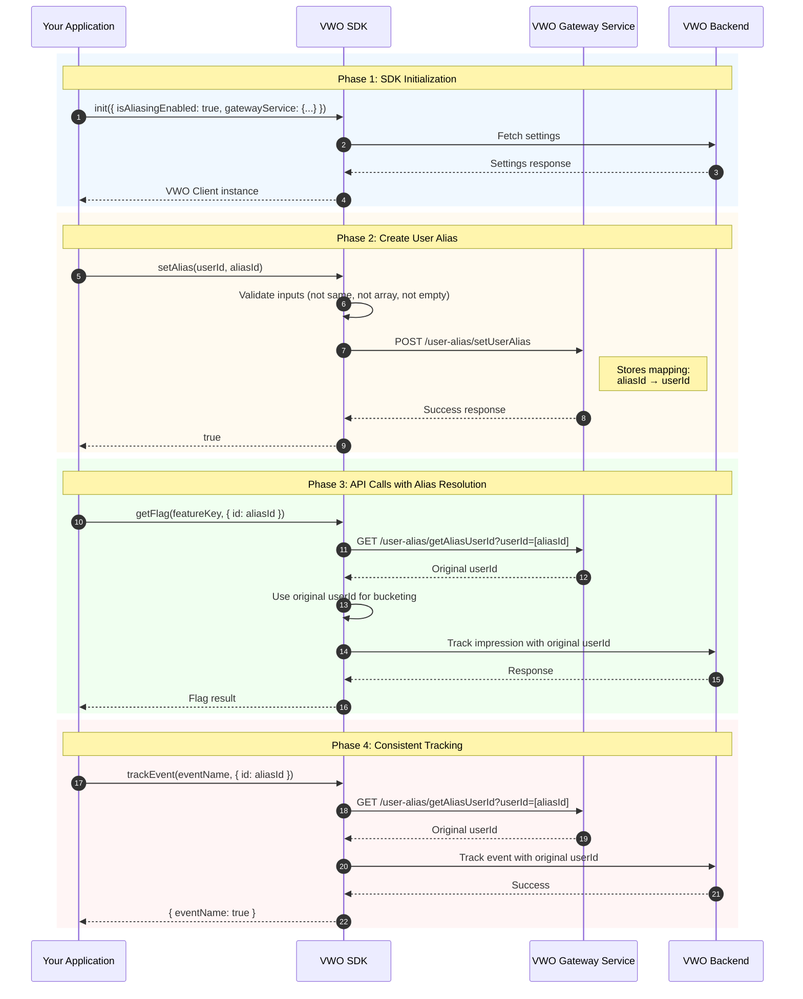

User aliasing allows you to associate two different user identifiers so your experimentation and personalization systems can treat them as the same user. This is especially useful when a user transitions from an anonymous ID to a logged-in ID.

Once an alias is created, all future lookups and evaluations can reference a unified identity.

### Prerequisites

To use user aliasing, the following must be configured in your SDK setup:

* **Aliasing must be enabled** via a configuration flag (e.g., `isAliasingEnabled: true`)
* **Gateway service must be configured**, since alias updates are sent through an API call

## Overview

User Aliasing is particularly useful in scenarios where users transition between anonymous and authenticated states. By creating an alias between identifiers, VWO ensures that:

* Users receive consistent feature flag variations regardless of which identifier is used
* Events and conversions are correctly attributed to the original user
* Flows where userId is not initially known but captured post a login, but the experience needs to be delivered immediately

<Callout icon="📘">
  User Aliasing requires the **VWO Gateway Service** to be configured. The Gateway Service stores and retrieves alias mappings. See [Gateway Service documentation](https://developers.vwo.com/v2/docs/gateway-service) for setup instructions.
</Callout>

## How It Works

The aliasing system works by maintaining a mapping between alias identifiers and original user IDs in the VWO Gateway Service. When API methods are called with an aliased identifier, the SDK automatically resolves it to the original user ID before processing.

### Flow Diagram



The diagram illustrates the complete aliasing flow from SDK initialization through alias creation and subsequent API calls with automatic alias resolution.

### Key Concepts

| Term      | Description                                                           |
| --------- | --------------------------------------------------------------------- |
| `userId`  | The original/primary user identifier used for bucketing and analytics |
| `aliasId` | An alternative identifier that maps to the original userId            |

## Configuration

To enable User Aliasing, you must configure both the `isAliasingEnabled` flag and the `gatewayService` when initializing the VWO SDK.

### Initialization Options

**isAliasingEnabled** `boolean` _optional_

Set to `true` to enable user aliasing functionality. Default is `false`.

**gatewayService** `object` _required for aliasing_

Configuration object for the VWO Gateway Service. Required when `isAliasingEnabled` is `true`.

### Example Configuration

<Tabs>
  <Tab title="TypeScript">
    ```typescript
    import { init } from 'vwo-fme-node-sdk';

    const vwoClient = await init({
      accountId: 'YOUR_ACCOUNT_ID',
      sdkKey: 'YOUR_SDK_KEY',

      // Enable aliasing
      isAliasingEnabled: true,

      // Gateway service is required for aliasing
      gatewayService: {
        url: 'https://your-gateway-service.com',
        // Optional: specify port if not using default
        port: 443,
        // Optional: specify protocol (defaults to https)
        protocol: 'https'
      }
    });
    ```
  </Tab>

  <Tab title="JavaScript">
    ```javascript
    const { init } = require('vwo-fme-node-sdk');

    const vwoClient = await init({
      accountId: 'YOUR_ACCOUNT_ID',
      sdkKey: 'YOUR_SDK_KEY',

      // Enable aliasing
      isAliasingEnabled: true,

      // Gateway service is required for aliasing
      gatewayService: {
        url: 'https://your-gateway-service.com',
        port: 443,
        protocol: 'https'
      }
    });
    ```
  </Tab>
</Tabs>

## API Reference

### setAlias()

Creates a mapping between a user ID and an alias ID. Once set, any API calls made with the `aliasId` will automatically resolve to the original `userId`.

#### Method Signatures

```typescript
// Using context object
setAlias(context: { id: string }, aliasId: string): Promise<boolean>

// Using userId directly
setAlias(userId: string, aliasId: string): Promise<boolean>
```

#### Parameters

**contextOrUserId** `object | string` _required_

Either a context object containing an `id` property, or the user ID string directly. This is the original/primary user identifier.

**aliasId** `string` _required_

The alias identifier to map to the original user ID. Cannot be the same as the userId, cannot be an array, and cannot be empty.

#### Returns

`Promise<boolean>` - Resolves to `true` if the alias was successfully created, `false` otherwise.

#### Where To Call

Typically, setAlias() is called, once the guest user has logged in. The first time the user comes to the platform, and there is no permanent userId available, assign a random userId and use that to get a decision. Once the user has logged in, set that as the aliasId and continue. After that, whether the userId is used, or the aliasId is used, the SDK treats them both as the same user and returns the same variable values.

#### Example Usage

<Tabs>
  <Tab title="With Context">
    ```typescript
    // User logs in - link anonymous ID to authenticated ID
    const anonymousId = 'anon_abc123';
    const authenticatedId = 'user_john_doe';

    // Create alias: anonymousId now maps to authenticatedId
    const success = await vwoClient.setAlias(
      { id: authenticatedId },  // Original user ID
      anonymousId               // Alias ID
    );

    if (success) {
      console.log('Alias created successfully');
    }
    ```
  </Tab>

  <Tab title="With User ID">
    ```typescript
    // Using user ID string directly
    const success = await vwoClient.setAlias(
      'user_john_doe',   // Original user ID
      'anon_abc123'      // Alias ID
    );

    if (success) {
      console.log('Alias created successfully');
    }
    ```
  </Tab>
</Tabs>

<Callout icon="🚧">
  * `userId` and `aliasId` cannot be the same value
  * Neither value can be an array or empty string
</Callout>

## Automatic Alias Resolution

When aliasing is enabled, the following SDK methods automatically resolve alias IDs to their original user IDs before processing:

| Method           | Behavior                                                                      |
| ---------------- | ----------------------------------------------------------------------------- |
| `getFlag()`      | Resolves alias before evaluating feature flags, ensuring consistent bucketing |
| `trackEvent()`   | Resolves alias before tracking, attributing events to the original user       |
| `setAttribute()` | Resolves alias before setting attributes on the original user profile         |

### Example: Cross-Device Consistency

```typescript
// Mobile app: User is anonymous
const mobileAnonId = 'mobile_anon_xyz';
const flag1 = await vwoClient.getFlag('new_checkout', { id: mobileAnonId });
// User gets variation A

// User logs in on mobile
const userId = 'user_12345';
await vwoClient.setAlias(userId, mobileAnonId);

// In another flow where userId is available (user already logged in)
const flag2 = await vwoClient.getFlag('new_checkout', { id: userId });
// User gets SAME variation A (since userId and mobileAnonId are aliased)

// Web app: Same user logs in
const userId = 'user_12345';
const flag3 = await vwoClient.getFlag('new_checkout', { id: userId });
// User gets SAME variation A (since userId and mobileAnonId are aliased in mobile app flow)
```

## Exception In Consistent Experience

When there are **multiple** devices being used by the same user, and in all those devices, the user is **first** logging in anonymously (with guest userId), and **then** logging in (permanent userId), it is possible that they might get a different experience once, but this gets resolved after setAlias() is called. This is a technical limitation.

```typescript
// Mobile app: User is anonymous
const mobileAnonId = 'mobile_anon_xyz';
const flag1 = await vwoClient.getFlag('new_checkout', { id: mobileAnonId });
// User gets variation A

// User logs in on mobile
const userId = 'user_12345';
await vwoClient.setAlias(userId, mobileAnonId);
const flag2 = await vwoClient.getFlag('new_checkout', { id: userId });
// User gets SAME variation A (since userId and mobileAnonId are aliased)

// Web app : SAME User is logging in anonymously
const webAnonId = 'web_anon_xyz';
const flag3 = await vwoClient.getFlag('new_checkout', { id: webAnonId });
// User MIGHT get variation B

// Now user is logging in
const userId = 'user_12345;
await vwoClient.setAlias(userId, webAnonId);
const flag4 = await vwoClient.getFlag('new_checkout', { id: webAnonId });
// User gets SAME variation A (since userId, webAnonId and mobileAnonId are all aliased)

// user gets a different variation, the first time they log in with second anon id (web_anon_xyz)
// but once this is connected to the other aliases, the experience reverts back to same variation
```

## Best Practices

* **Call setAlias immediately after user identification** - Create the alias as soon as the user logs in or is identified to ensure all subsequent calls use consistent bucketing.

* **Use meaningful identifier patterns** - Use prefixes like `anon_`, `mobile_`, or `web_` to easily distinguish identifier types during debugging.

* **Avoid circular aliases** - Don't create aliases that point to each other; always alias to a single canonical user ID.

***
