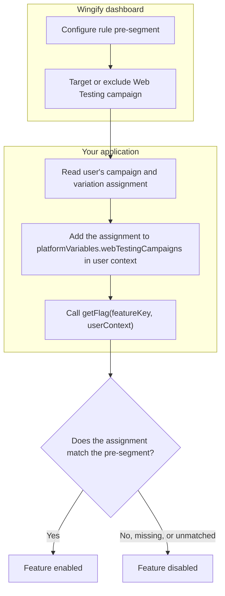

## **Overview**

Web Testing Pre-Segmentation lets a user be targeted based on their exposure to a **Web Testing** campaign and the variation assigned to them, thereby connecting two important platforms in the Wingify universe. It allows FE rules to be gated on, or exclude, visitors based on an in-flight Web Testing experiment, without an extra network round trip.

## **Key Features**

- Accepts the visitor's Web Testing assignment via context.platformVariables.webTestingCampaigns, as either a plain object or a JSON string
- As the web testing assignment is read via cookies, there is no network latency involved and hence response times are not affected
- Ensures that customers have the option to exclude users from becoming part of experiments from both frontend and backend

## **Enabling Web Testing Pre-Segmentation in FE**

- Configure the campaign's targeting segmentation in the app dashboard to use the campaignVariation operand for the Web Testing campaign ID(s) you want to gate on
- Inside the context object, populate platformVariables.webTestingCampaigns with the visitor's current Web Testing campaign → variation assignment
- You can do this manually, or you can use our sample scriptsamplescript to read the cookie dropped by the Web Testing product and pass on its values to the context object directly


<Image src="https://files.readme.io/d9b4973d4bd7bca547978d99be30a30bf1988b0f1a2596a23e30e6a7155d50df-Web_Testing_as_Pre-Segment.png" border={true} />


## **Usage**

```javascript
const context = {
  id: 'user-123',
  platformVariables: {
    // Map of Web Testing campaign ID -> assigned variation ID
    webTestingCampaigns: {
      123: '4',
      456: '1',
    },
  },
};
const flag = await wingifyClient.getFlag('feature-key', context);
```

## **Flow Diagram**



##

## **Context Field Reference**

| Field                                 | Type                                             | Required                                          | Description                                                                                                                                                            |
| :------------------------------------ | :----------------------------------------------- | :------------------------------------------------ | :--------------------------------------------------------------------------------------------------------------------------------------------------------------------- |
| platformVariables                     | Object                                           | No                                                | Namespaced container for platform-originated signals passed into the FE context                                                                                        |
| platformVariables.webTestingCampaigns | Record\<string, string \| number> or JSON string | Only if the campaign's DSL uses campaignVariation | Map of Web Testing campaign ID to the variation ID the visitor was assigned. Keys and values are coerced to strings; null/undefined values and empty keys are dropped. |

## **Script to read cookie value**

```javascript
/**
 * Reads Wingify cookies and returns a map of campaigns and variations.
 * @returns {Object} Example: { "122": "1", "130": "2" }
 */
function getWebTestingCampaigns() {
  const cookieVal = {};
  const nameRe = /^_vis_opt_exp_(\d+)_combi$/;
  const cookies = document.cookie ? document.cookie.split(";") : [];

  for (const entry of cookies) {
    const [name, value] = entry.split("=").map(s => s.trim());
    const match = nameRe.exec(name);

    if (match) {
      const campaignId = match[1];
      let decodedValue = decodeURIComponent(value);

      // Extracts the variation ID (the first numeric token)
      const variationId = (decodedValue.split(/[,\|:%]+/).find(t => /^\d+$/.test(t.trim())) || "").trim();
      if (variationId) cookieVal[campaignId] = variationId;
    }
  }
  return cookieVal;
}

```

## Script to send cookie value to FE UserContext

```javascript
/**
 * Sends the cookie value set by Web Testing product inside user context
 */
const userContext = {
  id: "user_123",
  platformVariables: {
    // cookie object scraped using helper script as above
    webTestingCampaigns: cookieVal
  }
};

const flag = await wingifyClient.getFlag("feature_key", userContext);

```