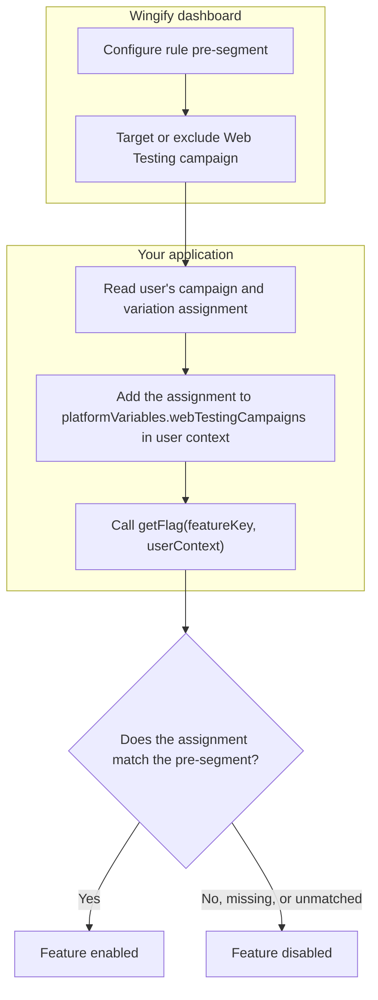

Pre-segment users based on their Web Testing campaign exposure and assigned variation.

## Overview

Web Testing Pre-Segmentation lets you target users based on their exposure to a **Web Testing** campaign and the variation assigned to them. This connects Feature Experimentation rules to an in-flight Web Testing experiment without an additional network round trip.

## Key features

- Accepts the visitor's Web Testing assignment through `context.platformVariables.webTestingCampaigns` as either a plain object or a JSON string.
- Reads the Web Testing assignment from cookies, so response times are not affected by network latency.
- Lets you exclude users from experiments across both frontend and backend targeting.

## Enable Web Testing Pre-Segmentation in FE

1. Configure the campaign's targeting segmentation in the dashboard to use the `campaignVariation` operand for the Web Testing campaign ID or IDs you want to gate on.
2. Populate `platformVariables.webTestingCampaigns` in the context object with the visitor's current Web Testing campaign-to-variation assignments.
3. Add the assignments manually, or use the sample script below to read the cookie created by Web Testing and pass its values directly to the context object.


## Usage

```javascript
const context = {
  id: 'user-123',
  platformVariables: {
    // Map of Web Testing campaign ID to assigned variation ID.
    webTestingCampaigns: {
      123: '4',
      456: '1',
    },
  },
};

const flag = await wingifyClient.getFlag('feature-key', context);
```

## Flow diagram



## Context field reference

| Field | Type | Required | Description |
| :--- | :--- | :--- | :--- |
| `platformVariables` | Object | No | Namespaced container for platform-originated signals passed into the FE context. |
| `platformVariables.webTestingCampaigns` | `Record<string, string \| number>` or JSON string | Only if the campaign's DSL uses `campaignVariation` | Map of Web Testing campaign ID to the variation ID assigned to the visitor. Keys and values are converted to strings; `null`, `undefined`, and empty keys are removed. |

## Read Web Testing cookie values

```javascript
/**
 * Reads Wingify cookies and returns a map of campaigns and variations.
 * @returns {Object} Example: { "122": "1", "130": "2" }
 */
function getWebTestingCampaigns() {
  const cookieVal = {};
  const nameRe = /^_vis_opt_exp_(\d+)_combi$/;
  const cookies = document.cookie ? document.cookie.split(";") : [];

  for (const entry of cookies) {
    const [name, value] = entry.split("=").map(s => s.trim());
    const match = nameRe.exec(name);

    if (match) {
      const campaignId = match[1];
      let decodedValue = decodeURIComponent(value);

      // Extract the variation ID from the first numeric token.
      const variationId = (
        decodedValue
          .split(/[,\|:%]+/)
          .find(t => /^\d+$/.test(t.trim())) || ""
      ).trim();

      if (variationId) {
        cookieVal[campaignId] = variationId;
      }
    }
  }

  return cookieVal;
}
```

## Send cookie values to the FE user context

```javascript
const cookieVal = getWebTestingCampaigns();

const userContext = {
  id: "user_123",
  platformVariables: {
    // Use the campaign-to-variation map read from Web Testing cookies.
    webTestingCampaigns: cookieVal,
  },
};

const flag = await wingifyClient.getFlag("feature_key", userContext);
```
