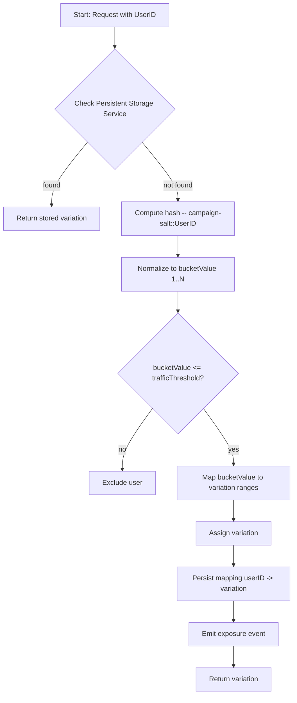

At a high level, bucketing in VWO means once a user is identified, determining if they are eligible for a campaign, then assigning them deterministically to one of the campaign’s variations based on traffic allocation. Once assigned, the same variation should be returned for that user across sessions (and platforms) as long as the setup remains unchanged.

### Step 1: Identifying the User

Before any bucketing logic can run, the SDK requires a consistent User ID (or equivalent identifier) to operate on.

* This is usually the user’s unique identifier in your system (for example, `user-12345`).
* It must remain constant across sessions and platforms for proper consistent bucketing.
* If you use varying IDs (e.g., session IDs, anonymous IDs that change frequently), you risk inconsistent variation assignments.
* Recommendation: use a stable, logged-in user ID or a persistent device/visitor ID if anonymous.

 

### Step 2: Campaign Eligibility

Once a user is identified, the SDK checks whether they are eligible for the campaign. This involves two major sub-steps:

#### 2.1 Percent-Traffic Setting

* Each campaign has a _percentage of traffic_ setting (0 %–100 %) that defines what fraction of the audience will enter the experiment/flag.
* The SDK computes a normalized hash value (derived from the user ID) mapped to a 0–100 scale.
* If the `normalized value ≤ the campaign’s traffic percentage`, user enters the campaign. Otherwise, they are excluded.
* Example: If campaign traffic is set to 40 % and the user’s normalized value is 23, the user is eligible (23 ≤ 40).
  developers.wingify.com
* If their normalized value were, say, 45, they would be excluded.

#### 2.2 Variation Bucket Allocation Only for Eligible Users

If the user is deemed eligible (via the percent-traffic check), the next step is to map them into a variation via the bucket allocation logic (see Step 3).
If excluded, the SDK will treat them as “not in the campaign” — typically showing default/control behavior.

 

### Step 3: Bucketing / Variation Assignment

Once a user is eligible, the SDK must map the user to a variation in a deterministic way. The mechanism used by VWO is outlined as follows:

#### 3.1 Hashing + Normalisation

* A hashing algorithm (specifically MurmurHash) is applied to the User ID to generate a hash value.
  developers.wingify.com
* This hash value is then normalized to fit within the bucket range domain (1 through 10,000).
  * Why `1–10,000`? Using a large integer range allows fine-grained traffic splits and stable arithmetic logic.
* Example: Suppose the normalized integer is `6,278`.

#### 3.2 Bucket Range Definition Based on Traffic Distribution

* For each variation in the campaign, the UI/configuration defines a traffic distribution (for example, Control 40 %, Variation-1 60 %).
* These percentages map to bucket-ranges within 1–10,000.
  * Control → buckets 1-4,000
  * Variation-1 → buckets 4,001-10,000
* The SDK checks which range the user’s normalized value falls into.

| **Variation Name** | **Bucket Range** |
| ------------------ | ---------------- |
| Control            | 1 - 4,000        |
| Variation-1        | 4,001 - 10,000   |

#### 3.3 Assigning Variation

* Continuing the example: user normalized value is 6,278 → which falls into 4,001–10,000 → assign Variation-1.
* This assignment is deterministic as long as the User ID and campaign settings remain unchanged.

 

### Step 4: Ensuring Consistency (Sticky Bucketing)

It is critical that once users are assigned a variation, they continue to see that variation (especially for multi-session/multi-platform experiences). Inconsistent variation assignments can invalidate experiment results and frustrate users.

#### 4.1 What Causes Re-Bucketing?

Re-bucketing (users getting different variation assignments) can occur if any of the following change:

* The campaign’s variation list is modified (e.g., adding/removing a variation).
* The traffic distribution splits are altered (for example, switching from 40/60 to 30/70).

#### 4.2 How to Prevent/Reinforce Sticky Bucketing

* Use a storage service or caching layer to persist the mapping of “User ID → variation” as soon as the variation is assigned.
* On subsequent SDK calls, first check the local store: if the mapping exists, return the stored variation immediately, bypassing hash+bucket logic.
* This approach ensures consistency even when campaign settings are modified mid-run (though best practice is to avoid changing settings once the campaign is live).

<Callout icon="📘" theme="info">
  **Note**: VWO SDKs support implementing this storage layer; ensure your integration includes this to avoid unwanted variation flips.
</Callout>

 

### Flow Diagram

Visualizes the entire bucketing flow from user identification to variation return, highlighting decision points such as sticky storage lookup, eligibility check, and persistence.

