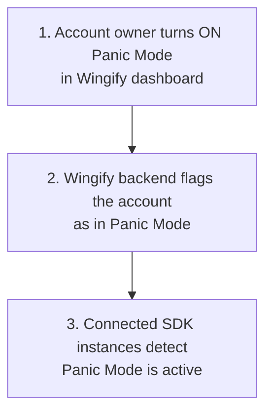

# Panic Mode

## Overview

Its an account-wide (account and environment specific) kill switch, which when turned on from the Wingify dashboard, forces every SDK to stop evaluating campaigns and feature flags, and instead return safe, default behavior. This protects the customer application without requiring any code change or redeploy.

## Key Features

> - **One-click activation** from the Wingify dashboard — no code deploy or SDK restart needed
>
> * **Applies instantly, account-wide (account and environment specific)** — every connected SDK instance detects the change on its own
>
> - **Safe fallback behavior** — while Panic Mode is active, feature flag calls return their default/fallback state, so application keeps running rather than erroring out or serving broken experiment variations
>
> * **Quiet in the background** — the SDK checks in periodically with Wingify to know the instant Panic Mode is lifted, without adding any noticeable overhead to the application.
>
> - **Automatic recovery** — the moment Panic Mode is turned off in the dashboard, the SDK resumes normal operation on its own. No manual restart of your app or SDK is required.
>
> * **Pairs with Force Refresh** (see Part 2) to make sure the SDK is working off the latest configuration the moment it comes back online.

## Enabling Panic Mode

> - Go to Websites and Apps - SDK Settings and for the required environment, click on Disable SDK
> - Every connected SDK instance detects this automatically — there is nothing to change in your codebase.
> - When the issue is resolved, click on Enable SDK from the same screen to let your application resume normal experimentation.


<br />

### What The Application Experiences

|                SDK behavior                |                                    While Panic Mode is ON                                   |
| :----------------------------------------: | :-----------------------------------------------------------------------------------------: |
| Feature flag evaluation (e.g. `getFlag()`) | Returns the flag's default/fallback state immediately — no campaign or targeting logic runs |
|            Event tracking calls            |    Held back — no experiment/tracking data is sent to Wingify while Panic Mode is active    |
|      SDK initialization / usage events     |                                            Paused                                           |
|      Background check-ins with Wingify     |           Continue quietly, so the SDK knows the instant Panic Mode is turned off           |

##

## Flow Diagram

#### Part 1: Enable Panic Mode



Part 2: SDK Behaviour and Recovery

\<mermaid

***

# Force Refresh

## Overview

Under normal conditions, the SDK refreshes its local copy of the account's campaigns, feature flags, and settings on a regular polling interval. Force Refresh lets Wingify tell the SDK to skip the wait and fetch the latest configuration immediately. This is very helpful when an urgent change in the configuration needs to be sent to the SDKs immediately.

## Key Features

> - **Bypasses the normal polling wait** — the SDK fetches the latest settings as soon as a refresh signal is received, instead of waiting out the rest of its polling interval.
>
> * **Fully automatic** — there is nothing to configure or call from the code; it's triggered by Wingify whenever an instant update is needed.
> * **Runs automatically after Panic Mode clears** — so the application comes back online with fully up-to-date experiment configuration, not a stale cached copy from before the incident.
> * **Non-disruptive** — refreshing settings happens in the background and does not block or delay in-flight flag evaluations or tracking calls.
> * **Safe under rapid changes** — if several refresh signals arrive in quick succession, the SDK avoids redundant fetches and always settles on the latest configuration, even if signals arrive out of order.

## Enabling Force Refresh

> - Go to Websites and Apps - SDK Settings and for the required environment, click on Force SDK Refresh
> - Every connected SDK instance detects this automatically — and fetches the latest settings from Wingify server
> - To prevent multiple unnecessary fetches for the SDKs, once the Force Refresh button is clicked, it freezes the state for 5 minutes, which means, the next Force Refresh can only be enabled after that duration
> - There is no explicit turning off Force Refresh


<br />

## Flow Diagram _(displayed as Mermaid diagram in dev docs)_

A\["Urgent change on Wingify's side\n(e.g. Panic Mode cleared, or an urgent\ndashboard update)"] --> B\["Wingify sends a refresh signal\nto connected SDK instances"]

B --> C\["SDK fetches latest settings\nimmediately, without waiting\nfor the next poll"]

C --> D\["SDK's local configuration\nis now fully up to date"]

D --> E\["getFlag() / tracking calls continue\nusing the refreshed configuration"]

```mermaid
A["Urgent change on Wingify's side\n(e.g. Panic Mode cleared, or an urgent\ndashboard update)"] --> B["Wingify sends a refresh signal\nto connected SDK instances"]

B --> C["SDK fetches latest settings\nimmediately, without waiting\nfor the next poll"]

C --> D["SDK's local configuration\nis now fully up to date"]

D --> E["getFlag() / tracking calls continue\nusing the refreshed configuration"]

```

***

# How Panic Mode and Force Refresh Work Together

These are two distinct features, but they're designed to complement each other during an incident:

1. **Panic Mode** ON — application immediately falls back to safe default behavior, account-wide (account and environment specific)
2. Once the issue is resolved, **Panic Mode** turned OFF from the dashboard.
3. SDK detects Panic Mode has cleared and automatically triggers **Force Refresh**, fetching latest settings immediately instead of waiting for next scheduled poll
4. Application resumes normal experimentation with fully up-to-date configuration — no manual restart, redeploy, or code change needed at any step.
