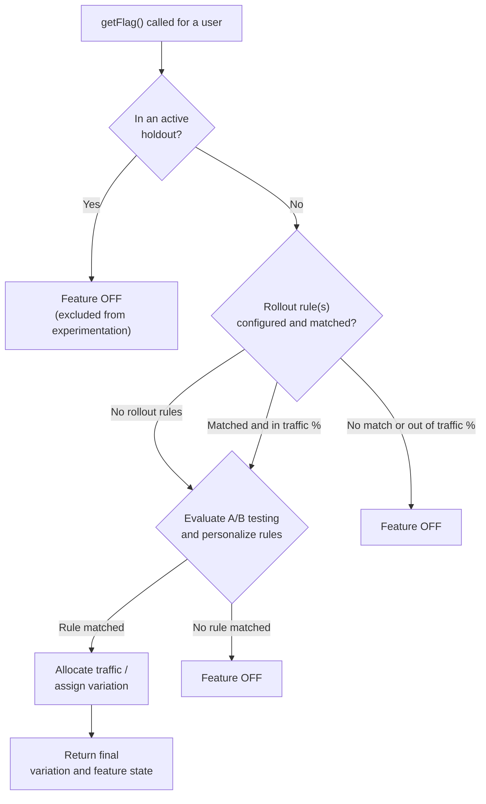

When you call `getFlag`, the SDK evaluates holdouts and feature rules to determine whether a feature is enabled and which variation, if any, a user receives.

## Overview

Feature-flag evaluation answers two questions:

1. Is the feature enabled for this user?
2. Which variation should the user see, if applicable?

The outcome depends on the rules configured for the feature, their order in the dashboard, and controls such as holdouts and Force Users (whitelisting).

## Types of rules

| Rule type | What it does |
| --- | --- |
| **Rollout** | Provides a simple on/off gate. A configured percentage of matching users receives the feature. Use rollouts to gradually release a feature. |
| **A/B and multivariate testing** | Splits qualifying traffic across two or more variations so you can compare their performance. |
| **Personalize** | Delivers a custom experience to a targeted percentage of a defined audience segment. |

You can combine rollout rules with A/B testing and/or personalize rules in a feature.

## Order of evaluation

For every `getFlag` call, Wingify evaluates rules in the following order. Evaluation stops as soon as the user's outcome is determined, and later rules are skipped.

1. **Check for a holdout.**
   - If the feature flag is connected to an active holdout, Wingify evaluates the user for the holdout before any feature rule.
   - If the user is assigned to the holdout, Wingify does not evaluate any rules and the user does not become part of the feature.

2. **Evaluate rollout rules.**
   - Wingify checks rollout rules from top to bottom in the order they appear in the dashboard.
   - For each rule, Wingify first evaluates audience targeting. If the user matches the audience, Wingify then uses the rule's traffic percentage for the final decision.
   - If the user passes both checks, they become part of the rollout rule.
   - After a user matches a rollout rule's audience, Wingify does not evaluate them against any other rollout rule—even if they are outside that rule's traffic allocation.

3. **Evaluate A/B testing, multivariate testing, and personalize rules.**
   - Wingify evaluates these rules only when the feature has no rollout rules, or when the user became part of a rollout rule.
   - Wingify checks these rules from top to bottom in the order they appear in the dashboard.
   - For each rule, Wingify first evaluates audience targeting. If the user matches the audience, Wingify then uses the rule's traffic percentage for the final decision.
   - If the user passes both checks, they become part of the rule:
     - For an A/B testing rule, Wingify assigns a variation from the variations connected to that rule.
     - For a personalize rule, Wingify assigns the variation associated with the rule.
     - For a multivariate testing rule, Wingify assigns a combination from the combinations connected to that rule.
   - After a user matches a rule's audience, Wingify does not evaluate them against any other testing or personalize rule—even if they are outside that rule's traffic allocation.

<Callout icon="fa-info-circle" theme="info">
If a feature has rollout rules, they act as a gate: a user must become part of a rollout rule before Wingify evaluates testing and personalize rules. If the feature has no rollout rules, Wingify evaluates testing and personalize rules directly.
</Callout>

## Exceptions and special cases

### Holdouts

A holdout reserves a percentage of user traffic as a **control group that never becomes part of any feature**. When a user becomes part of a holdout, Wingify does not evaluate them for any rule and disables the feature flag for that user.

### Whitelisting (forced variation)

Whitelisting forces specific users into a rollout or personalize rule, or into a specific variation of a testing rule. QA teams and internal stakeholders commonly use it to view a particular variation regardless of normal targeting or traffic-allocation rules.

When a user is eligible for whitelisting, Wingify does not evaluate them against other rules and directly makes them part of the whitelisted rule.

### Optional: Mutually Exclusive Groups

Mutually Exclusive Groups (MEGs) use a different evaluation flow and are documented separately.