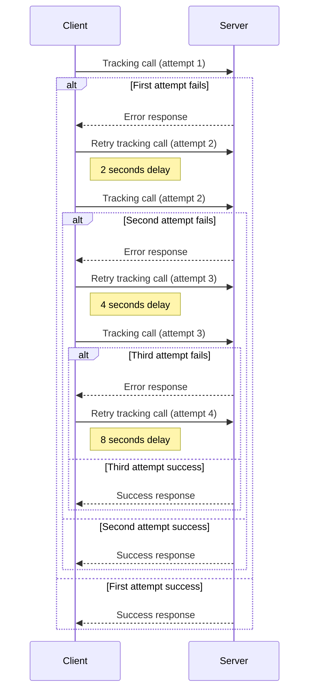

## Overview

The SDK includes an automatic retry feature for failed network requests. If a tracking call fails, it will be retried with increasing delays. This helps make the system more reliable by reducing the chance of overload during temporary issues.

## Key Features:

* **Exponential Backoff**: Failed tracking calls are retried with progressively increasing delays between each attempt.
* **Maximum Retries**: The system will retry a failed request up to **3 times**.
* **Initial Delay**: The retry delay starts at **2 seconds**, with subsequent delays doubling each time (**4 seconds** and **8 seconds**).

## How It Works

1. **Initial Request**: When a tracking call is made, the SDK will attempt to send the request.
2. **Failure Detection**: If the tracking call fails (due to a network issue, timeout, etc.), the SDK will initiate the retry process.
3. **Retry Attempts**:
   1. **First Retry**: If the request fails, the SDK will wait for **2 seconds** before retrying.
   2. **Second Retry**: If the request fails again, the SDK will wait for **4 seconds** before retrying.
   3. **Third Retry**: If the request fails once more, the SDK will wait for **8 seconds** before the final retry attempt.
4. **Max Retries Reached**: If all retry attempts fail, the request will be abandoned, and the failure will be logged.

 

## Benefits

* **Improved Reliability**: The retry mechanism automatically handles temporary failures, ensuring higher success rates for tracking requests.
* **Reduced Load on Servers**: By spacing out retry attempts, the load on both the client and server is minimized.
* **Automatic Recovery**: The SDK intelligently retries requests without requiring manual intervention.