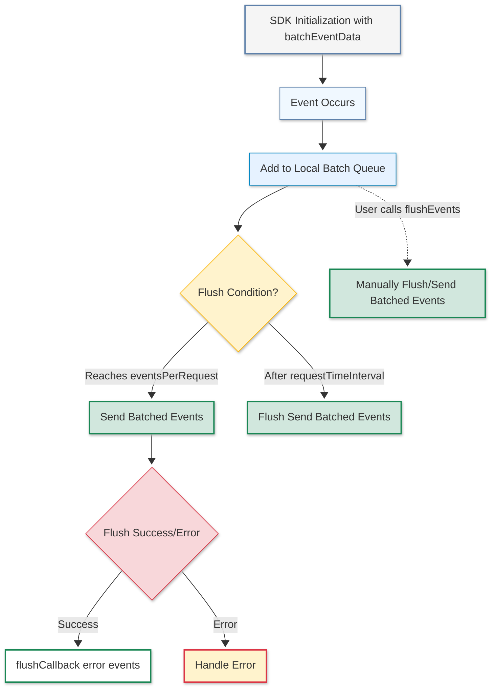

# Configuring Event Batching in VWO FME Node SDK

VWO FME Node SDK introduces a powerful mechanism to manage event batching for tracking visitors and conversions. Event Batching optimizes the way data is sent to VWO servers, allowing multiple events to be queued and dispatched together in a single network request. This leads to better performance and more efficient tracking, especially when handling a high volume of events.

## What is Event Batching?

Event Batching enables the SDK to collect events over a period of time, place them in a queue, and send them to the VWO servers in one batch. For example, if there are 4,000 events, the SDK will queue these events and dispatch them in a single network request, significantly reducing the overhead caused by sending individual requests for each event.

* **Key Points:**
  * Event Batching tracks multiple events for a single user session, sending them together in a single request.
  * Events are queued and dispatched when a threshold is met in terms of the number of events or the time interval.
  * Batch processing helps optimise network usage and server load.

## Configuring Event Batching

To enable Event Batching, you need to configure batchEventData during the SDK initialization. This allows you to specify the parameters for how events should be batched and dispatched to VWO servers.

### Configuration Options:

1. **Events per Request (eventsPerRequest) :**\
   This option specifies the maximum number of events that will be batched together in a single network request. Events accumulate in the queue until this number is reached.
2. **Request Time Interval (requestTimeInterval):**\
   This option sets the time interval (in seconds) after which the events in the queue are dispatched to the VWO server. The timer begins when the first event is added to the queue.
3. **Flush Callback (flushCallback):**\
   This option allows you to specify a callback function that will be executed after events are flushed to the VWO servers. The callback receives two parameters:
   1. error: If an error occurs during the flush.
   2. events: The events that were successfully flushed.

```javascript
const vwoClient = await init({
  accountId: '123456',
  sdkKey: '32-alpha-numeric-sdk-key',
  batchEventData: {
    eventsPerRequest: 1000, // Set the number of events per request
    requestTimeInterval: 300, // Flush events every 5 minutes
    flushCallback: (error, events) => {
      if (error) {
        console.log('Error flushing events:', error);
      } else {
        console.log('Events flushed successfully:', events);
      }
    },
  },
});

vwoClient.flushEvents();

```

> 🚧 Note
>
> * The maximum number of events that can be queued is 5000.
> * The default time interval is 600 seconds (10 minutes), in case of invalid time interval is passed.

> 📘 Important Note
>
> **Event Timing:** The timer starts when the first event is added to the queue. If the time interval expires before the event count reaches the eventsPerRequest threshold, the events are dispatched anyway.
>
> **Manual Flushing:** You can trigger the dispatch of events before the batch limit or time interval is reached by manually calling the flushEvents() method.

<Table align={["left","left","left"]}>
  <thead>
    <tr>
      <th>
        Parameter
      </th>

      <th>
        Type
      </th>

      <th>
        Description
      </th>
    </tr>
  </thead>

  <tbody>
    <tr>
      <td>
        **eventsPerRequest**
        *Optional*
      </td>

      <td>
        Number
      </td>

      <td>
        Maximum number of events to batch together before sending to the server
      </td>
    </tr>

    <tr>
      <td>
        **requestTimeInterval**
        *Optional*
      </td>

      <td>
        Number
      </td>

      <td>
        Time interval (in seconds) after which events are flushed to the server
      </td>
    </tr>

    <tr>
      <td>
        **flushCallback** *Optional*
      </td>

      <td>
        Function
      </td>

      <td>
        Callback function to be executed after events are flushed. Receives error and events parameters.
      </td>
    </tr>
  </tbody>
</Table>

## Flushing Events Manually (Flush Events API)

In some situations, events can be sent immediately, before the batch size or time interval is reached. This can be done using the flushEvents() method, which manually triggers the event dispatch.

```javascript
const vwoClient = await init({
  accountId: '123456',
  sdkKey: '32-alpha-numeric-sdk-key',
  batchEventData: {
    eventsPerRequest: 1000, // Set the number of events per request
    requestTimeInterval: 300, // Flush events every 5 minutes
  },
});

vwoClient.flushEvents();

```

## Advantages of Event Batching:

1. **Efficiency:** Reduces the number of network requests by grouping events together, minimizing overhead.
2. **Flexibility:** Customize batch size or time interval to suit your application’s needs.
3. **Optimized Data Transmission:** Common event properties are only sent once per batch, reducing overall data transfer.
4. **Manual Event Flushing:** The ability to flush events manually ensures no data is lost and reports are updated in real-time.

<br />

