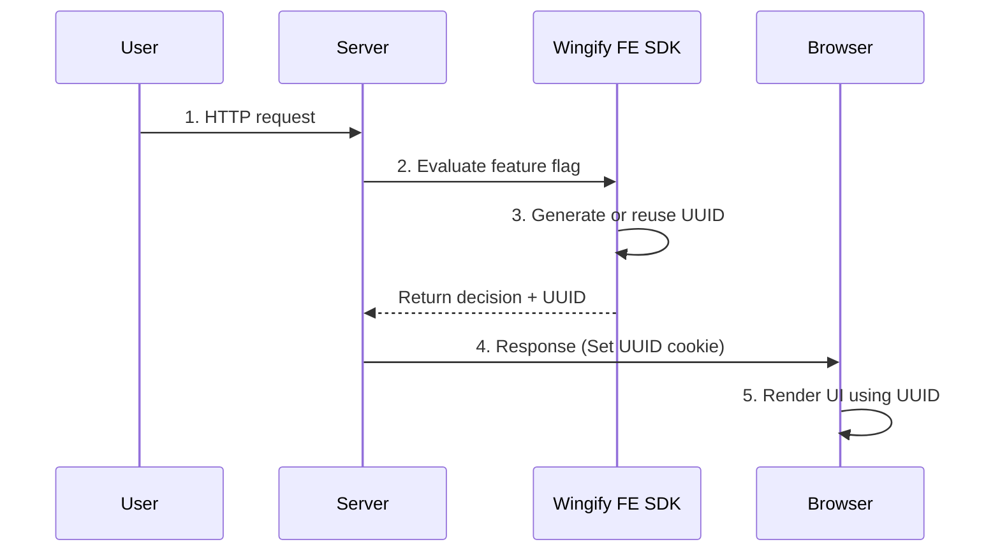
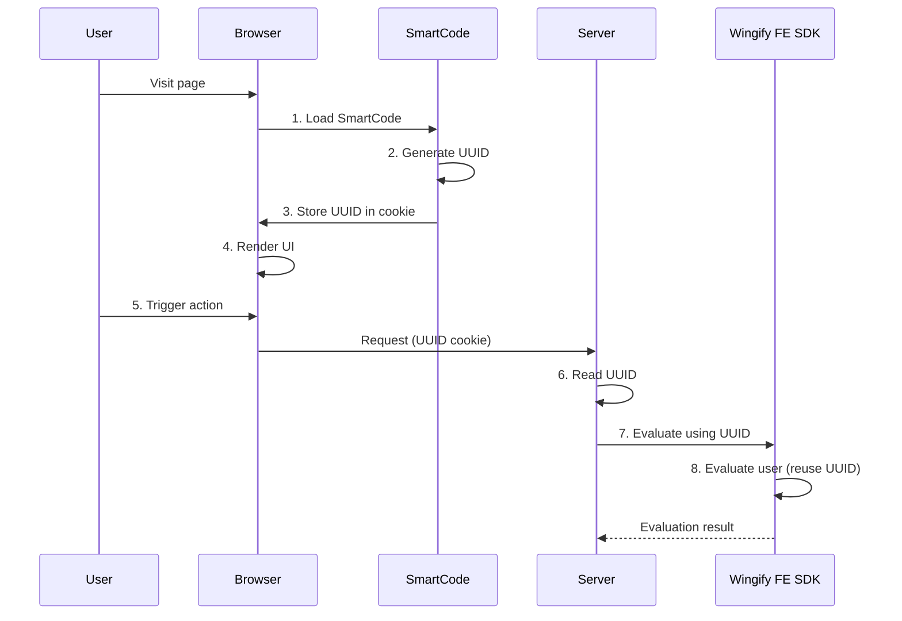
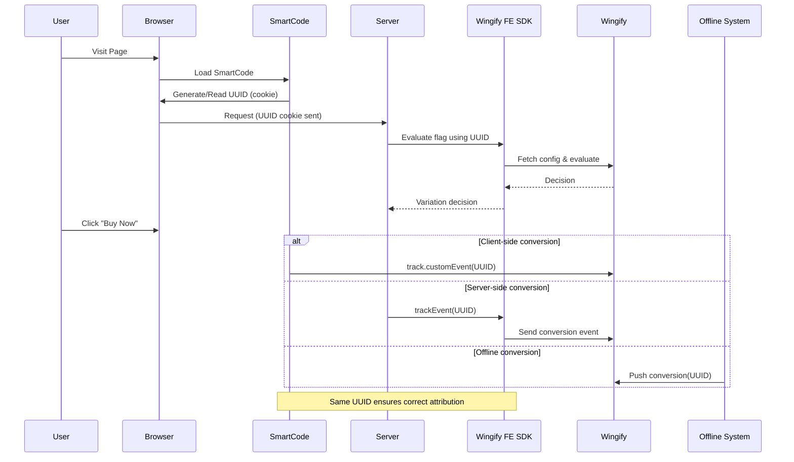

Conversion tracking in a connected Wingify architecture relies on one fundamental requirement:

> The same UUID must be used at the time of conversion as was used at the time of bucketing.

If identity is consistent across client and server layers, conversions can be attributed accurately across:

* Feature Experimentation (FE)
* Wingify Web Testing
* Wingify Web Insights
* Offline systems (CRM, POS, backend billing, etc.)

This section explains how conversion tracking works in both FE-first and Client-first architectures, and how offline conversions fit into the model.

### Conceptual Flow of a Connected Conversion

Let’s start with a simple system-level example:

1. FE SDK evaluates the user.
2. Server renders content based on flag decision.
3. Browser loads page (SmartCode may also evaluate visual experiments).
4. User clicks a “Buy Now” button.
5. Conversion event is fired.
6. Event is attributed using the same UUID that was used for bucketing.

If UUID continuity is maintained, attribution works across products.

### FE-First Conversion Flow

This flow is common in:

* Backend-rendered applications
* Authenticated SaaS products
* API-first architectures

#### Identity and Rendering

1. User request hits the server.
2. FE SDK evaluates the feature flag.
3. FE SDK generates (or reuses) a UUID.
4. Server sets UUID in cookie.
5. Client-side renders UI using this UUID.



At this point:

* Server-side experiment decision is locked.
* Client-side SmartCode reads the same UUID.
* Identity is unified.

### Client-Side-First Conversion Flow

This flow is common in:

* Marketing websites
* Anonymous traffic
* SEO landing pages
* Static web deployments

#### Identity and Rendering

1. SmartCode loads first.
2. SmartCode generates a UUID.
3. UUID stored in cookie.
4. UI renders.
5. User action triggers a server call.
6. Server reads UUID from cookie.
7. Server passes UUID into FE SDK.
8. FE evaluates the user based on the client-generated UUID.



Now:

* Client and server are aligned.
* Identity is unified.

### Conversion Trigger

Now, assume a button click occurs.

There are three supported ways to track the conversion:

1. Client-Side Custom Event API (Web Testing)
2. Method 2: FE SDK `trackEvent` API
3. Offline Conversion Tracking

#### Method 1: Client-Side Custom Event API (Web Testing)

Conversion is triggered via SmartCode custom event API on the webpage.

Example:

```html
<script>
// Do not change anything in the following two lines
window.VWO = window.VWO || [];
VWO.event = VWO.event || function () {VWO.push(["event"].concat([].slice.call(arguments)))};

// Replace the property values with your actual values
VWO.event("REPLACE_WITH_ACTUAL_EVENT_API_NAME", {
  "property1": "<text_value>",
  "property2": <number_value>,
});
</script>
```

Use this when:

* Conversion is purely UI-driven
* Marketing or CRO teams manage events
* You want conversion tracked within Web Testing

Since SmartCode is already using the UUID from cookie, attribution remains consistent.

#### Method 2: FE SDK trackEvent API

Conversion is tracked server-side using FE SDK.

Example (Node.js):

```javascript
wingifyClient.trackEvent('REPLACE_WITH_ACTUAL_EVENT_API_NAME', {
  id: uuidFromCookie
});
```

Use this when:

* Conversion is backend-confirmed (e.g., payment success)
* You want authoritative server validation
* You want conversion tied directly to FE experiment logic

Because the same UUID is passed, attribution aligns with earlier bucketing.

#### Method 3: Offline Conversion Tracking

Conversions may occur outside the web session:

* In-store purchase
* Call-center sale
* CRM lifecycle update
* Subscription upgrade via billing system

If the same UUID is stored in your backend systems, it can be sent later via Wingify Data360 offline conversion APIs.

Reference: [How to Track Offline Conversions Using Wingify Data360](https://help.vwo.com/hc/en-us/articles/25754666953241-How-to-Track-Offline-Conversions-Using-VWO-Data360)

Offline conversion tracking works seamlessly in a connected system.

**Requirements:**

* Store UUID alongside user record (CRM / DB)
* Use same UUID in offline event payload
* Ensure UUID originally used during evaluation

This enables:

* Web experiment attribution
* Feature flag attribution
* Full journey visibility
* Revenue mapping across touchpoints

<Callout icon="📘" theme="info">
  Note: As long as the UUID matches the one used during evaluation, attribution remains accurate across FE and Web Testing.
</Callout>

### Conversion Flow Architecture Diagram

Below is a unified conversion flow showing both evaluation and tracking stages across systems.



### Critical Requirement: Conversion After Identity Sync

Conversion tracking should only occur after successful visitor synchronization across layers.

If conversion fires:

* Before the UUID is shared,
* Or before the server reuses the client UUID,
* Or before FE SDK evaluation uses the correct identity,

Then attribution may fragment.