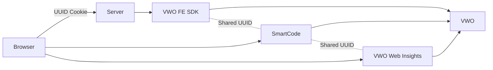

Beyond experimentation and conversion tracking, VWO Web Insights adds behavioral analytics capabilities such as:

* Session Recordings
* Heatmaps
* Funnel Analysis
  -Visitor-level analysis

When the `UUID` is consistent across:

* Web Testing
* Feature Experimentation
* Web Insights

You unlock a powerful capability:

> You can directly correlate experiment variations with actual user behavior.

### Why UUID Consistency Matters for Insights

If UUID is shared across products:

* A visitor bucketed into Variation B (client-side test)
* Or exposed to Feature Flag ON (server-side experiment)

Can be:

* Filtered inside Web Insights
* Viewed through session recordings
* Analyzed via heatmaps
* Compared across variations

Without shared UUID:

* Session recordings cannot be reliably tied to experiment variations
* Heatmap segmentation becomes inaccurate
* Behavioral debugging becomes fragmented

 

## Summary

When UUID is unified:

| Product                 | Role                    | What It Tracks                |
| ----------------------- | ----------------------- | ----------------------------- |
| Web Testing             | Client-side experiments | UI variation exposure         |
| Feature Experimentation | Server-side experiments | Business logic exposure       |
| Web Insights            | Behavioral analytics    | Session recordings & heatmaps |

Because UUID is identical:

* Exposure → Behavior → Conversion
* Are all tied to the same visitor profile.

### With all three systems connected:

This architecture enables system-wide experimentation, not just UI testing.

* Web Testing experiments UI behavior
* Feature Experimentation controls application logic
* `UUID` is the binding identity
* Cookies are the transport mechanism
* Two-way identity propagation is supported
* VWO Web Insights unifies analytics across layers

 

## Integration with VWO Mobile Insights

<Callout icon="📘" theme="info">
  Refer this [article](https://developers.wingify.com/v2/docs/fme-integrations-vwo-insights-mobile)  to know the details.
</Callout>
