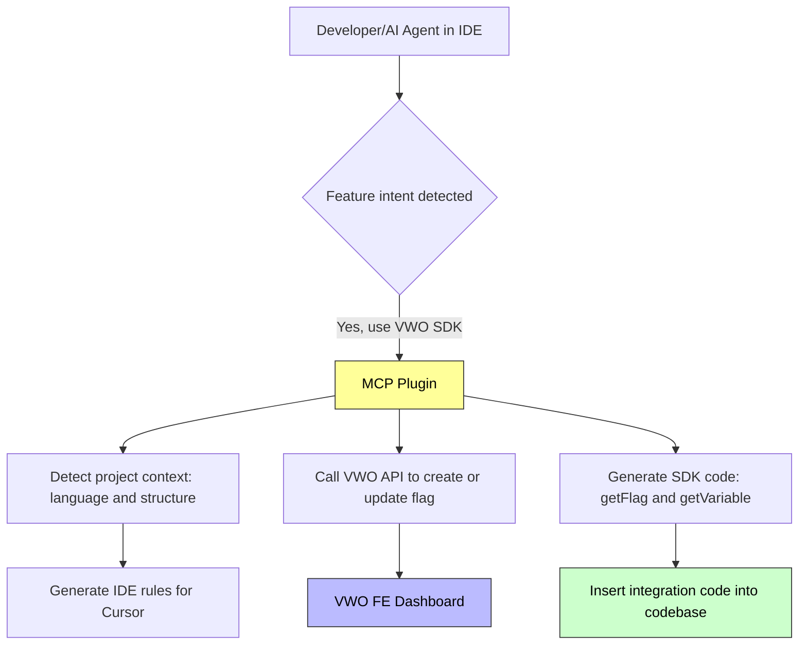

## Introduction

The **VWO FE MCP Server** serves as a seamless bridge between your development environment and VWO’s Feature Experimentation. It enables effortless feature flag management by integrating directly with AI-powered IDEs, allowing you to control and optimize feature releases without disrupting your coding workflow.

### Key Features

* **AI Assistant Integration**: Compatible with tools such as `Cursor`, `VS Code`, and `Claude`.
* **Feature Flag Management**: Enables the creation, reading, updating, and deletion of feature flags.
* **Environment Control**: Offers flexibility to enable or disable features in different environments.
* **Cursor Rule Setup**: Bootstrapping simplifies the configuration of Cursor rules to deliver contextual results and integrate with the SDK

This is ideal for developers who want to manage feature flags efficiently within their IDEs.

<br />

## Required Configuration

To connect the MCP server to the VWO feature experimentation system, you must configure two essential environment variables:

* **VWO_ACCOUNT_ID**: VWO Account ID.
* **VWO_API_KEY**: The API key (Developer Token) for authenticating with VWO REST APIs.

> To create your developer token, please refer to the article <Anchor label="How to Access VWO API" target="_blank" href="https://help.vwo.com/hc/en-us/articles/360020559993-How-to-Access-VWO-API">How to Access VWO API</Anchor> and navigate to the `Generate API Tokens` section for step-by-step instructions.

<br />

## Setup Instructions

To begin using the **VWO MCP server** with your client, follow the setup instructions below for popular tools.

### Cursor

1. Open **Cursor Settings** and navigate to the **MCP** section.
2. Click on **Add new global MCP server**.
3. Add the following configuration in `mcp.json`, ensuring that you replace the placeholder values with your actual credentials:

```json
{
  "mcpServers": {
    "vwo-mcp-server": {
      "command": "npx",
      "args": ["-y", "vwo-fme-mcp@latest"],
      "env": {
        "VWO_ACCOUNT_ID": "VWO_ACCOUNT_ID",
        "VWO_API_KEY": "VWO_API_KEY"
      }
    }
  }
}

```

4. Save the configuration and confirm that the server status turns green, indicating it's active.

<Image align="center" border={true} caption="VWO FE MCP Server Setup in Cursor" src="https://files.readme.io/2e318235298fb03b366a67dde23975d50a403f6329000980b364ad7df59497f8-fme-_mcp_cusror_setup.gif" />

> 📘 Note:
>
> If the MCP stays red after being turned on, ensure that you have **Node.js** installed, as the MCP requires **npx** to install the package. To confirm this, run `npx -v`. If you get an error saying the `npx: command not found`, then install **Node.js** and check again. If you get the correct version of npx, restart the cursor and try turning on the MCP again.

<br />

> You can add the VWO FE MCP Server by simply clicking the button below. Make sure to update the VWO_ACCOUNT_ID and VWO_API_KEY environment variables before you start using it.

<br />

<HTMLBlock>{`
<a href="cursor://anysphere.cursor-deeplink/mcp/install?name=VWO-fme-mcp&config=eyJlbnYiOnsiVldPX0FDQ09VTlRfSUQiOiJWV09fQUNDT1VOVF9JRCIsIlZXT19BUElfS0VZIjoiVldPX0FQSV9LRVkifSwiY29tbWFuZCI6Im5weCAteSB2d28tZm1lLW1jcEBsYXRlc3QifQ%3D%3D" target="_blank">
  
</a>
`}</HTMLBlock>

***

### VS Code

1. Open the **User Settings (JSON)** in VS Code.
2. Add or update the MCP server configuration as follows:

```json
"mcp": {
  "servers": {
    "vwo-mcp-server": {
      "command": "npx",
      "args": ["-y", "vwo-fme-mcp@latest"],
      "env": {
        "VWO_ACCOUNT_ID": "VWO_ACCOUNT_ID",
        "VWO_API_KEY": "VWO_API_KEY"
      }
    }
  }
}
```

3. Save the settings and ensure the MCP server is ready for use within VS Code.

<Image align="center" border={true} caption="VWO FE MCP Server Setup in VS Code" src="https://files.readme.io/351699fdc6e3c335f4b87f32eeaf204faca01600eda6fafc5291ab1464353da7-VWO_VS_Code_MCP.gif" />

***

### Claude Desktop

1. Open the **Settings** menu and navigate to the **Developer** section.
2. Click on **Edit Config** to open the `claude_desktop_config.json` file.
3. Add the following configuration (replacing placeholders with actual credentials):

```json
{
  "mcpServers": {
    "vwo-mcp-server": {
      "command": "npx",
      "args": ["-y", "vwo-fme-mcp@latest"],
      "env": {
        "VWO_ACCOUNT_ID": "VWO_ACCOUNT_ID",
        "VWO_API_KEY": "VWO_API_KEY"
      }
    }
  }
}
```

4. Save the file and restart Claude Desktop. Once the server is active, a hammer icon will appear in the chat window.

<Image align="center" border={true} caption="VWO FE MCP Server Setup in Claude" src="https://files.readme.io/5f8166e22cf8760d4ffde73bca3e88a89d6f81720668864062a9e77bbb0d11bc-VWO_Claude_MCP.gif" />

<br />

> 📘 Looking for other AI Clients?
>
> For other clients, refer to their documentation on configuring custom MCP servers. The configuration pattern remains similar.

<br />

## Available tools

Here's what you can do with our feature flag management tools:

### IDE Configuration with VWO

1. **Add VWO Rules** - Retrieve IDE rules and configuration settings to seamlessly manage feature flags within your project. This enables smooth integration with your SDK and leverages VWO's feature experimentation capabilities.

> Note: Supports both Cursor IDE and VS Code. The tool automatically detects your IDE or you can specify it manually. Needs to be called once after setting up VWO FE MCP.

* **Cursor IDE**: Creates rules in `.cursor/rules/vwo-feature-flag-rule.mdc`
* **VS Code**: Creates instructions in `.github/instructions/vwo-fme.instructions.md`

### Feature Flags

1. **Create Feature Flag With Defaults** - Create a complete feature flag with variables, variations, associated metric, rules, and automatic enablement. This tool handles the entire setup process.
2. **Create Feature Flag** - Create a new feature flag into your VWO account with mandatory requirements like variables, variations and metrics.
3. **Delete Feature Flag** - Safely remove any feature flag from your account when it's no longer needed.
4. **Get Feature Flag** - Dive into the details of any feature flag to see its current configuration and status.
5. **List Feature Flags** - Get a bird's-eye view of all your feature flags in one place.
6. **Update Feature Flag** - Fine-tune your feature flags by modifying their properties, metrics, and variations.
7. **Toggle Feature Flag** - Instantly enable or disable feature flags in different environments with a single click.
8. **Find Stale Feature Flags** - Identify unused or stale feature flags in your codebase by scanning your source code and comparing against active feature flags. This helps maintain clean code by finding feature flags that are no longer referenced in your project.
9. **Integrate SDK** - Get comprehensive SDK integration documentation and code examples for seamless feature flag implementation in your project. This tool provides language-specific integration guides without requiring Cursor rule files.

### Feature Flag Rules

1. **List Feature Flag Rules** - View all rules associated with your feature flags.

2. **Create Feature Flag Rules** - Set up rules for gradual rollout, A/B testing, personalization or multivariate testing of your features.

3. **Get Feature Flag Rule** - Examine the details of a specific feature flag rule.

4. **Toggle Feature Flag Rule** - Enable or disable specific rules for your feature flags.

5. **Update Feature Flag Rules** - Modify existing feature flag rules to change their configuration or targeting.

6. **Delete Feature Flag Rule** - Remove unwanted rules from your feature flags.

### Projects and Environments

1. **List Projects and Environments** - See all your projects and their associated environments.

### Metrics

1. **Get Metrics** - Access metrics for your feature flags and experiments.

<br />

<Accordion title="Source Code" icon="fa-info-circle">
  You can browse the source code on Wingify's GitHub repository, Here's the [link](https://github.com/wingify/vwo-fme-mcp)
</Accordion>

## How it works

* Starts with a natural language **prompt** from a developer or AI agent.
* MCP Plugin acts as the **orchestrator**: detecting context, managing IDE rules, interacting with VWO APIs, and generating SDK code.
* Flags are created/updated in the VWO dashboard, and integration code is directly injected into the user’s codebase.

<br />


