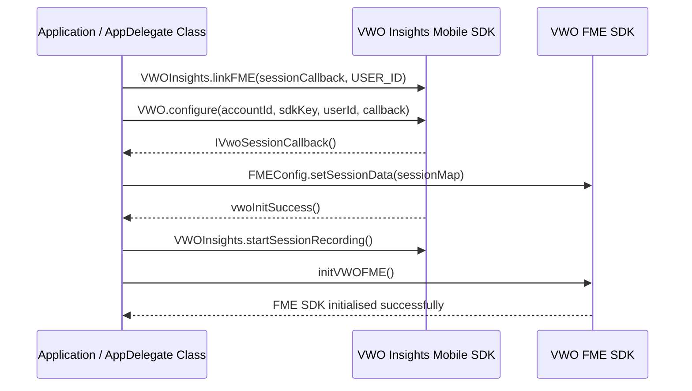

# Introduction

This guide outlines the integration process for the **[VWO Feature Management and Experimentation(FME) SDK](https://developers.vwo.com/v2/docs/fme-overview) and [VWO Insights Mobile SDK](https://developers.vwo.com/reference/mobile-insights-introduction)** to ensure seamless session data synchronization.

With this integration, customers can **link session data** between VWO Insights Mobile SDK and VWO FME SDK, enabling **post-segmentation of session data** based on various attributes. This empowers them to analyze user behavior more effectively, identify friction points, and optimize user experiences with precise insights.

Benefits of Integrating Both SDKs:

* Seamlessly link user sessions between VWO Insights Mobile SDK and VWO FME SDK.
* Post-segment session data based on specific attributes or flags.
* Ensure session consistency when sessions are renewed in the VWO Insights Mobile SDK.
* Enhance tracking, analysis, and insights across both platforms.

# Prerequisites

Before integrating, ensure the following:

* You have access to the latest versions of both SDKs.
* You have already added **VWO Insights Mobile SDK** and **VWO FME SDK** separately in your application.
* You have your **VWO Insights Mobile SDK API key** and **VWO FME SDK credentials** along with the **AccountId** and unique **USER\_ID**

## Integration

While integrating both SDKs, ensure the following:

* Implement the **Session Callback** as shown and pass the received session data to the **VWO FME SDK** for session validation.

```kotlin
private fun getSessionCallback(): IVwoSessionCallback {
    return IVwoSessionCallback { sessionData ->
        FMEConfig.setSessionData(sessionData)
    }
}
```
```swift
func vwoScreenCaptureSessionDidUpdate(sessionData: [String : Any]) {
    FmeConfig.setSessionData(sessionData)
}
```

* **USER\_ID** is mandatory to link both SDKs and ensure session continuity by passing the session callback.

```kotlin
val sessionCallback = getSessionCallback()

VWOInsights.linkFME(sessionCallback, USER_ID)
```
```swift
VWO.linkFme(sessionCallback: self, userId: "")
```

* **Initialize the VWO Insights Mobile SDK first**, as it handles session recording and tracking.
* **Wait for a successful initialization callback** from VWO Insights before starting the **VWO FME SDK** to avoid misalignment in session data.
* **Start session recording before initializing the VWO FME SDK** to ensure all interactions are captured correctly.

## Step 1: Configure and Initialize the VWO Insights Mobile SDK

```kotlin
class VWOApplication : Application() {
    override fun onCreate() {
        super.onCreate()
        
        initVWOInsights()
    }

    private fun initVWOInsights() {
        val config = ClientConfiguration(ACCOUNT_ID, SDK_KEY, null)
        
        /* Below two lines are extra code needed to link both the SDKs.*/

        // SessionCallback to revalidate sessions
        val sessionCallback = getSessionCallback()    
        // USER_ID is mandatory to link between both the SDKs
        VWOInsights.linkFME(sessionCallback, USER_ID) 

        // Initialize VWO Insights Mobile SDK
        VWOInsights.init(this, object : IVwoInitCallback {
            override fun vwoInitSuccess(message: String) {
							  // VWO Mobile Insights SDK initializated successfully
                VWOInsights.startSessionRecording()
                
                // Init VWO FME SDK
                initVWOFME()
            }

            override fun vwoInitFailed(message: String) {
                VWOLog.i(VWOLog.INITIALIZATION_LOGS, "vwoInitFailed: $message", false)
            }
        }, config)
    }
}
```
```swift
import VWO_FME
import VWO_Insights

@main
class AppDelegate: UIResponder, UIApplicationDelegate, VWOSessionCallback {
    func application(_ application: UIApplication, didFinishLaunchingWithOptions launchOptions: [UIApplication.LaunchOptionsKey: Any]?) -> Bool {
        self.initMiSDK()
        return true
    }

    func initMiSDK() {
				// SessionCallback to revalidate sessions and userId is mandatory
        VWO.linkFme(sessionCallback: self, userId: "")
        
        VWO.configure(accountId: "", sdkKey: "", userId: "", completion: { result in
            switch result {
            case .success(_):
                // VWO Mobile Insights SDK initializated successfully
                VWO.startSessionRecording()
              
                // Init VWO FME SDK 
                self.initVWOFME()											
            case .failure(_):
                print("VWO Insights initialization failed")
            }
        })
    }
}
```

## Step 2: Initialize the VWO FME SDK

```kotlin
private fun initVWOFME() {
    val vwoInitOptions = VWOInitOptions()
    vwoInitOptions.sdkKey = FME_SDK_KEY
    vwoInitOptions.accountId = VWO_ACCOUNT_ID
    vwoInitOptions.context = this@VWOApplication.applicationContext

    VWO.init(vwoInitOptions, object : com.vwo.interfaces.IVwoInitCallback {
        override fun vwoInitSuccess(vwoClient: VWO, message: String) {
            // use vwoClient to invoke VWO FME SDK APIs
        }

        override fun vwoInitFailed(message: String) {
            Log.i("VWOSession", "SessionId Uuid FME Init failed: $message")
        }
    })
}
```
```swift
private fun initVWOFME() {
    val vwoInitOptions = VWOInitOptions()
  
    vwoInitOptions.sdkKey = FME_SDK_KEY
    vwoInitOptions.accountId = VWO_ACCOUNT_ID
    vwoInitOptions.context = this@VWOApplication.applicationContext

    VWO.init(vwoInitOptions, object : com.vwo.interfaces.IVwoInitCallback {
        override fun vwoInitSuccess(vwoClient: VWO, message: String) {
            // use vwoClient to invoke VWO FME SDK APIs
        }

        override fun vwoInitFailed(message: String) {
            Log.i("VWOSession", "SessionId Uuid FME Init failed: $message")
        }
    })
}
```

## Step 3: Implement Session Callback

```kotlin
private fun getSessionCallback(): IVwoSessionCallback {
    return IVwoSessionCallback { sessionDetails ->
        // Pass the received session data to the FME SDK for session validation
        FMEConfig.setSessionData(sessionDetails)
    }
}
```
```swift
func vwoScreenCaptureSessionDidUpdate(sessionDetails: [String : Any]) {
    // Pass the received session data to the FME SDK for session validation
    FmeConfig.setSessionData(sessionDetails)
}
```

## Sequence Diagram



<br />

# Summary

This document outlines integrating the **VWO Insights Mobile SDK** and **VWO FME SDK** in both **Android** and **iOS** applications. Developers can ensure accurate tracking and analysis for experiments and feature rollouts by linking the session data between both SDKs.