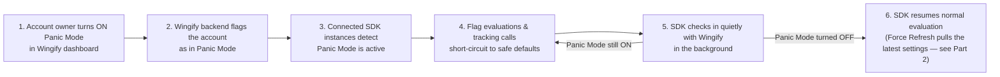

 

 

```mermaid
flowchart LR 
A["1. Account owner turns ON Panic Mode\nin Wingify dashboard"] --> B["2. Wingify backend flags the account\nas in Panic Mode"]

B --> C["3. Connected SDK instances detect\nPanic Mode is active"]

C --> D["4. Flag evaluations & tracking calls\nshort-circuit to safe defaults"]

D --> E["5. SDK checks in quietly with Wingify\nin the background"]

E -- "Panic Mode still ON" --> D

E -- "Panic Mode turned OFF" --> F["6. SDK resumes normal evaluation\n(Force Refresh pulls the latest settings — see Part 2)"]

```
