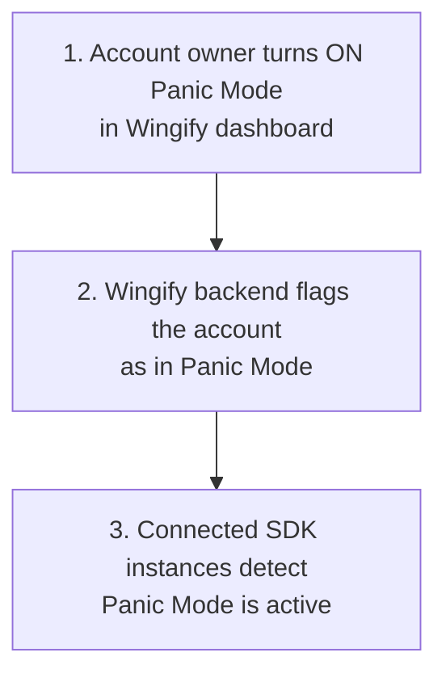
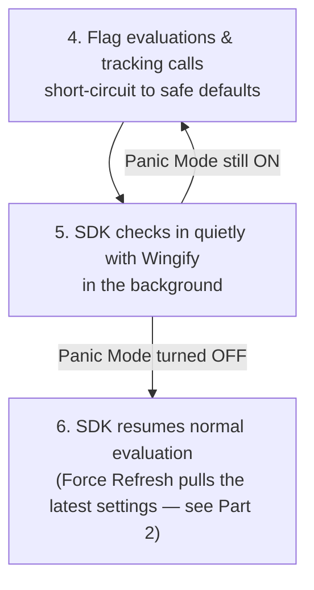

## Part 1: Enable Panic Mode

```mermaid
flowchart TD
  A["1. Account owner turns ON Panic Mode\nin Wingify dashboard"]
  B["2. Wingify backend flags the account\nas in Panic Mode"]
  C["3. Connected SDK instances detect\nPanic Mode is active"]

  A --> B --> C
```

## Part 2: SDK behavior and recovery

```mermaid
flowchart TD
  D["4. Flag evaluations & tracking calls\nshort-circuit to safe defaults"]
  E["5. SDK checks in quietly with Wingify\nin the background"]
  F["6. SDK resumes normal evaluation\n(Force Refresh pulls the latest settings — see Part 2)"]

  D --> E
  E -- "Panic Mode still ON" --> D
  E -- "Panic Mode turned OFF" --> F
```