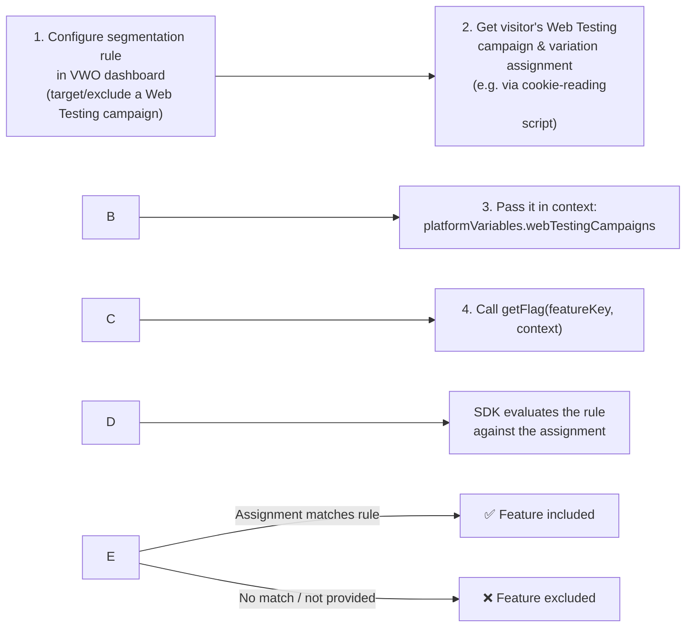
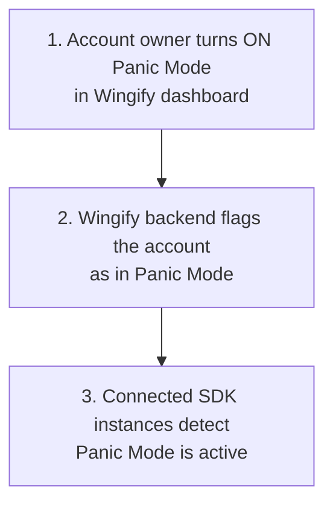
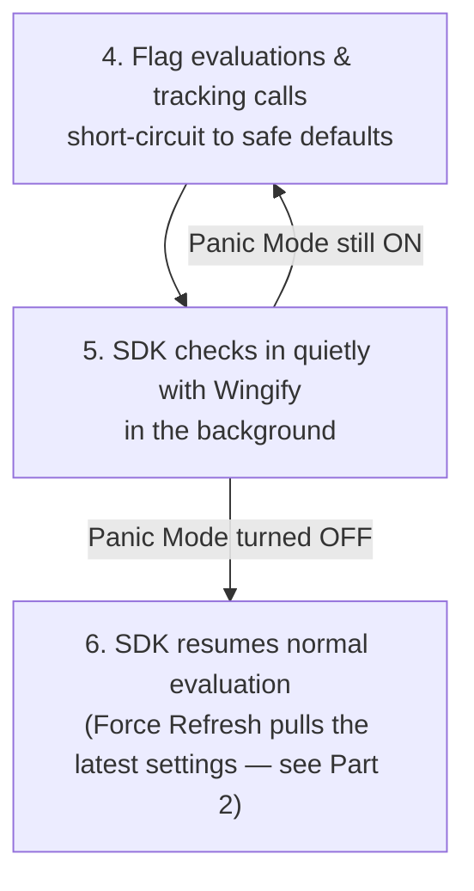
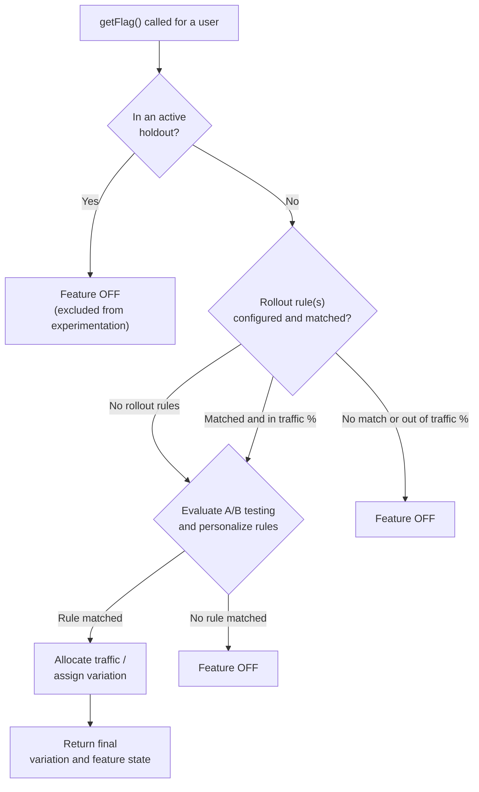

Web Testing as Pre-Seg

```mermaid
flowchart LR 
A\["1. Configure segmentation rule\nin VWO dashboard\n(target/exclude a Web Testing campaign)"] --> B\["2. Get visitor's Web Testing\ncampaign & variation assignment\n(e.g. via cookie-reading

script)"]

B --> C\["3. Pass it in context:\nplatformVariables.webTestingCampaigns"]

C --> D\["4. Call getFlag(featureKey, context)"]

D --> E\["SDK evaluates the rule\nagainst the assignment"]

E -- "Assignment matches rule" --> F\["✅ Feature included"]

E -- "No match / not provided" --> G\["❌ Feature excluded"]
```

 

 

## Part 1: Enable Panic Mode

```mermaid
flowchart TD
  A["1. Account owner turns ON Panic Mode\nin Wingify dashboard"]
  B["2. Wingify backend flags the account\nas in Panic Mode"]
  C["3. Connected SDK instances detect\nPanic Mode is active"]

  A --> B --> C
```

## Part 2: SDK behavior and recovery

```mermaid
flowchart TD
  D["4. Flag evaluations & tracking calls\nshort-circuit to safe defaults"]
  E["5. SDK checks in quietly with Wingify\nin the background"]
  F["6. SDK resumes normal evaluation\n(Force Refresh pulls the latest settings — see Part 2)"]

  D --> E
  E -- "Panic Mode still ON" --> D
  E -- "Panic Mode turned OFF" --> F
```

 

## **Rule Evaluation**

```mermaid
flowchart TD
  A["getFlag() called for a user"] --> C{"In an active<br/>holdout?"}

  C -- "Yes" --> H["Feature OFF<br/>(excluded from experimentation)"]
  C -- "No" --> D{"Rollout rule(s)<br/>configured and matched?"}

  D -- "No rollout rules" --> E{"Evaluate A/B testing<br/>and personalize rules"}
  D -- "Matched and in traffic %" --> E
  D -- "No match or out of traffic %" --> H2["Feature OFF"]

  E -- "Rule matched" --> F["Allocate traffic /<br/>assign variation"]
  E -- "No rule matched" --> H3["Feature OFF"]
  F --> Z2["Return final<br/>variation and feature state"]
```
