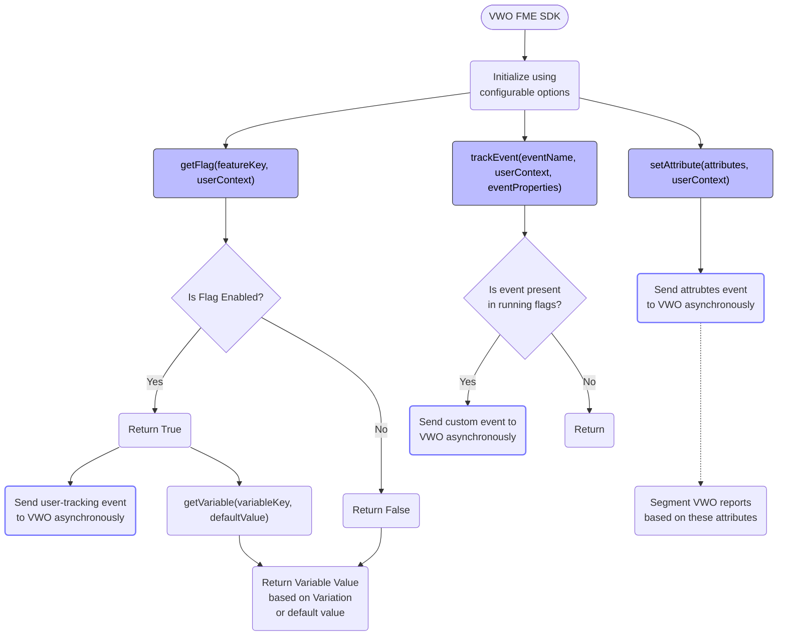
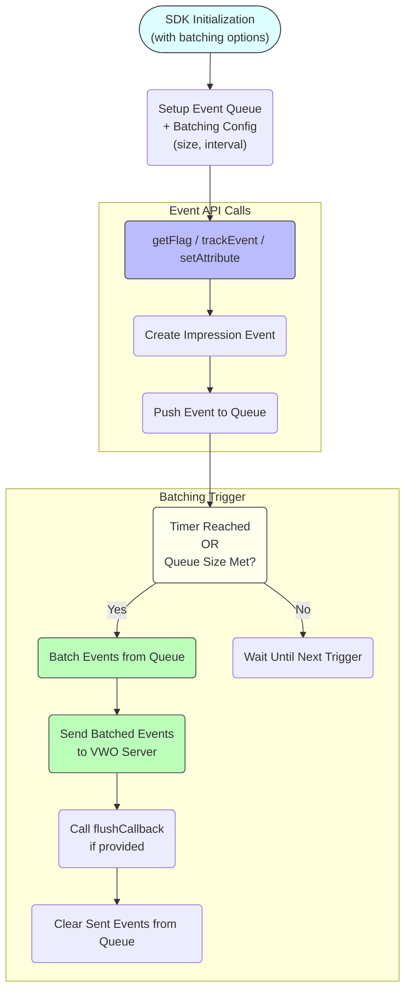
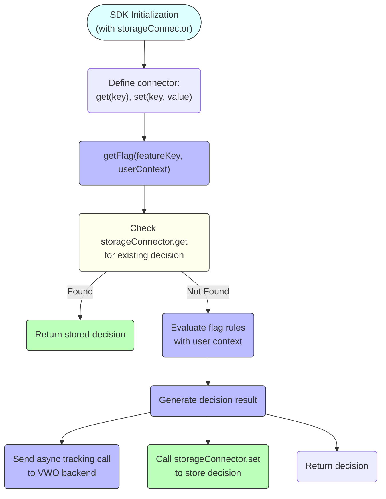

## High Level SDK Architecture

The diagram below represents the core workflow of the VWO Feature Management and Experimentation SDK, designed to enable dynamic feature delivery, experimentation, and behavioral analytics within an application. The flow is centered around initialization, flag evaluation, event tracking, and user attribute handling, emphasising asynchronous communication with the VWO backend.

 

### 1. Initialization as the Foundation

The SDK starts with an initialization phase, where configuration options like API keys, user context providers, and polling strategies are set. This establishes the SDK’s runtime environment, allowing it to consistently evaluate flags and track user activity.

### 2. Feature Evaluation and Experimentation

The core of the SDK is feature flag evaluation via the *getFlag*() method. When this is called:

* The SDK checks if a given feature is enabled for a specific user context.
* If the flag is active, it may also retrieve dynamic configuration values (via *getVariable*()).
* A **user exposure event is sent asynchronously** to VWO, capturing whether a user saw a specific variation or experience.
* If the flag is not enabled, the fallback behavior is returned without triggering tracking.

This mechanism supports **controlled rollouts, A/B testing, and personalized** experiences.

### 3. Behavioral and Conversion Event Tracking

The SDK also allows applications to report custom events using the *trackEvent*() method. These events are only reported to VWO if they’re relevant to ongoing experiments. This ensures:

* Only experiment-related events are captured, reducing noise.
* Events like "clicked CTA" or "error rates" can be used to measure experiment goals.

All tracking is handled **asynchronously**, ensuring no performance bottlenecks.

### 4. User Attribute Management

To enable user segmentation and deeper insights, the SDK includes a *setAttribute*() method. This lets developers send custom user attributes (like location, device type, or plan) to VWO. These are used to:

* **Segment experiment reports**
* **Target users more precisely** in feature rollouts and experiments

Again, this data is sent in the background, maintaining a lightweight client footprint.

### Asynchronous Communication & Decoupled Design

Across all core functions — flag checks, event tracking, and attribute setting- the SDK communicates with VWO asynchronously except PHP SDK due to the synchronous behavior of PHP language.. This design ensures that:

* App performance is not affected
* Network activity is minimized and batched

> Please refer [Server-side SDKs](doc:server-side-sdks) or [Client-side SDKs](doc:mobile-sdks) reference guides to know

 

## Event Batching in SDKs

The following diagram illustrates how the event batching mechanism works internally:

* To improve performance and reduce network overhead, the VWO FME SDK supports **event batching**. When batching options are provided during initialization (such as the maximum number of events to batch and the flush interval), the SDK no longer sends tracking or impression events immediately. Instead, events generated from calls like *getFlag*, *trackEvent*, or *setAttribute* are **pushed into an internal queue**.
* The SDK monitors this queue and flushes events under two conditions: either when the **number of queued events reaches** the defined threshold, or when the **configured time interval elapses**. Once triggered, all queued events are **batched together into a single payload** and sent asynchronously to the VWO backend, significantly reducing the number of network calls and improving efficiency, especially in high-interaction environments.

 

## Caching in SDKs

> Please refer the [Caching Layer](doc:fme-sdks-caching) document to understand more on caching.

 

### How Storage Connector for server-side SDKs work

To optimize performance and reduce repeated computation, the VWO FME SDK supports **custom storage integration** via a pluggable ***Storage Connector***. This allows the SDK to **persist and retrieve flag evaluation results**, reducing the need to re-evaluate feature flags for the same user context repeatedly. The diagram below illustrates how the SDK uses this connector during the *getFlag* call. If a decision is already available in storage, it's returned immediately. Otherwise, the SDK evaluates the feature flag, sends the tracking event asynchronously, and stores the decision for future use.

When a *storageConnector* is provided during SDK initialization, the SDK uses it **to cache feature flag decisions:**

* On each *getFlag* call, the SDK first checks the storage (via ***get*** method) for a previously evaluated decision.
* If a cached decision exists, it’s returned immediately, avoiding recomputation.
* If not found, the SDK evaluates the flag rules using the latest config and user context, then:
  * **Returns the decision**
  * **Tracks the exposure asynchronously** to VWO
  * **Caches the result** using the connector’s ***set*** method

This approach improves performance, reduces compute and I/O overhead, and supports **pluggable caching/storage layers** (e.g., memory, Redis, file system).

> Please refer to Storage section of server-side SDKs. Foe example: [Storage Service](doc:fme-node-storage) in Node.js.