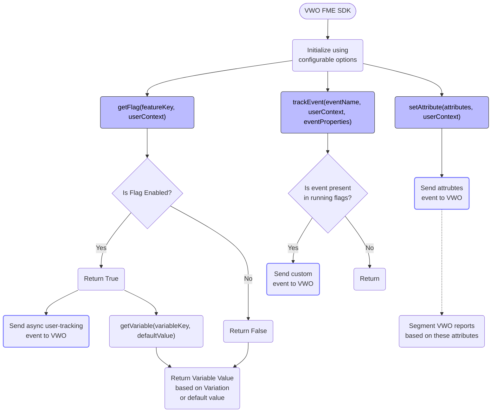

```mermaid
flowchart TD
    A0(["VWO FME SDK"]) --> A("Initialize using<br/>configurable options")
    A --> Y("getFlag(featureKey, userContext)")
    A --> X("trackEvent(eventName, userContext, eventProperties)")
    A --> Z("setAttribute(attributes, userContext)")

    %% getFlag & getVariable Flow
    Y --> Y1{"Is Flag Enabled?"}
    Y1 -- Yes --> Y2("Return True")
    Y1 -- No --> Y4("Return False")
    Y2 --> Y22("Send async user-tracking<br/>event to VWO")
    Y2 --> Y3("getVariable(variableKey, defaultValue)")
    Y3 --> Y5("Return Variable Value<br/>based on Variation<br/>or default value")
    Y4 --> Y5

    %% trackEvent Flow
    X --> X1{"Is event present<br/>in running flags?"}
    X1 -- Yes --> X2("Send custom<br/>event to VWO")
    X1 -- No --> X3("Return")

    %% setAttribute Flow
    Z --> Z1("Send attrubtes<br/>event to VWO")
    Z1 ..-> Z2("Segment VWO reports<br/>based on these attributes")

    %% Assign classes
    class Y getFlag
    class X trackEvent
    class Z setAttribute

    %% Define styles
    classDef getFlag fill:#bbf,stroke:#333,stroke-width:1px,color:#000
    classDef trackEvent fill:#bbf,stroke:#333,stroke-width:1px,color:#000
    classDef setAttribute fill:#bbf,stroke:#333,stroke-width:1px,color:#000

    style X2 stroke:#7373ff,stroke-width:2px
    style Y22 stroke:#7373ff,stroke-width:2px
    style Z1 stroke:#7373ff,stroke-width:2px

```