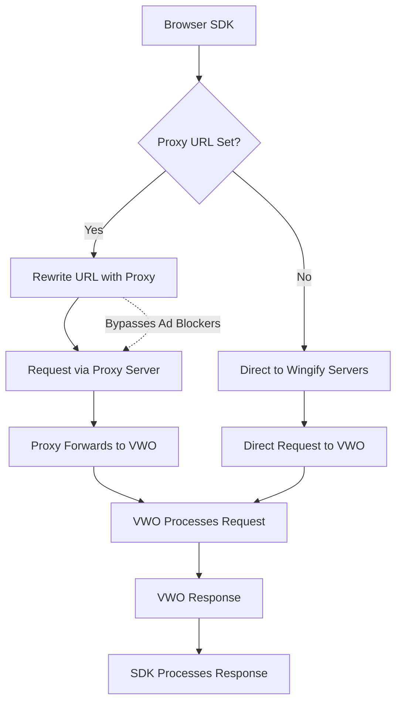

The Wingify JavaScript SDK supports setting up a **custom proxy URL**, enabling you to route all SDK network traffic through your proxy server. This feature provides enhanced control over request routing, offering significant benefits in environments where direct network access to Wingify endpoints may be restricted or blocked.

### Why Use a Custom Proxy URL?

In modern web environments, many users utilize browser-based **ad-blockers** and privacy tools that restrict access to known ad-serving or tracking domains. Since the Wingify JavaScript SDK communicates with Wingify services via the default domain (`dev.visualwebsiteoptimizer.com`), requests to this endpoint may be **intercepted or blocked**.

When this occurs, it can lead to partial or complete SDK failure, resulting in:

* **Experiment tracking disruptions** – Data collection for A/B tests and multivariate experiments may be incomplete or missing.
* **Settings fetch issues** – SDK initialization can fail if configuration settings cannot be retrieved.
* **Inconsistent user experience** – Variability in ad blocker configurations can cause different users to experience different application behavior, leading to reliability concerns.

To address these issues, Wingify provides the ability to configure a **proxy URL**, allowing organizations to **self-host a relay** for SDK traffic. This enables better control over network access, enhanced observability, and improved compatibility with restrictive user environments.

<br />

## How It Works: Request Routing Logic

The request flow when using a custom proxy is as follows:

1. **SDK → Proxy Server**\
   The Wingify SDK sends all API and data collection requests to the proxy server, using the `proxyUrl` specified in `getSettingsFile()` method. Check the <Anchor label="Configuration" target="_blank" href="https://developers.vwo.com/docs/proxy-url-prevent-ad-blockers?isFramePreview=true#configuration-example">Configuration</Anchor> Section for more details
2. **Proxy Server → Wingify Backend**\
   Your proxy server receives the SDK request and forwards it to the appropriate Wingify endpoint.
3. **VWO Backend → Proxy Server**\
   Wingify processes the incoming request, generates a response (e.g., experiment data), and sends it back to your proxy.
4. **Proxy Server → SDK**\
   Your proxy server relays the response from Wingify back to the SDK, completing the round trip.



<br />

## Benefits of Using a Proxy

* **Bypass ad-blockers**: Since the proxy URL is under your control (e.g., proxy.yourdomain.com), it is less likely to be blacklisted.
* **Improved reliability**: Ensures SDK functionality even in restricted network environments.
* **Custom logging and analytics**: Enables logging, monitoring, or transformation of SDK requests for internal analytics or debugging.
* **Security and compliance**: Offers an opportunity to inspect or validate outbound and inbound traffic to meet organizational policies.

<br />

## Configuration Example

Recommended way of passing the `proxyUrl`:

### While fetching setting-file

```javascript
const options = { proxyUrl: 'https://proxy.yourdomain.com' };

const settingsFile = await vwoSdk.getSettingsFile(
  accountId,
  sdkKey,
  null, 
  options
);
```

### While launching the SDK

Another way of passing the `proxyUrl` is when you are not calling `getSettingsFile` and are using locally stored settings, you can pass the `proxyUrl` directly in the `launch` method.

```javascript
const clientInstance = vwoSdk.launch({
  settingsFile,                             // settings file
  proxyUrl: 'https://proxy.yourdomain.com', // your custome proxy url here
});
```

> Ensure your proxy server is properly configured to forward requests to `dev.visualwebsiteoptimizer.com`, handle request/response headers appropriately, and support both GET and POST methods used by the SDK.

<br />

## Performance and Latency Considerations

Using a proxy introduces an additional network hop between the SDK and Wingify servers. While this offers flexibility and control, it can affect performance if not optimized properly.

**Key considerations:**

* **Minimize Latency**: Host your proxy server geographically close to your end users or leverage edge locations via a CDN.
* **Connection Reuse**: Enable `keep-alive` connections to reduce TCP handshake overhead.
* **Caching**: Use caching headers for SDK configuration responses (when appropriate) to reduce redundant API calls.
* **Compression**: Enable gzip or Brotli compression on your proxy server to reduce response size and speed up transfers.
* **Timeouts**: Configure reasonable timeouts to prevent long request queues or blocked SDK functionality.

> Tip: Monitor response times at both the proxy and SDK levels to detect bottlenecks.

<br />

## Security Considerations

Proxying SDK traffic gives you more control, but also introduces potential risks. Proper security practices help prevent misuse or data leaks.

**Recommendations:**

* **Use HTTPS**: Always serve your proxy over HTTPS to ensure encrypted data transmission.
* **Restrict Origins**: Limit access to your proxy to specific domains or IP addresses to prevent abuse.
* **Input Validation**: Sanitize and validate incoming requests to avoid injection or spoofing attacks.
* **Rate Limiting**: Implement rate limiting to protect your proxy from DDoS or high-traffic abuse.
* **Authorization (*Optional*)**: For internal or sensitive use cases, add token-based or header-based authentication.
* **Audit Logs**: Log incoming and outgoing proxy traffic (with PII masked) for observability and compliance.

<br />

## Sample Proxy Implementations

Below are basic proxy implementations in popular platforms to help you get started:

### Node.js (Express)

```javascript
const express = require('express');
const { createProxyMiddleware } = require('http-proxy-middleware');

const app = express();

// Parse JSON and URL-encoded bodies
app.use(express.json());
app.use(express.urlencoded({ extended: true }));

// Proxy all requests to Wingify dev environment
app.use('/', createProxyMiddleware({
  target: 'https://dev.visualwebsiteoptimizer.com',
  changeOrigin: true,
  onError: (err, req, res) => {
    res.status(500).json({ error: 'Proxy error', details: err.message });
  },
}));

app.listen(3300, () => {
  console.log('Proxy server running on http://localhost:3300');
});
```

### NGINX Config Snippet

```shell nginx
server {
  listen 443 ssl;
  server_name proxy.yourdomain.com;

  location / {
    proxy_pass https://dev.visualwebsiteoptimizer.com/;
    proxy_set_header Host dev.visualwebsiteoptimizer.com;
    proxy_set_header X-Forwarded-For $proxy_add_x_forwarded_for;
  }
}
```

> Make sure SSL certificates and CORS headers are correctly configured.

### Serverless (AWS Lambda + API Gateway)

For lightweight, scalable deployments, you can set up a proxy using AWS Lambda with API Gateway acting as the HTTP interface. This is useful for pay-as-you-go usage with minimal infrastructure overhead.