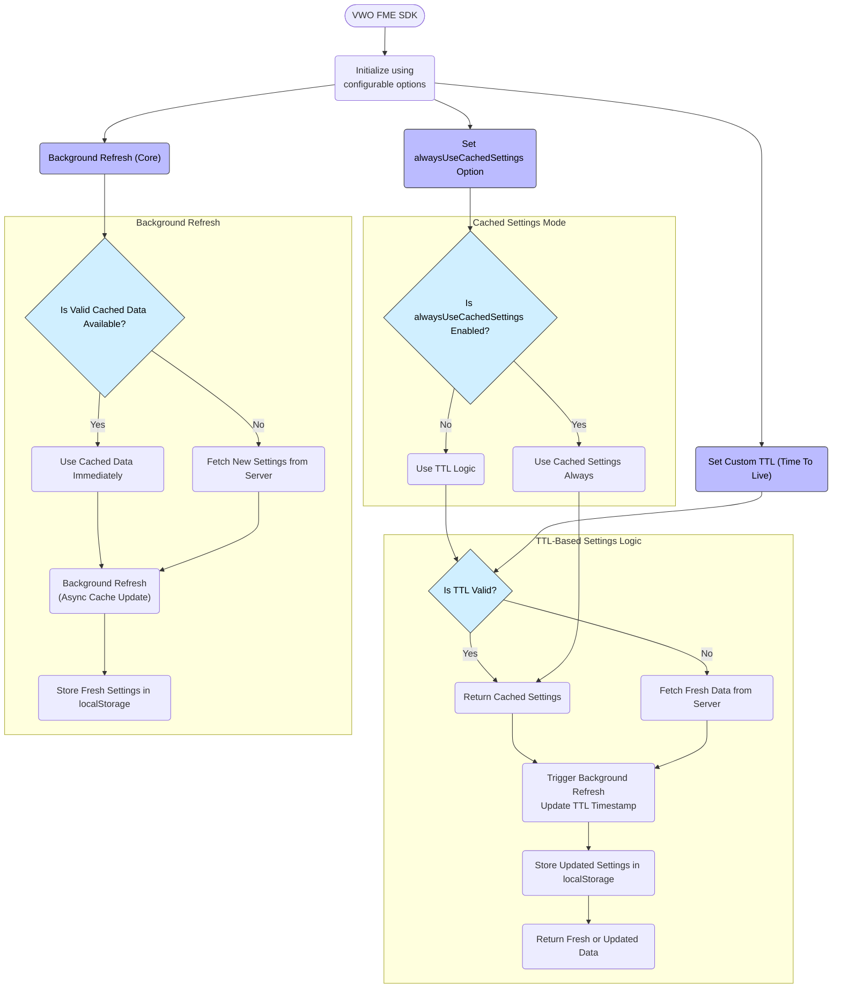

Advanced storage configuration capabilities enable greater flexibility and precision in managing how data is cached and updated within browser environments.

These enhanced options allow developers to fine-tune storage behavior by specifying which mechanisms to use (such as localStorage(default), sessionStorage, or IndexedDB), as well as defining custom rules for cache invalidation and refresh intervals. This level of granularity not only improves application performance by reducing unnecessary data fetches but also ensures more predictable and efficient control over data persistence and cache lifetimes, leading to a more responsive and consistent user experience.

## Key Features:

1. **Custom ttl (Time To Live) Option**
   * The ttl setting allows to specify how long the settings should remain valid in the storage. If not specified, the default TTL is set to 2 hours. This helps in controlling the frequency with which settings are refreshed from the server.\
     Note - The TTL value is specified in milliseconds.
   * This is especially useful when you want to limit the frequency of network requests and instead rely on cached settings for performance.
2. **`alwaysUseCachedSettings`Option**
   * When enabled, the SDK will always use cached settings, regardless of the TTL value. This means the settings stored in the browser will be used even if they have expired based on the TTL.
   * By default, this option is disabled. If disabled, the SDK will check the TTL and refresh settings as per the specified interval.
3. **Background Refresh**
   * When valid cached settings are returned and the TTL has not expired, the SDK will use the cached settings immediately. While doing so, it will asynchronously refresh the settings in the background. This helps in ensuring the settings are up to date without introducing delays in loading or performance bottlenecks.

## Benefits

* **Improved Performance:** By customizing the TTL and cache usage, you can optimize how often settings are fetched from the server, reducing unnecessary network requests and improving load times.
* **Better Control:** You can fine-tune how settings are stored and refreshed, ensuring that your application behaves exactly as needed depending on the environment and the use case.
* **Flexible Caching:** It allows for a balance between always using fresh settings and reducing the reliance on server fetches, giving you more control over your caching strategy.
* **Non-Blocking Updates:** The background refresh feature ensures that the user experiences no delay in getting the settings, while the SDK silently keeps them updated in the background.

<br />

## Configuration Parameters

<Table align={["left","left","left","left"]}>
  <thead>
    <tr>
      <th>
        Parameter
      </th>

      <th>
        Description
      </th>

      <th>
        Use Case
      </th>

      <th>
        Default
        Value
      </th>
    </tr>
  </thead>

  <tbody>
    <tr>
      <td>
        **ttl**(Integer)
        (*Optional*)
      </td>

      <td>
        Time-to-live for cached settings in milliseconds. Determines how long the cached settings are considered valid before expiring.
      </td>

      <td>
        Use when you want to control how frequently settings are refreshed from the server
      </td>

      <td>
        7200000 ms               (2 hours)
      </td>
    </tr>

    <tr>
      <td>
        **alwaysUseCachedSettings**(Boolean)
        (*Optional*)
      </td>

      <td>
        If set to true, always uses cached settings from storage, ignoring TTL and server fetch.
      </td>

      <td>
        Use when you want to force the SDK to always use local cached settings, even if expired.
      </td>

      <td>
        false
      </td>
    </tr>
  </tbody>
</Table>

<br />

## Usage

```javascript
const vwoClient = await init({
  accountId: '123456',
  sdkKey: '32-alpha-numeric-sdk-key',
  clientStorage: {
    // Custom key used to store SDK data, default is 'vwo_fme_data'
    key: 'vwo_data',
    
    // Use cached settings regardless of TTL, defaults to false
    alwaysUseCachedSettings: true,
    
    // Custom TTL value in milliseconds (1 hour), defaults to 2 hours
    ttl: 3600000
  },
});

```

<br />

## Flow

