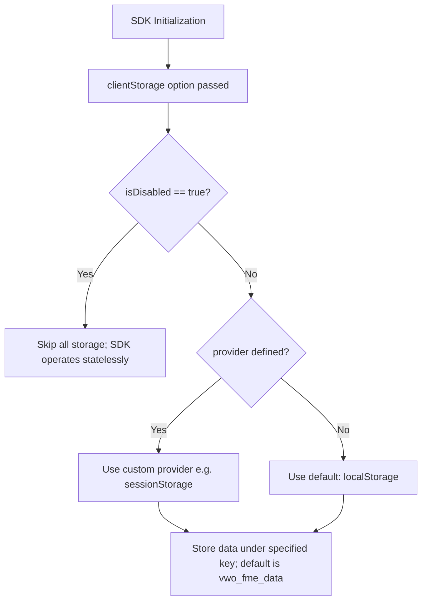

## In-Built Storage

In browser-based environments, the VWO FE JavaScript SDK automatically utilizes the browser’s localStorage API to persist user-related data. This ensures a seamless user experience by maintaining state across page reloads and browser sessions.

### Key Benefits of Custom Storage:

1. **Performance Optimization**: Cache feature flag and variation decisions locally, reducing round trips to remote APIs.
2. **Consistency Across Sessions**: Maintain stable experiences for returning users by preserving decision state.
3. **Reduced Backend/API Load**: Avoid repeated decision evaluations by storing results on the client side.

<br />

### Default Behavior

#### By default:

* The SDK leverages window.localStorage to persist all relevant data such as:
  * User variation assignments
  * Campaign and experiment metadata
  * Event tracking identifiers
* This persistence ensures that:
  * Data survives browser restarts and page reloads

    User consistency is maintained without requiring re-identification
* All data is stored under a key namespace prefixed with vwo_ for easy identification and isolation.

#### Customizing Storage: clientStorage Option

For more advanced use cases, the SDK provides a clientStorage configuration option during initialization. This allows you to override the default storage mechanism with a custom implementation.



<br />

### Usage

```javascript
const vwoClient = await init({
  accountId: '123456',
  sdkKey: '32-alpha-numeric-sdk-key',

  clientStorage: {
    // Custom key used to store SDK data, default is 'vwo_fme_data'
    key: 'vwo_data',
    // Storage mechanism to use: can be sessionStorage or localStorage (default)
    provider: sessionStorage,
    // If true, disables client-side in-built storage altogether. Though can connect Storage Connector still
    isDisabled: false,
  },
});
```

#### Explanation of `clientStorage` Parameters

<Table align={["left","left","left","left"]}>
  <thead>
    <tr>
      <th>
        Parameter
      </th>

      <th>
        Description
      </th>

      <th>
        Use case
      </th>

      <th>
        Default
        Value
      </th>
    </tr>
  </thead>

  <tbody>
    <tr>
      <td>
        **key**(String)
        (_Optional_)
      </td>

      <td>
        Specifies the key under which SDK data will be stored in browser storage. This allows you to customize the storage entry name to avoid conflicts or better organize stored data.
      </td>

      <td>
        Useful for avoiding key collisions or aligning with your app's naming conventions.
      </td>

      <td>
        `vwo_fme_data`
      </td>
    </tr>

    <tr>
      <td>
        **provider**(Object)
        (_Optional_)
      </td>

      <td>
        Determines the browser storage mechanism to use. It can be either `localStorage` or `sessionStorage`. `localStorage` persists data even after the browser is closed, while `sessionStorage` persists data only during the current browser tab session.
      </td>

      <td>
        * Use localStorage for persistent storage across sessions (default).
        * Use sessionStorage if you want data to reset on every new browser session (e.g., enhanced privacy or compliance needs).
      </td>

      <td>
        `localStorage`
      </td>
    </tr>

    <tr>
      <td>
        **isDisabled**(Boolean)  
        (_Optional_)
      </td>

      <td>
        When set to `true`, completely disables client-side storage. This is useful if you want to avoid any data persistence in the browser for privacy or other reasons.
      </td>

      <td>
        Ideal for ephemeral or stateless environments, or when you need full control over state management externally.
      </td>

      <td>
        `false`
      </td>
    </tr>
  </tbody>
</Table>

> 📘 Important Notes
>
> * **Browser Environment Only:** The `clientStorage` option works exclusively in browser environments where `localStorage` and `sessionStorage` APIs are available.
> * **Node.js Environments:** For server-side or Node.js environments, use the `storage` option for implementing custom storage logic, as `localStorage` and `sessionStorage` are not available there. To know more, click [here](https://developers.wingify.com/v2/docs/fme-node-storage#/).

<br />

## How to Implement a Custom Storage Connector

In browser environments, if you prefer not to rely on Wingify's default web-based APIs for decision resolution, you can still implement a custom storage connector. This gives you more control over how feature flag decisions are cached and reused, though it may introduce slight performance trade-offs depending on your implementation.

The storage mechanism ensures that once a decision is made for a user, it remains consistent even if campaign settings are modified in the VWO Application. This is particularly useful for maintaining a stable user experience during A/B tests and feature rollouts.

### Usage

```javascript
class StorageConnector extends StorageConnector {
  protected ttl = 7200000; // 2 hours in milliseconds
  protected alwaysUseCachedSettings = false;
  
  constructor() {
    super();
  }

  /**
   * Get data from storage
   * @param {string} featureKey
   * @param {string} userId
   * @returns {Promise<any>}
   */
  async get(featureKey, userId) {
    // return await data (based on featureKey and userId)
  }

  /**
   * Set data in storage
   * @param {object} data
   */
  async set(data) {
    // Set data corresponding to a featureKey and user ID
    // Use data.featureKey and data.userId to store the above data for a specific feature and a user
  }
  
  /**
   * Get settingsData from storage
   * @param {number} accountId
   * @param {string} sdkKey
   * @returns {Promise<ISettingsData>}
   */
  async getSettings(accountId, sdkKey) {
    // Implement logic to retrieve cached settings based on accountId and sdkKey
    // Must return an object with structure: { settings: {...}, timestamp: number }
  }

  /**
   * Set settingsData in storage
   * @param {ISettingsData} data
   */
  async setSettings(data) {
    // Implement logic to store settings data
    // Use data.settings.accountId and data.settings.sdkKey to store the above data for a specific accountId and sdkKey
  }

}

vwoSdk.init({
  sdkKey: '...',
  accountId: '123456',
  storage: new StorageConnector(),
});
```

### Required Methods (Variation Storage)

Storage Service should expose two methods: _get_ and _set_. These methods are used by VWO whenever there is a need to read from or write to the storage service.

| Method Name | Params             | Description                                                 | Returns                                                                                    |
| :---------- | :----------------- | :---------------------------------------------------------- | :----------------------------------------------------------------------------------------- |
| get         | featureKey, userId | Retrieve stored data corresponding to featureKey and userId | Returns a matching user-feature data mapping corresponding to featureKey and userId passed |
| set         | data               | Store user-feature data mapping                             | null                                                                                       |

### Optional Methods (Settings Storage)

> **Supported from SDK version `1.35.0` onwards**

These methods are **optional** but highly recommended for performance optimization. When implemented, the SDK can load settings from your storage instead of fetching them from VWO servers during initialization.

| Method Name   | Params            | Description                                | Returns                                                                                                   |
| :------------ | :---------------- | :----------------------------------------- | :-------------------------------------------------------------------------------------------------------- |
| `getSettings` | accountId, sdkKey | Retrieves cached VWO settings              | This function returns an object that includes the settings and a timestamp indicating when it was stored. |
| `setSettings` | data              | Stores VWO settings along with a timestamp | void                                                                                                      |

**_ISettingsData Interface:_**

```typescript TypeScript
interface ISettingsData {
  settings: Record<string, any>;  // The SDK configuration object
  timestamp: number;              // Unix timestamp in milliseconds when settings were stored
}
```

<br />

## Settings Storage Configuration

### TTL (Time To Live)

**TTL** controls how long cached settings remain valid before the SDK fetches fresh settings from VWO servers.

* **Type**: `number` (milliseconds)
* **Default**: `7200000` (2 hours)
* **Minimum**: `60000` (1 minute)
* **Location**: Set via `protected ttl` property in your storage connector class

**How TTL Works:**

1. When settings are stored via `setSettings`, a timestamp is saved
2. During SDK initialization, `getSettings` is called
3. The SDK calculates: `currentTime - storedTimestamp`
4. If the difference exceeds TTL, settings are considered expired
5. Expired settings trigger a fresh fetch from VWO servers

**Example:**

```typescript
class RedisStorageConnector extends Connector {
  protected ttl: number = 3600000; // 1 hour TTL

  constructor() {
    super();
    // TTL can be set in constructor or as a class property
  }
}
```

### alwaysUseCachedSettings

**alwaysUseCachedSettings** is a boolean flag that, when enabled, makes the SDK always use cached settings regardless of TTL expiration.

* **Type**: `boolean`
* **Default**: `false`
* **Location**: Set via `protected alwaysUseCachedSettings` property in your storage connector class

**Behavior:**

* **When `false`** (default): SDK respects TTL and fetches fresh settings when cache expires
* **When `true`**: SDK always uses cached settings, skipping TTL validation entirely

**Use Cases:**

* **`false`**: Recommended for most scenarios. Ensures settings stay relatively fresh while benefiting from caching
* **`true`**: Useful when you want maximum performance and control settings updates manually, or when network calls are expensive/restricted

**Example:**

```typescript
class CustomStorageConnector extends Connector {
  protected alwaysUseCachedSettings: boolean = true; // Always use cache

  constructor() {
    super();
  }
}
```

**Important Notes:**

* Settings storage is completely transparent to variation evaluation logic
* If `getSettings` or `setSettings` throw errors, SDK falls back to fetching from VWO servers
* Settings are validated for `accountId` and `sdkKey` match before use
* Invalid or mismatched settings trigger a fresh fetch

<br />
