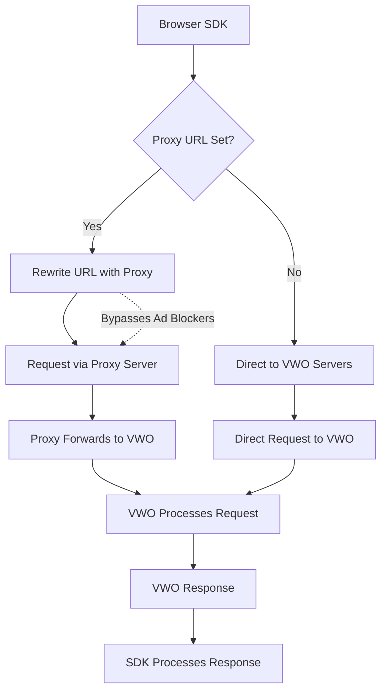

The VWO JavaScript SDK now includes support for **custom proxy URLs**, enabling you to route all SDK network traffic through your own proxy server. This feature provides enhanced control over request routing, offering significant benefits in environments where direct network access to VWO endpoints may be restricted or blocked.

### Why Use a Custom Proxy URL?

In modern web environments, many users utilize browser-based **ad-blockers** and privacy tools that restrict access to known ad-serving or tracking domains. Since the VWO JavaScript SDK communicates with VWO services via the default domain (`dev.visualwebsiteoptimizer.com`), requests to this endpoint may be **intercepted or blocked**.

When this occurs, it can lead to partial or complete SDK failure, resulting in:

* **Feature flag loading failures** – Targeted feature variations may not be served correctly to end users.
* Experiment tracking disruptions – Data collection for A/B tests and multivariate experiments may be incomplete or missing.
* **Settings fetch issues** – SDK initialization can fail if configuration settings cannot be retrieved.
* **Inconsistent user experience** – Variability in ad blocker configurations can cause different users to experience different application behavior, leading to reliability concerns.

To address these issues, VWO provides the ability to configure a **proxy URL**, allowing organizations to **self-host a relay** for SDK traffic. This enables better control over network access, enhanced observability, and improved compatibility with restrictive user environments.

<br />

## How It Works: Request Routing Logic

The request flow when using a custom proxy is as follows:

1. **SDK → Proxy Server**\
   The VWO SDK sends all API and data collection requests to the proxy server, using the `proxyUrl` specified during SDK initialization.
2. **Proxy Server → VWO Backend**\
   Your proxy server receives the SDK request and forwards it to the appropriate VWO endpoint.
3. **VWO Backend → Proxy Server**\
   VWO processes the incoming request, generates a response (e.g., flag configuration, experiment data), and sends it back to your proxy.
4. **Proxy Server → SDK**\
   Your proxy server relays the response from VWO back to the SDK, completing the round trip.

<br />



<br />

## Benefits of Using a Proxy

* **Bypass ad-blockers**: Since the proxy URL is under your control (e.g., proxy.yourdomain.com), it is less likely to be blacklisted.
* **Improved reliability**: Ensures SDK functionality even in restricted network environments.
* **Custom logging and analytics**: Enables logging, monitoring, or transformation of SDK requests for internal analytics or debugging.
* **Security and compliance**: Offers an opportunity to inspect or validate outbound and inbound traffic to meet organizational policies.

<br />

## Configuration Example

```javascript
vwoClient = init({
  accountId: "VWO_ACCOUNT_ID",
  sdkKey: "VWO_SDK_KEY",

  proxyUrl: "https://proxy.yourdomain.com/vwo-proxy",
  // other configuration options
});
```

> Ensure your proxy server is properly configured to forward requests to `dev.visualwebsiteoptimizer.com`, handle request/response headers appropriately, and support both GET and POST methods used by the SDK.