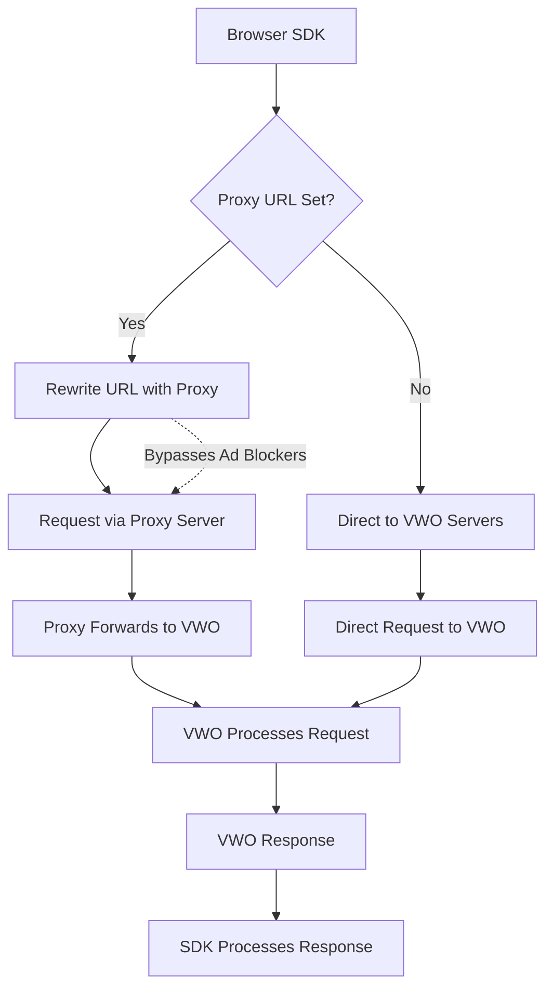

## Overview

VWO's JavaScript SDK now supports custom proxy URLs, allowing you to route all network requests through your own proxy server. This powerful feature is particularly useful for bypassing ad-blockers and ensuring reliable delivery of feature flags and experimentation data.

## What is the Issue that may occur

Many ad blockers prevent requests to certain URLs associated with ads or tracking services. If a user has an ad blocker enabled and the default dev.visualwebsiteoptimizer.com URL is blocked, the JavaScript SDK may fail to load resources or send data as expected. This can cause functionality issues in your application, including:

* Feature flags not loading - Users may not receive the correct feature states
* Experiments not tracking - A/B test data collection may be interrupted
* Settings fetch failures - SDK initialization may fail completely
* Inconsistent user experience - Different users may see different behaviors based on their ad blocker settings

## How the Logic Functions

**Request Flow**

1. **SDK→ Proxy:** The SDK sends requests to your proxy server (specified in proxyUrl)
2. **Proxy → VWO:** Your server forwards the request to VWO's servers
3. **VWO → Proxy:** VWO processes the request and returns a response
4. **Proxy → SDK:** Your server forwards VWO's response back to the SDK

 

 

## Custom Infrastructure

* Own Your Data Flow: Route requests through your existing infrastructure.
* Enhanced Security: Apply your own security policies and monitoring.
* Better Control: Customize request handling and logging.