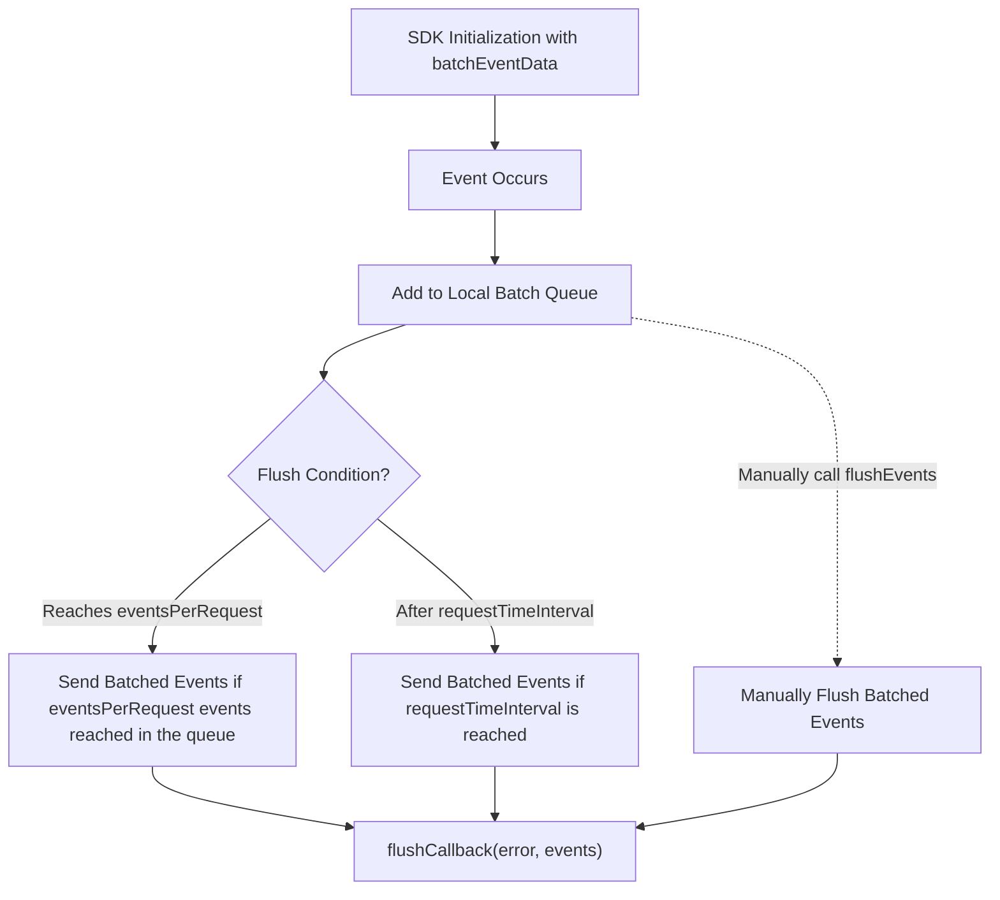

All Wingify FE SDKs implement an advanced event batching mechanism to efficiently handle tracking for visitor events, conversion goals, and custom attributes. Instead of sending each event individually, the SDK collects them in memory and dispatches them in bulk within a single network request.

This batching approach offers several advantages:

- **Performance Optimisation**: Reduces the number of network calls, thereby lowering bandwidth usage and minimising latency.
- **Improved Reliability**: Batching makes the system more resilient during high event throughput by avoiding request flooding.
- **Configurable Dispatch Triggers**: Events are dispatched either when a predefined batch size is reached or after a time threshold, whichever comes first.
- **Memory-Efficient Queuing**: Events are queued in memory, ensuring lightweight operations with minimal overhead on the application.

Developers can configure batching behavior to match their application’s performance characteristics and tracking needs. Whether you’re using the SDK on a web, mobile, or server-side environment, event batching ensures scalable and robust data collection.

<br />

## What is Event Batching?

Event Batching is a core mechanism across all Wingify FE SDKs that enhances performance and scalability by aggregating multiple tracking events—such as visitors, conversions, and attribute updates—before sending them to the Wingify servers.

Rather than sending each event as an individual network request, the SDK collects events over a period of time, queues them in memory, and dispatches them together in a single batched request. For example, if an application generates 4,000 events in quick succession, the SDK groups these into one or more batches based on configurable thresholds, significantly reducing the number of outbound network calls.

### Key Concepts:

- **Events-Level Tracking**: Multiple events (user, conversion, and attributes) for the same user are batched and sent together.
- **Threshold-Based Dispatching**: Events are flushed when a maximum batch size is reached or after a specified time interval, whichever comes first.
- **Optimized Network and Server Usage**: Batching dramatically reduces API call volume, helping conserve bandwidth and decrease server load.
- **Configurable Behaviour**: Developers can adjust batching thresholds to suit their application's scale, responsiveness requirements, and network conditions.

This approach ensures reliable and efficient data transmission, especially in high-traffic environments where event volumes are significant.

<br />

## Configuring Event Batching

Wingify FE SDKs offer flexible configuration options to control how event batching behaves across different environments. During SDK initialization, developers can enable and fine-tune event batching via a configuration object (commonly named `batchEventData` or equivalent, depending on the SDK language.

This configuration allows you to define when and how events—such as visitor tracking, conversions, and custom attributes—should be grouped and dispatched to the Wingify servers.

### Configuration Parameters:

1. `eventsPerRequest` – Maximum Events per Batch<br />Specifies the maximum number of events that can be included in a single batch request.
   Events continue to accumulate in the internal queue until this threshold is reached, triggering an immediate dispatch.
2. `requestTimeInterval` – Dispatch Interval (in seconds)<br />Defines the time-based threshold for flushing events.
   Once the first event is queued, the SDK starts a timer. If the eventsPerRequest limit is not met by the end of this interval, the queued events are dispatched anyway.
3. `flushCallback` – Post-Dispatch Hook<br />An optional callback function is executed after the events are successfully (or unsuccessfully) sent to the Wingify servers.
   The callback typically receives:
   1. `error`: Details of any transmission failure (if applicable).
   2. `events`: The list of events that were flushed in the batch.

<Table align={["left","left","left","left"]}>
  <thead>
    <tr>
      <th>
        Parameter
      </th>

      <th>
        Type
      </th>

      <th>
        Description
      </th>

      <th>
        Default
      </th>
    </tr>
  </thead>

  <tbody>
    <tr>
      <td>
        **eventsPerRequest**
        _Optional_
      </td>

      <td>
        Number
      </td>

      <td>
        Maximum number of events to batch together before sending to the server
      </td>

      <td>
        100
      </td>
    </tr>

    <tr>
      <td>
        **requestTimeInterval**
        _Optional_
      </td>

      <td>
        Number
      </td>

      <td>
        Time interval (in seconds) after which events are flushed to the server
      </td>

      <td>
        600 seconds
      </td>
    </tr>

    <tr>
      <td>
        **flushCallback** _Optional_
      </td>

      <td>
        Function
      </td>

      <td>
        Callback function to be executed after events are flushed. Receives error and event parameters.
      </td>

      <td>
        NA
      </td>
    </tr>
  </tbody>
</Table>

### Example Use Cases:

- On a high-traffic application, increase `eventsPerRequest` to reduce API overhead.
- For low-frequency tracking, reduce `requestTimeInterval` to ensure timely dispatch.
- Use `flushCallback` for logging, retry logic, or triggering downstream workflows.

By customizing these options, developers gain fine-grained control over how event data flows to Wingify, ensuring optimal performance, reliability, and observability across different platforms.

<br />

## Example usage

```javascript
import { init } from 'wingify-fme-node-sdk';

const wingifyClient = await init({
  accountId: '123456',
  sdkKey: '32-alpha-numeric-sdk-key',
  batchEventData: {
    eventsPerRequest: 1000, // Set the number of events per request
    requestTimeInterval: 300, // Flush events every 5 minutes
    flushCallback: (error, events) => {
      if (error) {
        console.log('Error flushing events:', error);
      } else {
        console.log('Events flushed successfully:', events);
      }
    },
  },
});
```

> 🚧 Note
>
> - The maximum number of events that can be queued is 5000.
> - The default time interval is 600 seconds (10 minutes), in case of invalid time interval is passed.

> 📘 Important Note
>
> **Event Timing:** The timer starts when the first event is added to the queue. If the time interval expires before the event count reaches the eventsPerRequest threshold, the events are dispatched anyway.
>
> **Manual Flushing:** You can trigger the dispatch of events before the batch limit or time interval is reached by manually calling the flushEvents() method.

<br />

## Flushing Events Manually (Flush Events API)

In some situations, events can be sent immediately, before the batch size or time interval is reached. This can be done using the flushEvents() method, which manually triggers the event dispatch.

```javascript
// Call the following method only if you need to manually flush the events; otherwise, it can be ignored.
await wingifyClient.flushEvents();
```

<br />

## Event Batching Lifecycle in Wingify FE SDKs

The Wingify FE SDKs provide a structured mechanism for batching events before sending them to the Wingify server. The flow below outlines how events are processed, queued, and flushed—either automatically or manually, based on configuration parameters defined during SDK initialization.



<br />

### 1. SDK Initialization with _batchEventData_

The event batching behavior is activated by passing the batchEventData configuration during SDK initialization. This includes:

- `eventsPerRequest`: Maximum number of events per batch.
- `requestTimeInterval`: Max wait time before forcing a flush.
- `flushCallback`: Function called post-flush.

### 2. Event Occurs

Each time an event is triggered (visitor tracking, conversion, or attribute update), the SDK:

- Captures the event data.
- Adds the event to an in-memory local batch queue.

### 3. Batch Queue Management

As events accumulate, the SDK evaluates flushing conditions based on the following criteria:

> ➤ Automatic Flush Triggers

The SDK checks if it's time to flush the queued events:

- When `eventsPerRequest` is reached:<br />Once the number of events in the queue meets or exceeds the configured limit, the SDK immediately sends the batched request to the Wingify server.
- When `requestTimeInterval` is exceeded:<br />If the configured time interval passes (from the time the first event was added), the SDK flushes whatever events are present in the queue—even if the batch size hasn’t been met.

> ➤ Manual Flush Option

Developers can trigger a flush programmatically using a method like `flushEvents()` (name may vary by SDK). This is useful in scenarios such as:

- App shutdown or page unload
- Test/QA scripts
- Ensuring real-time dispatch in critical flows

### 4. Post-Flush Callback

Regardless of how the flush was triggered (automatic or manual), the SDK invokes the `flushCallback` function (if provided), which receives:

- `error`: Any error encountered during the dispatch (e.g., network failure).
- `events`: The list of events successfully sent in the batch.

This allows for custom logging, error handling, or retry logic.
