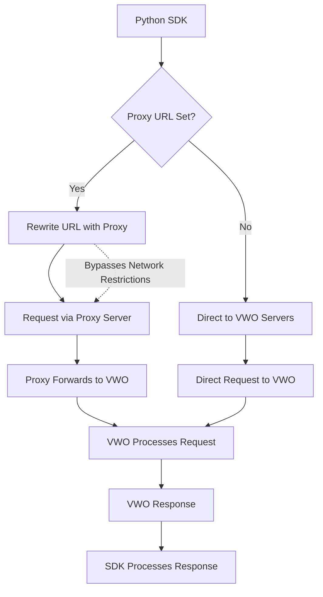

The VWO Python SDK now includes support for **custom proxy URLs**, enabling you to route all SDK network traffic through your own proxy server. This feature provides enhanced control over request routing, offering significant benefits in environments where direct network access to VWO endpoints may be restricted or blocked.

## Why Use a Custom Proxy URL?

In modern server environments, many organizations utilize network firewalls, security policies, or compliance requirements that restrict direct access to external services. Since the VWO Python SDK communicates with VWO services via the default domain (`dev.visualwebsiteoptimizer.com`), requests to this endpoint may be **blocked or restricted**.

When this occurs, it can lead to partial or complete SDK failure, resulting in:

* **Feature flag loading failures** – Targeted feature variations may not be served correctly to end users.
* **Experiment tracking disruptions** – Data collection for A/B tests and multivariate experiments may be incomplete or missing.
* **Settings fetch issues** – SDK initialization can fail if configuration settings cannot be retrieved.
* **Inconsistent user experience** – Variability in network configurations can cause different servers to experience different application behavior, leading to reliability concerns.

To address these issues, VWO provides the ability to configure a **proxy URL**, allowing organizations to **self-host a relay** for SDK traffic. This enables better control over network access, enhanced observability, and improved compatibility with restrictive network environments.

## How It Works: Request Routing Logic

The request flow when using a custom proxy is as follows:

1. **SDK → Proxy Server**  
   The VWO SDK sends all API and data collection requests to the proxy server, using the `proxy_url` specified during SDK initialization.
2. **Proxy Server → VWO Backend**  
   Your proxy server receives the SDK request and forwards it to the appropriate VWO endpoint.
3. **VWO Backend → Proxy Server**  
   VWO processes the incoming request, generates a response (e.g., flag configuration, experiment data), and sends it back to your proxy.
4. **Proxy Server → SDK**  
   Your proxy server relays the response from VWO back to the SDK, completing the round trip.



## Benefits of Using a Proxy

* **Bypass network restrictions**: Since the proxy URL is under your control (e.g., proxy.yourdomain.com), it can be whitelisted in your network policies.
* **Improved reliability**: Ensures SDK functionality even in restricted network environments.
* **Custom logging and analytics**: Enables logging, monitoring, or transformation of SDK requests for internal analytics or debugging.
* **Security and compliance**: Offers an opportunity to inspect or validate outbound and inbound traffic to meet organizational policies.

## Configuration Example

```python
from vwo import init

options = {
    'sdk_key': '32-alpha-numeric-sdk-key', # SDK Key
    'account_id': '123456', # VWO Account ID
    'proxy_url': 'https://proxy.yourdomain.com',
    # other configuration options
}

vwo_client = init(options)
```

> Ensure your proxy server is properly configured to forward requests to `dev.visualwebsiteoptimizer.com`, handle request/response headers appropriately, and support both GET and POST methods used by the SDK.

## Performance and Latency Considerations

Using a proxy introduces an additional network hop between the SDK and VWO servers. While this offers flexibility and control, it can affect performance if not optimized properly.

**Key considerations:**

* **Minimize Latency**: Host your proxy server geographically close to your application servers or leverage edge locations via a CDN.
* **Connection Reuse**: Enable `keep-alive` connections to reduce TCP handshake overhead.
* **Caching**: Use caching headers for SDK configuration responses (when appropriate) to reduce redundant API calls.
* **Compression**: Enable gzip or Brotli compression on your proxy server to reduce response size and speed up transfers.
* **Timeouts**: Configure reasonable timeouts to prevent long request queues or blocked SDK functionality.

> Tip: Monitor response times at both the proxy and SDK levels to detect bottlenecks.

## Security Considerations

Proxying SDK traffic gives you more control, but also introduces potential risks. Proper security practices help prevent misuse or data leaks.

**Recommendations:**

* **Use HTTPS**: Always serve your proxy over HTTPS to ensure encrypted data transmission.
* **Restrict Origins**: Limit access to your proxy to specific IP addresses or networks to prevent abuse.
* **Input Validation**: Sanitize and validate incoming requests to avoid injection or spoofing attacks.
* **Rate Limiting**: Implement rate limiting to protect your proxy from DDoS or high-traffic abuse.
* **Authorization (_Optional_)**: For internal or sensitive use cases, add token-based or header-based authentication.
* **Audit Logs**: Log incoming and outgoing proxy traffic (with PII masked) for observability and compliance.

## Sample Proxy Implementations

Below are basic proxy implementations in popular platforms to help you get started:

### Python (Flask)

```python
from flask import Flask, request, jsonify
import requests
from urllib.parse import urljoin

app = Flask(__name__)

VWO_BASE_URL = 'https://dev.visualwebsiteoptimizer.com'

@app.route('/', defaults={'path': ''}, methods=['GET', 'POST'])
@app.route('/<path:path>', methods=['GET', 'POST'])
def proxy(path):
    # Construct the target URL
    target_url = urljoin(VWO_BASE_URL, '/' + path)
    
    # Forward query parameters
    params = request.args.to_dict()
    
    # Forward headers (excluding host and connection)
    headers = {k: v for k, v in request.headers if k.lower() not in ['host', 'connection']}
    
    try:
        if request.method == 'GET':
            response = requests.get(target_url, params=params, headers=headers, timeout=30)
        else:  # POST
            json_data = request.get_json(silent=True)
            response = requests.post(target_url, json=json_data, params=params, headers=headers, timeout=30)
        
        # Return response with appropriate status code and headers
        return response.content, response.status_code, response.headers.items()
    except requests.RequestException as e:
        return jsonify({'error': 'Proxy error', 'details': str(e)}), 500

if __name__ == '__main__':
    app.run(host='0.0.0.0', port=3300, ssl_context='adhoc')  # Use proper SSL in production
```

### Python (FastAPI)

```python
from fastapi import FastAPI, Request
from fastapi.responses import Response
import httpx
from urllib.parse import urljoin

app = FastAPI()

VWO_BASE_URL = 'https://dev.visualwebsiteoptimizer.com'

@app.api_route('/{path:path}', methods=['GET', 'POST', 'PUT', 'DELETE'])
async def proxy(request: Request, path: str):
    # Construct the target URL
    target_url = urljoin(VWO_BASE_URL, '/' + path)
    
    # Get query parameters
    params = dict(request.query_params)
    
    # Get request body if present
    body = None
    if request.method in ['POST', 'PUT']:
        body = await request.body()
    
    # Forward headers (excluding host and connection)
    headers = {k: v for k, v in request.headers.items() if k.lower() not in ['host', 'connection']}
    
    async with httpx.AsyncClient() as client:
        try:
            response = await client.request(
                method=request.method,
                url=target_url,
                params=params,
                content=body,
                headers=headers,
                timeout=30.0
            )
            
            # Return response with appropriate status code and headers
            return Response(
                content=response.content,
                status_code=response.status_code,
                headers=dict(response.headers)
            )
        except httpx.RequestError as e:
            return Response(
                content=f'{{"error": "Proxy error", "details": "{str(e)}"}}',
                status_code=500,
                media_type='application/json'
            )

if __name__ == '__main__':
    import uvicorn
    uvicorn.run(app, host='0.0.0.0', port=3300, ssl_keyfile='key.pem', ssl_certfile='cert.pem')
```

### NGINX Config Snippet

```nginx
server {
    listen 443 ssl;
    server_name proxy.yourdomain.com;

    ssl_certificate /path/to/cert.pem;
    ssl_certificate_key /path/to/key.pem;

    location / {
        proxy_pass https://dev.visualwebsiteoptimizer.com/;
        proxy_set_header Host dev.visualwebsiteoptimizer.com;
        proxy_set_header X-Forwarded-For $proxy_add_x_forwarded_for;
        proxy_set_header X-Real-IP $remote_addr;
        
        # Enable keep-alive connections
        proxy_http_version 1.1;
        proxy_set_header Connection "";
        
        # Timeouts
        proxy_connect_timeout 30s;
        proxy_send_timeout 30s;
        proxy_read_timeout 30s;
        
        # Buffer settings
        proxy_buffering on;
        proxy_buffer_size 4k;
        proxy_buffers 8 4k;
    }
}
```

### Serverless (AWS Lambda + API Gateway)

For lightweight, scalable deployments, you can set up a proxy using AWS Lambda with API Gateway acting as the HTTP interface. This is useful for pay-as-you-go usage with minimal infrastructure overhead.

## Testing Your Proxy

After setting up your proxy, test it with a simple Python script:

```python
from vwo import init

# Test with proxy
options = {
    'sdk_key': 'your-sdk-key',
    'account_id': 'your-account-id',
    'proxy_url': 'https://proxy.yourdomain.com',
    'logger': {
        'level': 'DEBUG'  # Enable debug logging to see requests
    }
}

vwo_client = init(options)

# Test a simple operation
user_context = {'id': 'test-user-123'}
flag = vwo_client.get_flag('your-feature-key', user_context)
print(f"Flag enabled: {flag.is_enabled()}")
```

<br />
