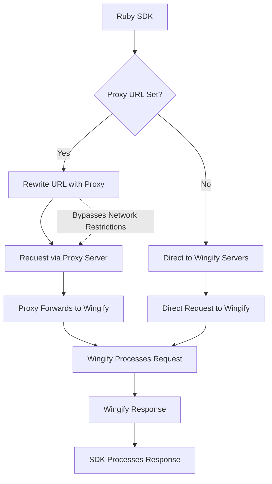

The Wingify Ruby SDK includes support for **custom proxy URLs**, enabling you to route all SDK network traffic through your own proxy server. This feature provides enhanced control over request routing, offering significant benefits in environments where direct network access to Wingify endpoints may be restricted or blocked.

### Why Use a Custom Proxy URL?

In modern server environments, many organizations utilize network firewalls, security policies, or compliance requirements that restrict direct access to external services. Since the Wingify Ruby SDK communicates with Wingify services via the default domain (`dev.visualwebsiteoptimizer.com`), requests to this endpoint may be **blocked or restricted**.

When this occurs, it can lead to partial or complete SDK failure, resulting in:

- **Feature flag loading failures** – Targeted feature variations may not be served correctly to end users.
- **Experiment tracking disruptions** – Data collection for A/B tests and multivariate experiments may be incomplete or missing.
- **Settings fetch issues** – SDK initialization can fail if configuration settings cannot be retrieved.
- **Inconsistent user experience** – Variability in network configurations can cause different servers to experience different application behavior, leading to reliability concerns.

To address these issues, Wingify provides the ability to configure a **proxy URL**, allowing organizations to **self-host a relay** for SDK traffic. This enables better control over network access, enhanced observability, and improved compatibility with restrictive network environments.

To address these issues, Wingify provides the ability to configure a **proxy URL**, allowing organizations to **self-host a relay** for SDK traffic. This enables better control over network access, enhanced observability, and improved compatibility with restrictive user environments.

## How It Works: Request Routing Logic

The request flow when using a custom proxy is as follows:

1. **SDK → Proxy Server**<br />The Wingify SDK sends all API and data collection requests to the proxy server, using the `proxy_url` specified during SDK initialization.
2. **Proxy Server → Wingify Backend**<br />Your proxy server receives the SDK request and forwards it to the appropriate Wingify endpoint.
3. **Wingify Backend → Proxy Server**<br />Wingify processes the incoming request, generates a response (e.g., flag configuration, experiment data), and sends it back to your proxy.
4. **Proxy Server → SDK**<br />Your proxy server relays the response from Wingify back to the SDK, completing the round trip.



## Benefits of Using a Proxy

- **Bypass network restrictions**: Since the proxy URL is under your control (e.g., proxy.yourdomain.com), it can be whitelisted in your network policies.
- **Improved reliability**: Ensures SDK functionality even in restricted network environments.
- **Custom logging and analytics**: Enables logging, monitoring, or transformation of SDK requests for internal analytics or debugging.
- **Security and compliance**: Offers an opportunity to inspect or validate outbound and inbound traffic to meet organizational policies.

## Configuration Example

```ruby
wingify_client = Wingify.init({
    sdk_key: '32-alpha-numeric-sdk-key',
    account_id: '123456',
    proxy_url: 'https://custom.proxy.com'
})
```

> Ensure your proxy server is properly configured to forward requests to `dev.visualwebsiteoptimizer.com`, handle request/response headers appropriately, and support both GET and POST methods used by the SDK.

## Performance and Latency Considerations

Using a proxy introduces an additional network hop between the SDK and Wingify servers. While this offers flexibility and control, it can affect performance if not optimized properly.

**Key considerations:**

- **Minimize Latency**: Host your proxy server geographically close to your application servers or leverage edge locations via a CDN.
- **Connection Reuse**: Enable `keep-alive` connections to reduce TCP handshake overhead.
- **Caching**: Use caching headers for SDK configuration responses (when appropriate) to reduce redundant API calls.
- **Compression**: Enable gzip or Brotli compression on your proxy server to reduce response size and speed up transfers.
- **Timeouts**: Configure reasonable timeouts to prevent long request queues or blocked SDK functionality.

> Tip: Monitor response times at both the proxy and SDK levels to detect bottlenecks.

## Security Considerations

Proxying SDK traffic gives you more control, but also introduces potential risks. Proper security practices help prevent misuse or data leaks.

**Recommendations:**

- **Use HTTPS**: Always serve your proxy over HTTPS to ensure encrypted data transmission.
- **Restrict Origins**: Limit access to your proxy to specific IP addresses or networks to prevent abuse.
- **Input Validation**: Sanitize and validate incoming requests to avoid injection or spoofing attacks.
- **Rate Limiting**: Implement rate limiting to protect your proxy from DDoS or high-traffic abuse.
- **Authorization (_Optional_)**: For internal or sensitive use cases, add token-based or header-based authentication.
- **Audit Logs**: Log incoming and outgoing proxy traffic (with PII masked) for observability and compliance.

## Sample Proxy Implementations

Below is a basic proxy implementation

```ruby
# proxy.rb
require 'sinatra'
require 'net/http'
require 'uri'

set :port, 3300

# Proxy all HTTP methods and paths
%w[get post put patch delete options].each do |verb|
  send(verb, '/*') do
    begin
      target_base = 'https://dev.visualwebsiteoptimizer.com'

      # Build target URI: keep path + query string
      path = params['splat'].first || ''
      query = request.query_string
      target_uri = URI.join(target_base + '/', path)
      target_uri.query = query unless query.empty?

      # Build corresponding Net::HTTP request
      http = Net::HTTP.new(target_uri.host, target_uri.port)
      http.use_ssl = (target_uri.scheme == 'https')

      klass = case request.request_method
              when 'GET'     then Net::HTTP::Get
              when 'POST'    then Net::HTTP::Post
              when 'PUT'     then Net::HTTP::Put
              when 'PATCH'   then Net::HTTP::Patch
              when 'DELETE'  then Net::HTTP::Delete
              when 'OPTIONS' then Net::HTTP::Options
              else Net::HTTP::Get
              end

      proxy_req = klass.new(target_uri)

      # Copy headers from incoming request
      request.env.each do |key, value|
        next unless key.start_with?('HTTP_')

        header_name = key.sub('HTTP_', '')
                         .split('_')
                         .map(&:capitalize)
                         .join('-')
        proxy_req[header_name] = value
      end

      # Copy request body (for POST/PUT/PATCH, etc.)
      request.body.rewind
      body_content = request.body.read
      proxy_req.body = body_content unless body_content.empty?

      # Perform the request
      response = http.request(proxy_req)

      # Copy response status and headers
      status response.code.to_i

      hop_by_hop = %w[
        connection keep-alive proxy-authenticate proxy-authorization
        te trailers transfer-encoding upgrade
      ]

      response.each_header do |k, v|
        next if hop_by_hop.include?(k.downcase)

        headers[k] = v
      end

      # Return response body
      body response.body
    rescue => e
      status 500
      content_type :json
      {
        error: 'Proxy error',
        details: e.message
      }.to_json
    end
  end
end

puts 'Proxy server running on http://localhost:3300'
```

<br />
