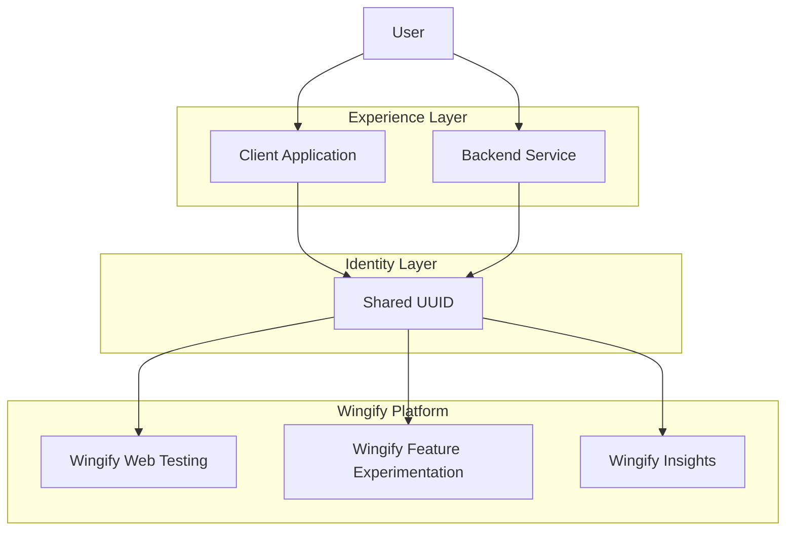
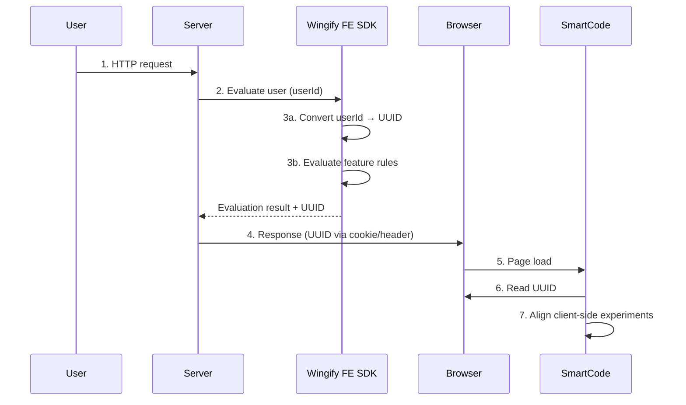
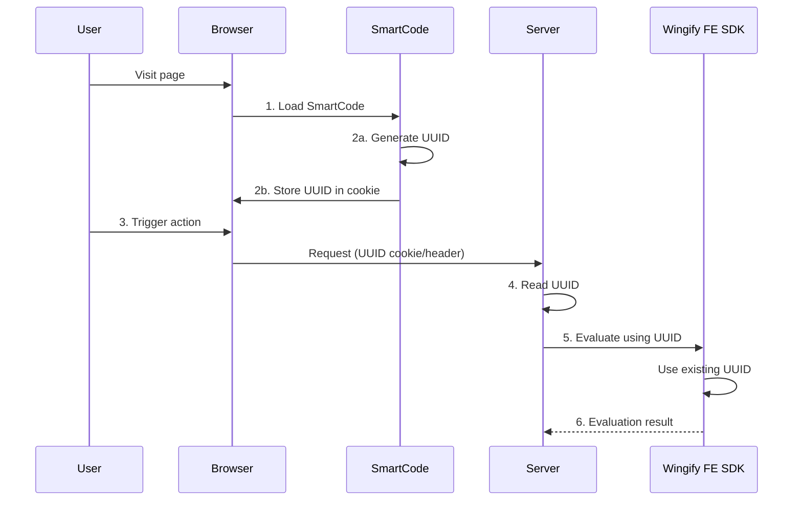
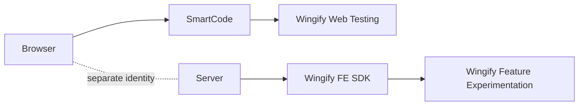
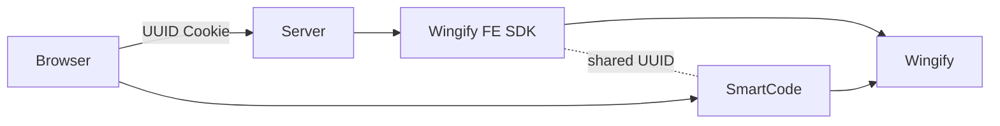
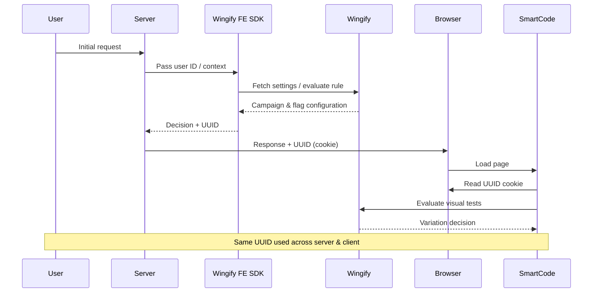

## Need for Cross-System Identity Synchronization

If Web Testing and Feature Experimentation operate independently:

* A user bucketed client-side may be unknown to server-side systems
* Backend experiments cannot be correlated with frontend experiments
* Funnel-level analysis becomes fragmented
* Attribution becomes inaccurate

In other words:

> Without shared identity, experimentation becomes siloed.

Connectivity ensures:

> One user → One identity → One journey → Unified insights

## Core Design Principle: UUID-Based Identity

The unifying principle is:

<Callout icon="📘" theme="info">
  **A canonical UUID must represent the same user across all evaluation layers.**  
  Check [what is a UUID](https://developers.wingify.com/v3/docs/user-id-management)  for more details.
</Callout>

Whether evaluation occurs:

* In the browser (SmartCode)
* In the backend (FE SDK)
* In mobile apps (FE SDK)
* In APIs (Payload)

The identity must remain stable.

Wingify achieves this by ensuring that:

* FE SDKs can generate/read and reuse UUIDs
* SmartCode can generate/read and preserve the same UUID
* Both systems communicate identity through cookies or server headers
* All events flow into Web Insights under the same visitor profile



<br />

## Step-by-step guide

### SmartCode Installation (Web Experimentation Example)

A minimal SmartCode installation looks like this:

```javascript
<!-- Start Wingify Async SmartCode -->
<link rel="preconnect" href="https://dev.visualwebsiteoptimizer.com" />
<script type='text/javascript' id='vwoCode'>
window._vwo_code ||
(function () {
var w=window,
d=document;
var account_id=REPLACE_WITH_WINGIFY_ACCOUNT_ID,
version=2.2,
settings_tolerance=2000,
hide_element='body',
hide_element_style = 'opacity:0 !important;filter:alpha(opacity=0) !important;background:none !important',
f=0;
/* DO NOT EDIT BELOW THIS LINE */
if(f=!1,v=d.querySelector('#vwoCode'),cc={},-1<d.URL.indexOf('__vwo_disable__')||w._vwo_code)return;try{var e=JSON.parse(localStorage.getItem('_vwo_'+account_id+'_config'));cc=e&&'object'==typeof e?e:{}}catch(e){}function r(t){try{return decodeURIComponent(t)}catch(e){return t}}var s=function(){var e={combination:[],combinationChoose:[],split:[],exclude:[],uuid:null,consent:null,optOut:null},t=d.cookie||'';if(!t)return e;for(var n,i,o=/(?:^|;\s*)(?:(_vis_opt_exp_(\d+)_combi=([^;]*))|(_vis_opt_exp_(\d+)_combi_choose=([^;]*))|(_vis_opt_exp_(\d+)_split=([^:;]*))|(_vis_opt_exp_(\d+)_exclude=[^;]*)|(_vis_opt_out=([^;]*))|(_vwo_global_opt_out=[^;]*)|(_vwo_uuid=([^;]*))|(_vwo_consent=([^;]*)))/g;null!==(n=o.exec(t));)try{n[1]?e.combination.push({id:n[2],value:r(n[3])}):n[4]?e.combinationChoose.push({id:n[5],value:r(n[6])}):n[7]?e.split.push({id:n[8],value:r(n[9])}):n[10]?e.exclude.push({id:n[11]}):n[12]?e.optOut=r(n[13]):n[14]?e.optOut=!0:n[15]?e.uuid=r(n[16]):n[17]&&(i=r(n[18]),e.consent=i&&3<=i.length?i.substring(0,3):null)}catch(e){}return e}();function i(){var e=function(){if(w.VWO&&Array.isArray(w.VWO))for(var e=0;e<w.VWO.length;e++){var t=w.VWO[e];if(Array.isArray(t)&&('setVisitorId'===t[0]||'setSessionId'===t[0]))return!0}return!1}(),t='a='+account_id+'&u='+encodeURIComponent(w._vis_opt_url||d.URL)+'&vn='+version+'&ph=1'+('undefined'!=typeof platform?'&p='+platform:'')+'&st='+w.performance.now();e||((n=function(){var e,t=[],n={},i=w.VWO&&w.VWO.appliedCampaigns||{};for(e in i){var o=i[e]&&i[e].v;o&&(t.push(e+'-'+o+'-1'),n[e]=!0)}if(s&&s.combination)for(var r=0;r<s.combination.length;r++){var a=s.combination[r];n[a.id]||t.push(a.id+'-'+a.value)}return t.join('|')}())&&(t+='&c='+n),(n=function(){var e=[],t={};if(s&&s.combinationChoose)for(var n=0;n<s.combinationChoose.length;n++){var i=s.combinationChoose[n];e.push(i.id+'-'+i.value),t[i.id]=!0}if(s&&s.split)for(var o=0;o<s.split.length;o++)t[(i=s.split[o]).id]||e.push(i.id+'-'+i.value);return e.join('|')}())&&(t+='&cc='+n),(n=function(){var e={},t=[];if(w.VWO&&Array.isArray(w.VWO))for(var n=0;n<w.VWO.length;n++){var i=w.VWO[n];if(Array.isArray(i)&&'setVariation'===i[0]&&i[1]&&Array.isArray(i[1]))for(var o=0;o<i[1].length;o++){var r,a=i[1][o];a&&'object'==typeof a&&(r=a.e,a=a.v,r&&a&&(e[r]=a))}}for(r in e)t.push(r+'-'+e[r]);return t.join('|')}())&&(t+='&sv='+n)),s&&s.optOut&&(t+='&o='+s.optOut);var n=function(){var e=[],t={};if(s&&s.exclude)for(var n=0;n<s.exclude.length;n++){var i=s.exclude[n];t[i.id]||(e.push(i.id),t[i.id]=!0)}return e.join('|')}();return n&&(t+='&e='+n),s&&s.uuid&&(t+='&id='+s.uuid),s&&s.consent&&(t+='&consent='+s.consent),w.name&&-1<w.name.indexOf('_vis_preview')&&(t+='&pM=true'),w.VWO&&w.VWO.ed&&(t+='&ed='+w.VWO.ed),t}code={nonce:v&&v.nonce,library_tolerance:function(){return'undefined'!=typeof library_tolerance?library_tolerance:void 0},settings_tolerance:function(){return cc.sT||settings_tolerance},hide_element_style:function(){return'{'+(cc.hES||hide_element_style)+'}'},hide_element:function(){return performance.getEntriesByName('first-contentful-paint')[0]?'':'string'==typeof cc.hE?cc.hE:hide_element},getVersion:function(){return version},finish:function(e){var t;f||(f=!0,(t=d.getElementById('_vis_opt_path_hides'))&&t.parentNode.removeChild(t),e&&((new Image).src='https://dev.visualwebsiteoptimizer.com/ee.gif?a='+account_id+e))},finished:function(){return f},addScript:function(e){var t=d.createElement('script');t.type='text/javascript',e.src?t.src=e.src:t.text=e.text,v&&t.setAttribute('nonce',v.nonce),d.getElementsByTagName('head')[0].appendChild(t)},load:function(e,t){t=t||{};var n=new XMLHttpRequest;n.open('GET',e,!0),n.withCredentials=!t.dSC,n.responseType=t.responseType||'text',n.onload=function(){if(t.onloadCb)return t.onloadCb(n,e);200===n.status?_vwo_code.addScript({text:n.responseText}):_vwo_code.finish('&e=loading_failure:'+e)},n.onerror=function(){if(t.onerrorCb)return t.onerrorCb(e);_vwo_code.finish('&e=loading_failure:'+e)},n.send()},init:function(){var e,t=this.settings_tolerance();w._vwo_settings_timer=setTimeout(function(){_vwo_code.finish()},t),'body'!==this.hide_element()?(n=d.createElement('style'),e=(t=this.hide_element())?t+this.hide_element_style():'',t=d.getElementsByTagName('head')[0],n.setAttribute('id','_vis_opt_path_hides'),v&&n.setAttribute('nonce',v.nonce),n.setAttribute('type','text/css'),n.styleSheet?n.styleSheet.cssText=e:n.appendChild(d.createTextNode(e)),t.appendChild(n)):(n=d.getElementsByTagName('head')[0],(e=d.createElement('div')).style.cssText='z-index: 2147483647 !important;position: fixed !important;left: 0 !important;top: 0 !important;width: 100% !important;height: 100% !important;background: white !important;',e.setAttribute('id','_vis_opt_path_hides'),e.classList.add('_vis_hide_layer'),n.parentNode.insertBefore(e,n.nextSibling));var n='https://dev.visualwebsiteoptimizer.com/j.php?'+i();-1!==w.location.search.indexOf('_vwo_xhr')?this.addScript({src:n}):this.load(n+'&x=true',{l:1})}};w._vwo_code=code;code.init();})();
</script>
<!-- End Wingify Async SmartCode -->
```

Once installed on web pages:

* Wingify can identify visitors
* Bucketing happens client-side
* Cookies are set automatically
* Visual experiments can be launched without code changes

### Feature Experimentation Example (Server-Side)

A simple Node.js server-side Feature Experimentation example:

```javascript
import { init } from 'wingify-fme-node-sdk';

const wingifyClient = await init({
  sdkKey: 'WINGIFY_SDK_KEY',
  accountId: 'WINGIFY_ACCOUNT_ID'
});

const userContext = {
  id: 'unique_user_id' // can be email, CRM ID, etc.
};

const flag = wingifyClient.getFlag('new_checkout_flow', userContext);

if (flag.isEnabled()) {
  enableNewCheckout();
} else {
  enableOldCheckout();
}
```

Here:

* The SDK buckets the user locally based on the unique ID for the user
* Decisions happen before the response is sent to the front-end
* Perfect for backend-controlled flows

<br />

## Experiment Evaluation Entry Points

There are only two logical ways a user can enter the experimentation system:

1. **Server-first flow**
2. **Client-first flow**

> Wingify supports both symmetrically.

Before we dive into how UUID synchronization works between server-side Feature Experimentation and client-side Web Testing, it is important to understand a more fundamental concept: **How do servers and browsers generally exchange information?**

The mechanisms used for UUID propagation are not unique to experimentation systems. They rely on standard web communication patterns used across modern applications.

Below are the most common and industry-standard ways information flows between the server and the client.

### How Server and Client Exchange Information(Passing UUID Between Server and Client)

#### UUID Generation

A UUID can be generated by either system:

| Entry Point  | UUID Generated By |
| ------------ | ----------------- |
| Server-first | FE SDK            |
| Client-first | SmartCode         |

> Once generated, the UUID becomes the source of truth.

To keep the same UUID across server-side and client-side experiments, the identifier must be transferable in both directions, from server to client and from client back to server. The following mechanisms support this bidirectional flow.

1. Cookies `(Rcommended)`
2. HTTP Response / Request Headers
3. Injecting into the window Object

#### 1. Cookies `(Recommended)`

Cookies are the most reliable way to share a UUID between server and client.

* **Server → Client**: Server sets the UUID using the `Set-Cookie` header
* **Client → Server**: Browser automatically sends the cookie with every request
* **Client access**: Available via JavaScript if not marked HttpOnly

Cookies persist across page refreshes and navigations, making them ideal for keeping server and client experiments in sync.

#### 2. HTTP Response / Request Headers

Custom headers can be used to pass the UUID explicitly.

* **Server → Client**: Server sends the UUID in a response header (e.g., `X-VWO-Visitor-ID`)
* **Client → Server**: Client includes the same header in subsequent API requests

This approach works well for API-driven applications but requires explicit handling and persistence on the client.

#### 3. Injecting into the window Object

The server embeds the UUID into the page during rendering:

```html
<script>
  window.__VWO_UUID__ = "12345-uuid";
</script>
```

* **Server → Client**: UUID is injected during SSR
* **Client → Server**: Client reads the value and sends it back via cookies or headers

This method provides immediate client-side access but relies on another mechanism for persistence.

> 📘 Recommendation
>
> There can be other ways too, depending on the requirements. For consistent experiment identity, use cookies as the primary bidirectional channel, optionally combined with HTML injection (window or JSON script) for immediate client-side availability during initialization.

<br />

## Server-First Architecture

This is common in:

* Authenticated applications
* API-driven products
* Backend-rendered pages
* SaaS dashboards

### Theoretical Flow

1. User request hits the server.
2. Server calls FE SDK.
3. SDK:
   1. Converts the provided user ID to a UUID.
   2. Evaluates rules.
4. UUID is attached to the response (cookie or header).
5. Browser loads SmartCode.
6. SmartCode reads UUID.
7. Client-side experiments align with server-side decisions.



### Conceptual Outcome

* The server becomes the primary authority.
* Browser inherits identity.
* Cross-layer alignment is automatic.

#### Server-side Example

```javascript
const userContext = { id: 'crm_987' };
const flag = wingifyClient.getFlag('feature_key', userContext);

const sessionId = flag.getSessionId();
const uuid = wingifyClient.getUUID(userContext);

// Pass sessionId and uuid to front-end either via cookies, window,
```

#### Client-side Example

> Add the below code before Wingify SmartCode Script

```javascript
window.VWO.push(['setSessionId', () => {
  // Read sessionId from cookie or request headers
  return sessionId;
}]);

window.VWO.push(['setVisitorId', () => {
  // Read uuid from cookie or request headers
  return uuid;
}]);
```

<br />

## Client-First Architecture

Common in:

* Marketing websites
* SEO landing pages
* Anonymous traffic
* Static sites

### Theoretical Flow

1. SmartCode loads first.
2. SmartCode:

* Generates a UUID.
* Stores it in a cookie.

3. User performs an action, triggering a server request.
4. Server reads UUID from cookie or request headers.
5. Server passes UUID into FE SDK.
6. Backend experiments now align with client-side identity.



### Conceptual Outcome

* The browser becomes the identity authority.
* Server reuses existing identity.
* No duplication occurs.

#### Server-side Example

```javascript
const _WEB_UUID_COOKIE_NAME = '_vwo_uuid';
const uuidFromCookie = req.cookies[VWO_WEB_UUID_COOKIE_NAME];

const userContext = {
  id: uuidFromCookie
};

const flag = wingifyClient.getFlag('recommendation_algo', userContext);
```

<br />

## Why Bidirectional Identity Synchronization Is Critical

In real-world systems:

* Some users land on marketing pages first.
* Some users enter through authenticated deep links.
* Some traffic originates via APIs.
* Some flows are SPA-based.

If experimentation only supported one direction, identity fragmentation would occur.

Wingify's model ensures:

| Entry Mode   | Identity Authority | System Alignment |
| ------------ | ------------------ | ---------------- |
| Server-first | Backend            | Browser inherits |
| Client-first | Browser            | Backend inherits |
| Repeat visit | Cookie persistence | Full alignment   |

<br />

## Architecture: Isolated vs Unified Systems

### Isolated Architecture (Not Recommended)



Problems

* Separate visitor identities
* No shared attribution
* Fragmented analytics
* Incomplete funnel visibility

### Unified Architecture (Recommended)



**Benefits**

* Single UUID across systems
* Unified experimentation
* Reliable attribution
* End-to-end journey tracking

<br />

## End-to-End Execution Architecture

The diagram below illustrates:

* FE SDK communicates with Wingify for configuration
* SmartCode communicates independently with Wingify
* UUID is the shared binding identity



<br />

## What This Enables

### True Omni-Channel Experimentation

A single user could experience:

* Visual homepage test
* Server-side pricing experiment
* Feature-flagged recommendation engine
* Mobile push personalization

> All attributed to one identity.

### Unified Web Insights

Because both FE SDK events and SmartCode events use the same UUID:

* Funnels remain intact
* Cross-experiment impact can be measured
* Combined revenue lift can be calculated

> Attribution is reliable

<br />

## Conceptual Example: E-Commerce Platform Migration

#### Scenario: E-commerce Funnel

1. User lands on homepage (web)
2. Sees a visual hero banner test (Web Testing)
3. Proceeds to checkout
4. Backend applies a pricing or recommendation experiment (Feature Experimentation)
5. Conversion is tracked holistically

#### Without connectivity:

* These appear as two different users
* Insights are fragmented

#### With connectivity:

* One visitor profile (Same user → same UUID → same journey)
* Full funnel visibility (Analyze impact, not isolated tests)
* Clear insight into how frontend + backend experiments interact